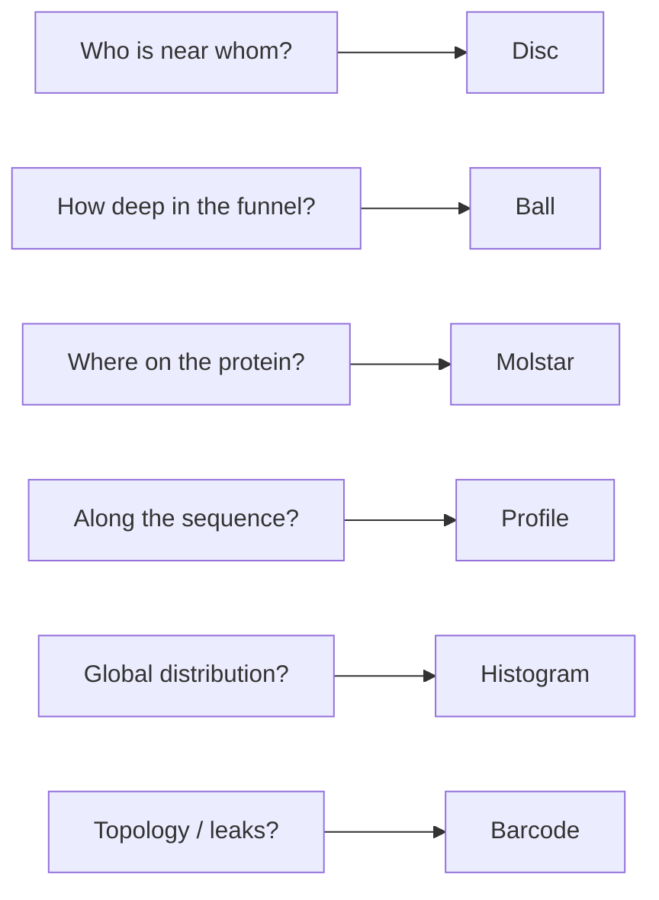

Yes — quite a few, and Tokyo Eye already uses several of them. They fall into three buckets: **what you have now**, **other hyperbolic views of the same data**, and **complementary non-hyperbolic views**.

## What you have today

### Interactive workbench (live)

| View | What it shows | Best for |

|------|---------------|----------|

| **Disc** | `(x, y)` Poincaré projection | Clusters, neighborhoods, Möbius focus |

| **Ball** | `(x, y)` on a plane + `cone_depth` on vertical axis | Funnel layers, depth separation |

| **Mol\*** | 3D protein structure | Sequence/chain ground truth |

| **Tri** | All three side by side | Cross-referencing |

**Color modes** (disc + ball): cone depth, epistemic uncertainty, aleatoric uncertainty. **κ slider** stretches/compresses radial layout. **Möbius** re-centers on a selected residue.

### Agent-generated static plots `generate_plot`)

Six matplotlib exports already wired:

- Poincaré disc (colored by any metric)

- Uncertainty profile along sequence

- Cone depth histogram

- WT vs mutant displacement

- Persistence barcode (Phase 3 topology)

- Source leak map (sequence + depth + uncertainty)

### Legacy / not yet in triple viewport

- *`PoincareScatter`** — richer disc with zone labels (core/mid/periphery), brush select, optional resistance-topology overlay

- *`LatentSpace3D`** — Three.js point cloud: same x/y/depth extrusion as the ball, but free-orbit 3D

- *`Visualizer3D`** — older 3D shell

So you're already doing **2D hyperbolic**, **depth-extruded pseudo-3D**, **sequence-linear**, **histogram**, **topology**, and **structural** views.

---

## Other ways to visualize the *same* embedding

These use the same governed fields `x`, `y`, `cone_depth`, uncertainties) but change the *lens*:

### 1. Alternative hyperbolic models

Same geometry, different chart:

| Model | Look | Tradeoff |

|-------|------|----------|

| **Upper half-plane** | Residues in \(\mathbb{H}^2\) above the x-axis | Geodesics are semicircles; good for tree-like hierarchy |

| **Klein disc** | Straight chords instead of curved geodesics | Easier to read "straight" distances; less intuitive area |

| **Hyperboloid / Minkowski** | 3D saddle surface | True 3D hyperbolic coords; harder UX but no "fake" depth axis |

| **Horocycle / depth rings** | Concentric bands at fixed `cone_depth` | Makes funnel layers explicit without extrusion |

The GNN trains in the **Poincaré ball**; disc/ball are stereographic projections of that. Switching models is mostly a coordinate transform — no retraining.

### 2. Radial / polar disc

Plot **angle** = cluster identity, **radius** = `cone_depth` (or \(\|x,y\|\)). Turns hierarchy into a literal radial axis on the disc itself — no separate ball needed.

### 3. Hyperbolic tree / dendrogram

If clusters are tree-like (they often are in \(\mathbb{H}^n\)), project to a **phylogram-style tree** using hyperbolic distance, not Euclidean k-means. Good for "which branch is this residue on?"

### 4. Distance heatmaps

N×N matrix of hyperbolic distances between residues (or sequence-adjacent pairs only). Surfaces **long-range couplings** that 2D projection compresses.

### 5. Geodesic flow / Möbius animation

Instead of static Möbius snap-to-focus, animate sliding along geodesics between two residues. Shows how "far apart" they are in hyperbolic space vs how close they look on disc.

---

## Complementary non-hyperbolic views

These answer different scientific questions:

| View | Data source | Question |

|------|-------------|----------|

| **Sequence strip** | residue index × metric | "Where along the chain?" |

| **Persistence barcode** | Phase 3 | Topological holes/features |

| **WT vs mutant arrows** | two runs | Which residues moved in embedding space? |

| **Source leak map** | depth + uncertainty + sequence | Rim candidates |

| **Graph overlay** | Cα edges on disc/ball | Structural adjacency vs embedding proximity |

| **PCA/UMAP of 64-d scrubber** | `hyp_projections` high-dim | Alternative layout (not hyperbolic-faithful) |

| **Resistance topology** | therapeutic compiler | Drug-resistance pathways in hyperbolic coords |

---

## Practical guidance

**Most useful additions** (if you want to extend the workbench):

1. **Polar/radial disc mode** — hierarchy without leaving 2D

2. **Sequence-linked brushing** — click disc → highlight sequence strip (and vice versa)

3. **WT/mutant arrow overlay** on disc — already have the plot, not live yet

4. **Port `PoincareScatter` resistance layer** into triple viewport

5. **True hyperboloid view** — only if you want mathematically honest 3D (vs today's depth extrusion)

The ball shape you're seeing is one deliberate choice (angular clustering + explicit depth). The disc is the canonical hyperbolic view. Neither replaces the others — they emphasize different structure in the same embedding.

If you want to go further, the highest-impact next step is probably **polar disc + sequence strip** in the triple viewport toolbar, since those are cheap to add and answer the two questions users ask most after "what am I looking at?"