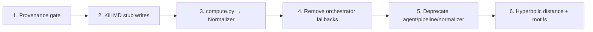

# Write Path Inventory

**Repository:** tokyo-eye-agenticpoincare  
**Date:** June 25, 2026  
**Status:** Living audit — regenerate table rows with `python scripts/audit_write_paths.py`  
**Related:** `science-container-audit-report.txt`, `data-governance-audit.txt`, `AGENTS.md`, [`PIPELINE_AUDIT.md`](./PIPELINE_AUDIT.md) (runtime compute audit), [`DEVELOPER_ONBOARDING.md`](../DEVELOPER_ONBOARDING.md) (compliance guide for all new work)

---

## Purpose

`AGENTS.md` states that **all data writes go through `data/normalizer/core.py`**. This document inventories every runtime SQL write to governed tables, classifies bypass severity, and proposes a migration order.

**Canonical write path:**

```
science / agent computation
    → adapter (science/dtie/common/adapters/*)
    → Normalizer payload (Pydantic)
    → data/normalizer/core.py
    → fact_* + governed_asset + provenance_run
```

---

## Provenance gate (implemented)

As of this audit, `_ensure_provenance_run()` enforces provenance completeness when strict mode is active.

| Control | Behavior |
|---------|----------|
| `PROVENANCE_STRICT=true` | Always enforce |
| `PROVENANCE_STRICT=false` | Never enforce |
| Unset | Enforce when `ENVIRONMENT` is `prod` or `staging`; relaxed in `dev` |

**Strict requirements:**

| Run type | `code_version` | `checkpoint_sha256` (64-char hex) |
|----------|----------------|-----------------------------------|
| `inference`, `training` | required | required |
| `analysis`, `historical_backfill`, etc. | required | not required |

Runtime helpers live in `science/dtie/common/provenance_runtime.py`. GNN writes resolve checkpoint hash from the on-disk checkpoint path and code version from env / `git rev-parse HEAD`.

---

## Summary counts

| Category | Count | Risk |
|----------|------:|------|
| Canonical (`data/normalizer/core.py`) | 28 | ✅ intended |
| Direct `fact_*` bypasses | 32 | 🔴 P0 |
| Governance/dimension bypasses | 25 | 🟡 P1 |
| Config / agent UI tables (out of scope) | — | 🟢 low |

---

## P0 — Direct `fact_*` bypasses (migrate first)

These paths can persist scientific facts without Normalizer validation, asset registration, or audit trail.

### Science API (active production risk)

| File | Table | Route / context | Migration |
|------|-------|-----------------|-----------|
| `science/api/routers/compute.py:420` | `fact_graph_node_metrics` | `/graph-topology` standalone | Route through `normalize_graph_topology()` (already exists in Normalizer) |
| `science/api/routers/compute.py:458` | `fact_graph_edge` | same | same |
| `science/api/routers/compute.py:812` | `fact_hyperbolic_motif` | motif analysis persist helper | Add `HyperbolicMotifPayload` + `normalize_hyperbolic_motifs()` |
| `science/api/routers/compute.py:1168` | `fact_md_validation` | MD validation stub | **Disable writes** until real OpenMM; highest science risk |

### DTIE orchestrator / adapters

| File | Table | Context | Migration |
|------|-------|---------|-----------|
| `science/dtie/v5/orchestrator/pipeline.py:585` | `fact_phase_output` | buffering_atlas fallback | Finish `BufferingAtlasAdapter` → Normalizer path; remove fallback |
| `science/dtie/common/adapters/buffering_atlas_adapter.py:76` | `fact_phase_output` | adapter fallback insert | Remove fallback; fail closed or use Normalizer |
| `science/dtie/v5/workers/hyperbolic_distance_populator.py:235` | `fact_hyperbolic_distance` | post-GNN distance matrix | Add `HyperbolicDistancePayload` to Normalizer |
| `science/dtie/v5/resistance/profiler.py:966` | `fact_resistance_profile` | resistance profiler | Route through existing resistance adapters / Normalizer |
| `science/dtie/v5/resistance/sdrp_engine.py:292` | `fact_ensemble_resistance_profile` | ensemble resistance | same |

### Legacy agent pipeline (likely dead or dev-only)

| File | Tables | Migration |
|------|--------|-----------|
| `agent/pipeline/normalizer/*.py` | various `fact_*` | Deprecate package; redirect callers to `data/normalizer/core.py` |
| `agent/pipeline/services/gnn_writeback.py` | `fact_gnn_*` | Delete or shim to `GNNOutputAdapter` |
| `agent/pipeline/jobs/gnn_inference.py` | `fact_gnn_*` | Same — production uses v5 orchestrator + adapter |

### Agent tools

| File | Tables | Migration |
|------|--------|-----------|
| `agent/tools/cryptic/scan_phase.py` | `fact_cryptic_site`, `fact_binding_site_scan` | Add cryptic-site payload + Normalizer method |

---

## P1 — Governance / dimension bypasses

These skip Normalizer but may be acceptable short-term if provenance-complete and idempotent.

| File | Tables | Notes | Migration |
|------|--------|-------|-----------|
| `science/api/routers/compute.py:382` | `provenance_run` | graph topology route creates run without gate | Use Normalizer provenance path |
| `science/api/routers/ingest.py:479` | `provenance_run`, `provenance_event` | audit-only duplicate ingest | OK as audit; document as exception |
| `science/dtie/common/ingestion.py` | `dim_*`, `provenance_run` | structure ingest bootstrap | Route dimensions through `normalize_ingest_dimensions()` |
| `science/dtie/common/structure_parser.py` | `dim_*` | parser side-effect writes | Parser returns payload; Normalizer writes |
| `agent/tools/rcsb.py` | `dim_*`, `provenance_run` | RCSB fetch tool | Use ingest normalizer path |
| `agent/pipeline/normalizer/structure.py` | `dim_*` | legacy | Delete with legacy package |

---

## Canonical path — `data/normalizer/core.py`

The Normalizer currently owns writes to:

- Dimensions: `dim_structure`, `dim_chain`, `dim_residue`, `dim_atom`
- DTIE facts: phase2/3, source leaks, allosteric sites, resistance, pharmacophores, drug candidates, graph topology, GNN embeddings
- Hypothesis engine tables
- Registry: `provenance_run`, `embedding_space`, `governed_asset`, `normalization_audit`

All new fact types should extend this module (payload schema + normalize method + audit logging).

---

## Recommended migration sequence



### Sprint 1 (this work)
- [x] Provenance gate in `_ensure_provenance_run`
- [x] Runtime resolution of `code_version` + `checkpoint_sha256` for GNN adapter
- [x] Write-path inventory + scanner script

### Sprint 2
- [ ] Disable `fact_md_validation` writes from stub OpenMM path
- [ ] Refactor `compute.py` graph topology to `normalize_graph_topology()`
- [ ] Remove buffering_atlas direct-insert fallbacks

### Sprint 3
- [ ] Add Normalizer payloads for motifs + hyperbolic distances
- [ ] Delete or quarantine `agent/pipeline/normalizer/*` and `gnn_writeback.py`
- [ ] Consolidate ingest dimension writes under Normalizer

### Sprint 4
- [ ] Pre-write hyperbolic collapse validation (radii bounds)
- [ ] Fail-closed pipeline status (`complete | degraded | failed`)
- [ ] Single read model: `mv_residue_latest_hyperbolic` everywhere

---

## Exceptions (documented, not bugs)

| Path | Rationale |
|------|-----------|
| `ingest.py` audit-only provenance on duplicate ingest | No fact rewrite; audit trail only |
| `agent/coordinator/memory.py` | Agent session/chat — not scientific facts |
| `agent/coordinator/routers/workspace.py` | UI layout persistence |
| `data/db.py` `_migrations` | Schema migration bookkeeping |

---

## Verification

```bash
# Regenerate raw inventory
python scripts/audit_write_paths.py

# Provenance gate unit tests
pytest tests/test_provenance_gate.py -v

# Normalizer regression
pytest tests/test_normalizer_audit.py tests/test_normalizer_payloads.py -v
```

---

## Ownership

| Area | Owner module | Target |
|------|--------------|--------|
| GNN inference writes | `science/dtie/common/adapters.py` | ✅ uses Normalizer + provenance gate |
| DTIE phases | `science/dtie/common/phase_persistence.py` | Normalizer adapters |
| Science API one-offs | `science/api/routers/compute.py` | Migrate or disable |
| Legacy agent pipeline | `agent/pipeline/` | Deprecate |

**Next action:** Sprint 2 — disable MD stub persistence and refactor `compute.py` graph topology to the existing Normalizer method.
