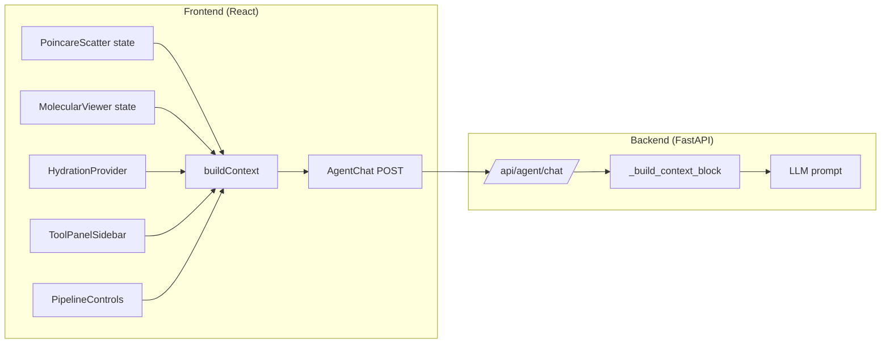

# Design Document: Agent Viewport Context

## Overview

Enriches the chat agent's context with the full dashboard viewport state so the LLM can provide answers relevant to what the user is currently viewing. The frontend gathers state from all panels (Poincaré disc, 3D viewer, hydration data, tool panels, pipeline status) into a structured context payload. The backend formats this into a compact text block prepended to the user's message.

## Architecture



## Components and Interfaces

### Frontend: ViewportState Interface

A new `ViewportState` type collected by `AgentChat.buildContext()`:

```typescript
interface ViewportState {
  // Structure identity
  structure_id: string | null;
  structure_title: string | null;

  // Poincaré disc
  poincare: {
    color_mode: string;          // "cone_depth" | "uncertainty"
    mobius_focus_enabled: boolean;
    mobius_focus_residue: string | null;
    selected_residue: SelectedResidueInfo | null;
    brush_selected_ids: string[];
  };

  // 3D Molecular Viewer
  viewer_3d: {
    color_mode: string;          // "spectrum" | "cone_depth" | "epistemic" | ...
    risk_threshold: number;
    highlighted_residue_ids: string[];
  };

  // Hydration data summary
  data_summary: {
    residue_count: number;
    source_leak_count: number;
    hypothesis_count: number;
    hypothesis_status_distribution: Record<string, number> | null;
    provenance_run_count: number;
    annotation_count: number;
    top_uncertainty_residues: TopResidueInfo[];
    persistence_status: Record<string, boolean>;
    resistance_summary: ResistanceSummary | null;
  };

  // Active tool panel
  active_panel: string | null;   // "hypothesis" | "graph_topology" | "data_tools" | ...

  // Pipeline status
  pipeline: {
    status: string;              // "never_run" | "queued" | "running" | "complete" | "failed"
    current_step: string | null;
    progress: number | null;
  };
}

interface SelectedResidueInfo {
  residue_id: string;
  residue_name: string | null;
  chain_label: string | null;
  epistemic_uncertainty: number | null;
  cone_depth: number | null;
}

interface TopResidueInfo {
  residue_id: string;
  epistemic_uncertainty: number;
}

interface ResistanceSummary {
  lambda_2: number;
  hinge_count: number;
  high_sensitivity_count: number;
  moderate_count: number;
  stable_count: number;
}
```

### Frontend: Context Gathering Pattern

`AgentChat` will receive view state via props passed from `App.tsx`. App already manages the top-level dashboard state and renders both the viewers and the chat panel. The pattern:

1. `App.tsx` lifts Poincaré state (selectedId, colorMode, mobiusFocus, brushSelection) from `PoincareScatter` via callbacks
2. `App.tsx` lifts 3D viewer state (colorMode, riskThreshold) from `MolecularViewer` via callbacks  
3. `App.tsx` passes active panel name from `ToolPanelSidebar`
4. `AgentChat` consumes `useHydration()` for data summary
5. `AgentChat.buildContext()` assembles the `ViewportState` object

### Backend: Enhanced Context Block Builder

```python
def _build_context_block(context: dict[str, Any]) -> str:
    """Format enriched viewport context into a structured prompt section.
    
    Organizes into sections, omits null/empty sections, caps at 2000 chars.
    """
    sections = []
    
    # Section 1: Structure
    if context.get("structure_id"):
        sections.append(f"Structure: {context['structure_id']}"
                       + (f" ({context['structure_title']})" if context.get('structure_title') else ""))
    
    # Section 2: Poincaré View
    poincare = context.get("poincare")
    if poincare:
        lines = [f"Poincaré View: color={poincare['color_mode']}"]
        if poincare.get("mobius_focus_enabled"):
            lines[0] += f", Möbius focus on {poincare.get('mobius_focus_residue', '?')}"
        if poincare.get("selected_residue"):
            r = poincare["selected_residue"]
            lines.append(f"  Selected: {r['residue_id']} (unc={r.get('epistemic_uncertainty')}, depth={r.get('cone_depth')})")
        if poincare.get("brush_selected_ids"):
            n = len(poincare["brush_selected_ids"])
            lines.append(f"  Brush selection: {n} residues")
        sections.append("\n".join(lines))
    
    # Section 3: 3D Viewer
    viewer = context.get("viewer_3d")
    if viewer:
        line = f"3D Viewer: color={viewer['color_mode']}, threshold={viewer['risk_threshold']}"
        if viewer.get("highlighted_residue_ids"):
            line += f", {len(viewer['highlighted_residue_ids'])} highlighted"
        sections.append(line)
    
    # Section 4: Data Availability
    ds = context.get("data_summary")
    if ds:
        lines = [f"Data: {ds.get('residue_count', 0)} residues, {ds.get('source_leak_count', 0)} source leaks"]
        if ds.get("hypothesis_count"):
            lines.append(f"  Hypotheses: {ds['hypothesis_count']} (dist: {ds.get('hypothesis_status_distribution', {})})")
        if ds.get("resistance_summary"):
            rs = ds["resistance_summary"]
            lines.append(f"  Resistance: λ₂={rs['lambda_2']:.3f}, {rs['hinge_count']} hinges, "
                        f"{rs['high_sensitivity_count']}H/{rs['moderate_count']}M/{rs['stable_count']}S")
        ps = ds.get("persistence_status", {})
        available = [k.replace("_persisted", "") for k, v in ps.items() if v]
        if available:
            lines.append(f"  Available phases: {', '.join(available)}")
        sections.append("\n".join(lines))
    
    # Section 5: Active Analysis
    panel = context.get("active_panel")
    pipeline = context.get("pipeline")
    if panel or pipeline:
        parts = []
        if panel:
            parts.append(f"Active panel: {panel}")
        if pipeline and pipeline.get("status") != "never_run":
            p_str = f"Pipeline: {pipeline['status']}"
            if pipeline["status"] == "running":
                p_str += f" ({pipeline.get('current_step')}, {pipeline.get('progress')}%)"
            parts.append(p_str)
        sections.append("; ".join(parts))
    
    if not sections:
        return ""
    
    block = "\n\nDashboard Context:\n" + "\n".join(sections)
    # Enforce 2000 char cap
    if len(block) > 2000:
        block = block[:1997] + "..."
    return block
```

## Data Models

### Context Payload (JSON over HTTP)

The `AgentChatRequest.context` field is already a `dict[str, Any]`. We expand it to include the new fields without changing the Pydantic model — the backend just processes more keys.

### No New Database Tables

This feature adds no database state. All context is ephemeral — gathered at send time from in-memory frontend state.

## Correctness Properties

*A property is a characteristic or behavior that should hold true across all valid executions of a system — essentially, a formal statement about what the system should do.*

### Property 1: Context payload completeness

*For any* complete dashboard state with a non-null active structure, Poincaré color mode, viewer color mode, and hydration data, the context payload produced by `buildContext()` shall contain non-null values for `structure_id`, `poincare.color_mode`, `viewer_3d.color_mode`, and `data_summary.residue_count`.

**Validates: Requirements 1.1, 1.2, 1.3**

### Property 2: Residue selection fidelity

*For any* set of selected/highlighted/brush-selected residue IDs in the frontend state, those exact IDs shall appear in the corresponding context payload fields (`poincare.selected_residue.residue_id`, `poincare.brush_selected_ids`, `viewer_3d.highlighted_residue_ids`).

**Validates: Requirements 2.1, 2.3, 3.3**

### Property 3: Hydration summary accuracy

*For any* hydration response with N residues, M source leaks, K hypotheses with status distribution D, the context payload's `data_summary` shall contain `residue_count=N`, `source_leak_count=M`, `hypothesis_count=K`, and `hypothesis_status_distribution=D`.

**Validates: Requirements 4.1, 4.2, 4.3, 4.4**

### Property 4: Context block formatting with null omission

*For any* context payload where some sections are null/empty, the formatted context block shall contain section text only for non-null fields and shall not raise errors.

**Validates: Requirements 6.1, 6.2, 6.3**

### Property 5: Context block size bound

*For any* valid context payload (including maximally populated payloads), the formatted context block shall be at most 2000 characters in length.

**Validates: Requirements 6.4**

### Property 6: Resistance classification count accuracy

*For any* resistance data with residues classified as high_sensitivity/moderate/stable and a given threshold, the `resistance_summary` in the context payload shall report counts that match the number of residues in each classification with sensitivity_score above the threshold.

**Validates: Requirements 3.4, 4.3**

## Error Handling

- Null hydration: `buildContext()` returns payload with null data_summary fields — no crash
- Missing viewer state props: defaults to sensible values (color_mode="spectrum", threshold=0.5)
- Backend receives unknown keys: ignored gracefully (forward-compatible)
- Context block exceeds 2000 chars: hard-truncated with "..." suffix

## Testing Strategy

**Property-Based Testing Library:** Hypothesis (Python) for backend `_build_context_block` tests.

**Approach:**
- Property tests: Backend context formatter (Properties 4, 5, 6)
- Unit tests: Frontend `buildContext()` output shape, backend formatting of specific scenarios
- Each property test runs 100+ iterations

**Tag format:** `Feature: agent-viewport-context, Property {number}: {property_text}`
