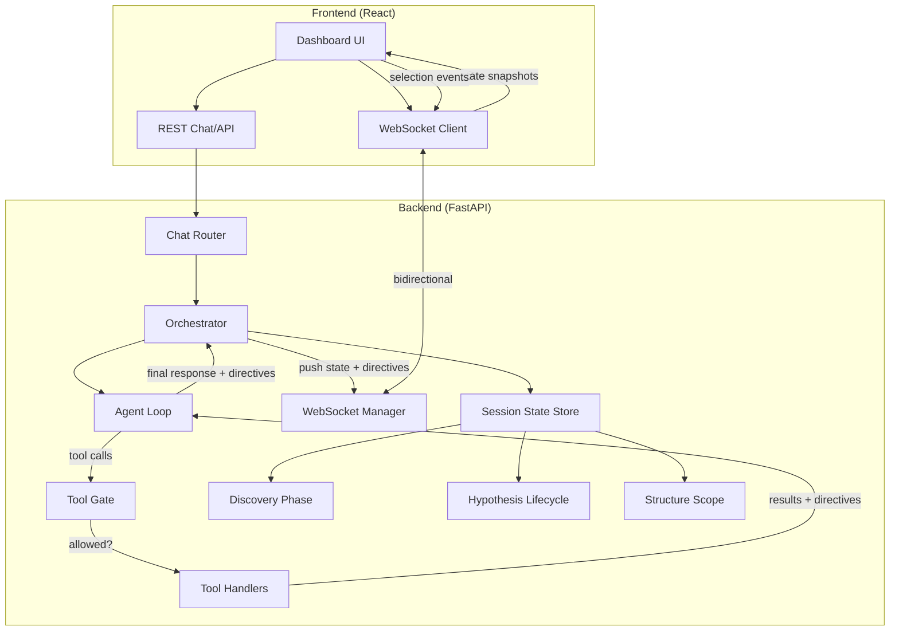

# Design Document: Backend Orchestration Layer

## Overview

This design establishes a server-side orchestration layer that becomes the single source of truth for Tokyo Eye's scientific workflow state. It integrates with the existing Agent loop (`agent/llm/base.py`), chat endpoint (`coordinator/routers/chat.py`), and WebSocket viewport protocol (`coordinator/viewport.py`) to enforce tool gating, enrich LLM context with dashboard state, enable agent-driven viewport interaction, and synchronize residue selection across all viewers.

The core architectural decision is: **the backend is the authority**. The frontend derives its displayed state from backend-pushed snapshots over WebSocket. The frontend may optimistically predict transitions for UI responsiveness, but the backend state is canonical.

## Architecture



## Components and Interfaces

### 1. SessionOrchestrator

The central coordinator that maintains state and derives policy. One instance per active session.

```python
class SessionOrchestrator:
    """Maintains canonical state for a session and derives planner policy."""

    def __init__(self, session_id: str):
        self.session_id = session_id
        self.discovery_phase: DiscoveryPhase = "residue"
        self.hypothesis_lifecycle: HypothesisLifecycleState = "emergent"
        self.structure_scope: StructureScopeContext = default_scope()
        self.viewport_state: ViewportState | None = None
        self.selected_residue: ResidueSelection | None = None

    def derive_policy(self) -> PlannerPolicy:
        """Compute the current planner policy from all state."""
        ...

    def can_invoke_tool(self, tool_name: str) -> tuple[bool, str | None]:
        """Check if a tool is allowed in current state. Returns (allowed, reason)."""
        ...

    def transition_discovery(self, event: DiscoveryPhaseEvent) -> None:
        """Apply a discovery phase event and push new state."""
        ...

    def transition_hypothesis(self, event: HypothesisLifecycleEvent) -> None:
        """Apply a hypothesis lifecycle event and push new state."""
        ...

    def update_viewport(self, state: ViewportState) -> None:
        """Update the cached viewport state from frontend."""
        ...

    def select_residue(self, selection: ResidueSelection) -> SelectionResult:
        """Process a residue selection, validate, and propagate."""
        ...

    def get_state_snapshot(self) -> dict:
        """Full state snapshot for WebSocket push to clients."""
        ...
```

### 2. Tool Gate

Wraps tool invocation to enforce phase-aware policy.

```python
async def gated_tool_invoke(
    orchestrator: SessionOrchestrator,
    tool_name: str,
    arguments: dict,
    tool_handler: Callable,
) -> ToolResult:
    """Invoke a tool only if current policy allows it."""
    allowed, reason = orchestrator.can_invoke_tool(tool_name)
    if not allowed:
        return ToolResult(
            tool_call_id="",
            content=f"Tool '{tool_name}' is not available in the current "
                    f"discovery phase ({orchestrator.discovery_phase}). {reason}",
            is_error=True,
        )
    result = await tool_handler(**arguments)
    # After successful tool execution, fire any state transitions
    orchestrator.handle_tool_completion(tool_name, result)
    return result
```

### 3. Context Block Builder

Formats viewport state + orchestration state into compact LLM context.

```python
def build_context_block(
    orchestrator: SessionOrchestrator,
    viewport_state: ViewportState | None,
) -> str:
    """Build a compact text block for LLM context injection.

    Structure:
    - Active structure identity
    - Discovery phase + hypothesis lifecycle
    - Selected residue with metrics
    - Viewport configuration (color modes, highlights)
    - Allowed/blocked speech acts
    - Reasoning mode instruction
    """
    ...
```

The context block is bounded to ~500 tokens maximum to avoid consuming excessive LLM context.

### 4. Residue Selection Sync

A canonical selection protocol that ensures all viewports agree.

```python
@dataclass(frozen=True)
class ResidueSelection:
    structure_id: str
    chain_id: str
    residue_number: int
    source: Literal["poincare", "3d", "table", "agent", "api"]

@dataclass
class SelectionResult:
    valid: bool
    selection: ResidueSelection | None
    error: str | None = None
```

Selection flow:
1. Source viewport (or agent) emits selection event
2. Backend validates against current structure context
3. If valid: push `selection_sync` message to all connected viewports
4. Each viewport applies the selection locally (highlight + camera focus on 3D)
5. If invalid: push `selection_error` to source only

### 5. Agent Viewport Interaction

The agent issues viewport directives through a dedicated tool (`emit_viewport_directive`) that the orchestrator intercepts, validates against current state, and pushes to all connected clients.

The **inspect-preview-commit** pattern:
1. Agent includes a `message` field explaining what it's about to show
2. The message appears in chat BEFORE the directive fires
3. The directive animates the viewport change
4. User can issue `clear` to revert

### 6. WebSocket State Protocol

Extended protocol messages:

```typescript
// Backend → Frontend
type WSMessage =
  | { type: "state_snapshot"; payload: OrchestratorState }
  | { type: "selection_sync"; payload: ResidueSelection }
  | { type: "selection_error"; payload: { error: string } }
  | { type: "semantic_command"; directive: ViewportDirective }
  | { type: "phase_transition"; phase: DiscoveryPhase; source: string }
  | { type: "hypothesis_transition"; state: HypothesisLifecycleState }

// Frontend → Backend
type WSEvent =
  | { type: "viewport_register"; viewport_id: string; capabilities: string[] }
  | { type: "viewport_event"; event_type: "selection"; payload: { residue_ids: string[] } }
  | { type: "viewport_event"; event_type: "hover"; payload: { residue_id: string | null } }
  | { type: "viewport_state_update"; payload: ViewportState }
```

## Data Models

### Discovery Phase (Backend Mirror)

```python
from enum import Enum
from pydantic import BaseModel

class DiscoveryPhase(str, Enum):
    RESIDUE = "residue"
    TOPOLOGY = "topology"
    STRUCTURE = "structure"
    POCKET = "pocket"
    SCREENING = "screening"
    REPORT = "report"

PHASE_RANK = {
    DiscoveryPhase.RESIDUE: 0,
    DiscoveryPhase.TOPOLOGY: 1,
    DiscoveryPhase.STRUCTURE: 2,
    DiscoveryPhase.POCKET: 3,
    DiscoveryPhase.SCREENING: 4,
    DiscoveryPhase.REPORT: 5,
}

class DiscoveryPhaseState(BaseModel):
    phase: DiscoveryPhase = DiscoveryPhase.RESIDUE
    phase_source: str = "default"  # "default" | "user" | "inferred" | "system"
    has_residue_selection: bool = False
    has_topology_selection: bool = False
    has_structure_mapping: bool = False
    has_pocket_extraction: bool = False
    has_screening_results: bool = False
    allowed_tools: list[str] = []
    blocked_tools: list[str] = []
```

### Hypothesis Lifecycle (Backend Mirror)

```python
class HypothesisLifecycleState(str, Enum):
    EMERGENT = "emergent"
    FRAMED = "framed"
    TESTING = "testing"
    SUPPORTED = "supported"
    CONTRADICTED = "contradicted"
    REVISED = "revised"
    SYNTHESIZED = "synthesized"

class HypothesisState(BaseModel):
    lifecycle: HypothesisLifecycleState = HypothesisLifecycleState.EMERGENT
    hypothesis_text: str | None = None
    supporting_evidence_count: int = 0
    unresolved_contradictions: list[str] = []
    confidence_band: str = "low"  # "low" | "medium" | "high"
    reasoning_mode: str = "explore"
    allowed_speech_acts: list[str] = []
    blocked_speech_acts: list[str] = []
    can_escalate_tools: bool = False
```

### Tool Policy

```python
TOOL_POLICY: dict[DiscoveryPhase, dict[str, list[str]]] = {
    DiscoveryPhase.RESIDUE: {
        "allowed": ["get_residue_state", "get_high_uncertainty_residues",
                    "search_residues", "highlight_residues", "set_metric"],
        "blocked": ["extract_pockets", "screen_fragments",
                    "run_docking_surrogate", "generate_report"],
    },
    DiscoveryPhase.TOPOLOGY: {
        "allowed": ["get_graph_metrics", "find_graph_bridges",
                    "get_shortest_paths", "highlight_residues", "search_residues"],
        "blocked": ["screen_fragments", "run_docking_surrogate"],
    },
    DiscoveryPhase.STRUCTURE: {
        "allowed": ["get_residue_state", "get_allosteric_sites",
                    "compare_wt_mutant", "highlight_residues"],
        "blocked": ["run_docking_surrogate"],
    },
    DiscoveryPhase.POCKET: {
        "allowed": ["get_allosteric_sites", "search_residues",
                    "highlight_residues", "annotate_structure"],
        "blocked": ["generate_report"],
    },
    DiscoveryPhase.SCREENING: {
        "allowed": ["screen_fragments", "run_docking_surrogate",
                    "highlight_residues", "annotate_structure"],
        "blocked": [],
    },
    DiscoveryPhase.REPORT: {
        "allowed": ["generate_report", "export_structure_data",
                    "get_provenance_lineage"],
        "blocked": ["screen_fragments", "run_docking_surrogate"],
    },
}
```

### Planner Policy (Backend Output)

```python
class PlannerPolicy(BaseModel):
    discovery_phase: DiscoveryPhase
    hypothesis_state: HypothesisLifecycleState
    reasoning_mode: str
    allowed_tools: list[str]
    blocked_tools: list[str]
    preferred_tools: list[str]
    speech_style: str
    allowed_speech_acts: list[str]
    blocked_speech_acts: list[str]
    should_ask_clarifying_question: bool
    target_residues: list[str]
    report_ready: bool
    rationale: list[str]
```

## Error Handling

- **Invalid residue selection**: Return `selection_error` with descriptive message; do not propagate to other viewports
- **Tool gating rejection**: Return structured error to LLM with phase context and unlock instructions
- **WebSocket disconnection**: On reconnect, push full state snapshot; no state loss
- **Context block overflow**: Truncate low-priority fields (highlighted residues list → count only) to stay within token budget
- **Stale structure scope**: If structure changes mid-session, invalidate all downstream state and push reset event


## Correctness Properties

*A property is a characteristic or behavior that should hold true across all valid executions of a system — essentially, a formal statement about what the system should do. Properties serve as the bridge between human-readable specifications and machine-verifiable correctness guarantees.*

### Property 1: Session initialization invariant

*For any* newly created session (regardless of structure, user, or connection state), the orchestrator SHALL initialize with discovery phase = `residue` and hypothesis lifecycle = `emergent`.

**Validates: Requirements 1.1**

### Property 2: State consistency across connected clients

*For any* sequence of state-transition events applied to an orchestrator, all connected WebSocket clients SHALL receive the same state snapshot, and that snapshot SHALL match the orchestrator's canonical internal state.

**Validates: Requirements 1.2, 1.4**

### Property 3: Context block completeness

*For any* valid ViewportState (with non-null fields for structure identity, selected residue, color modes, and pipeline flags), the formatted context block SHALL contain all of: structure_id, selected residue identifier, Poincaré color mode, 3D viewer color mode, and pipeline completion flags.

**Validates: Requirements 2.2, 2.3**

### Property 4: Context block size bound

*For any* ViewportState (including pathological cases with hundreds of highlighted residues), the formatted context block SHALL not exceed the configured maximum token budget (500 tokens).

**Validates: Requirements 2.5**

### Property 5: Agent directive action correctness

*For any* agent viewport action (highlight with residue IDs, focus on a residue, set_metric with a metric name), the emitted ViewportDirective SHALL have the correct `action` field and contain the specified parameters in the appropriate fields.

**Validates: Requirements 3.1, 3.2, 3.3**

### Property 6: Directive announcement precedes execution

*For any* viewport directive emitted by the agent, the chat response text SHALL contain an announcement of the viewport change, and that announcement SHALL appear in the response before the directive is pushed to WebSocket clients.

**Validates: Requirements 3.4**

### Property 7: Tool gating correctness

*For any* combination of discovery phase and tool name, `can_invoke_tool` SHALL return `True` if and only if the tool appears in the allowed list for that phase (as defined by `TOOL_POLICY`), and SHALL return `False` with an explanation if the tool appears in the blocked list.

**Validates: Requirements 4.1, 4.2**

### Property 8: Tool policy equivalence

*For any* discovery phase, the backend `TOOL_POLICY` derivation SHALL produce the same allowed and blocked tool lists as the frontend `toolPolicyForPhase` function.

**Validates: Requirements 4.5**

### Property 9: Selection propagation with canonical identity

*For any* valid residue selection from any source (poincaré, 3d, table, agent, api), the propagated selection message SHALL use canonical identity format (structure_id, chain_id, residue_number) and SHALL be delivered to all connected viewports.

**Validates: Requirements 5.1, 5.4**

### Property 10: Invalid selection rejection

*For any* residue selection where the (structure_id, chain_id, residue_number) tuple does not exist in the current structure's residue set, the orchestrator SHALL reject the selection and return an error rather than propagating it.

**Validates: Requirements 5.5**

### Property 11: Selection replacement

*For any* sequence of N residue selections applied to the orchestrator, only the most recent valid selection SHALL be active — all previous selections SHALL be cleared.

**Validates: Requirements 5.6**

### Property 12: Lifecycle-to-language-policy mapping

*For any* hypothesis lifecycle state, the derived context block SHALL contain the correct reasoning mode, allowed speech acts, blocked speech acts, and language guidance as defined by the reasoning policy table.

**Validates: Requirements 6.1, 6.2, 6.3, 6.4, 6.5**

## Testing Strategy

### Property-Based Testing

Use **Hypothesis** (Python) for all property tests. Each property maps to one `@given` test function.

Configuration:
- Minimum 100 examples per property test
- Use `@settings(max_examples=200)` for state-machine properties
- Tag format: `# Feature: backend-orchestration-layer, Property N: <title>`

Library: `hypothesis` with `hypothesis.stateful` for interaction sequence testing.

### Unit Tests

Unit tests cover:
- Specific edge cases (empty viewport state, null structure_id)
- WebSocket reconnection behavior (example test, not property)
- User override of blocked tools (example test)
- Context block truncation behavior at boundary

### Test Organization

```
tests/
├── test_orchestrator_properties.py     # Properties 1-12 via Hypothesis
├── test_orchestrator_unit.py           # Edge cases and examples
├── test_context_block.py               # Context formatting (Properties 3, 4)
├── test_tool_gating.py                 # Tool policy (Properties 7, 8)
└── test_selection_sync.py              # Residue selection (Properties 9, 10, 11)
```

### Stateful Testing

Properties 2 and 11 benefit from Hypothesis stateful testing (`RuleBasedStateMachine`):
- Generate random sequences of: phase transitions, hypothesis events, residue selections, tool invocations
- Assert invariants after each step: state consistency, only one active selection, tool gating holds

```python
class OrchestratorStateMachine(RuleBasedStateMachine):
    @initialize()
    def init(self):
        self.orchestrator = SessionOrchestrator("test-session")

    @rule(phase=st.sampled_from(list(DiscoveryPhase)))
    def set_phase(self, phase):
        self.orchestrator.transition_discovery({"type": "USER_SET_PHASE", "phase": phase})

    @rule(tool=st.sampled_from(ALL_TOOL_NAMES))
    def try_tool(self, tool):
        allowed, _ = self.orchestrator.can_invoke_tool(tool)
        policy = TOOL_POLICY[self.orchestrator.discovery_phase]
        if tool in policy["blocked"]:
            assert not allowed

    @invariant()
    def phase_tool_consistency(self):
        policy = TOOL_POLICY[self.orchestrator.discovery_phase]
        for tool in policy["blocked"]:
            allowed, _ = self.orchestrator.can_invoke_tool(tool)
            assert not allowed
```
