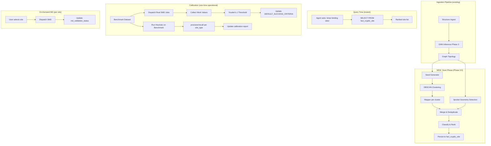

# Design Document: Binding Site Scan at Ingestion

## Overview

This system transforms binding site discovery from a manual hypothesis-driven tool into an exhaustive pre-computed asset. When a structure completes the DTIE pipeline, a new Scan Phase automatically identifies, classifies, and ranks all candidate binding sites (cryptic and surface) across the entire structure. Downstream interaction becomes a simple database query.

Additionally, this spec covers the operational calibration gap: running benchmark sites through real steered molecular dynamics on the GPU science container to replace provisional thresholds with empirically calibrated values.

The system has three pillars:
1. **Scan Phase** — exhaustive site enumeration at ingestion time
2. **Real MD Calibration** — GPU-powered threshold calibration against benchmark sites
3. **Query-Time Retrieval** — instant binding site lookup from pre-computed results

## Architecture



## Components and Interfaces

### 1. Seed Generator

Location: `agent/tools/cryptic/seed_generator.py`

```python
@dataclass
class CandidateCluster:
    """A spatially-clustered group of high-signal residues."""
    cluster_id: int
    residue_ids: list[str]
    centroid_xyz: tuple[float, float, float]
    composite_score: float  # mean composite score of cluster members
    member_count: int

def generate_seeds_from_gnn(
    gnn_nodes: list[GNNNodeOutput],
    ca_coords: dict[str, tuple[float, float, float]],
    uncertainty_threshold: float = 9.5,
    cone_depth_threshold: float = 6.0,
    eps_angstrom: float = 8.0,
    min_cluster_size: int = 3,
    max_clusters: int = 25,
) -> list[CandidateCluster]:
    """Identify all candidate binding site clusters from GNN output.

    Pipeline:
    1. Filter residues by epistemic_uncertainty >= threshold AND cone_depth >= threshold
    2. Extract Cα coordinates for qualifying residues
    3. Run DBSCAN with eps=eps_angstrom, min_samples=min_cluster_size
    4. Score each cluster by mean composite_score of its members
    5. Sort by score descending, cap at max_clusters

    Returns list of CandidateCluster sorted by composite_score descending.
    """
```

### 2. Surface Pocket Detector Adapter

Location: `agent/tools/cryptic/pocket_detector.py`

```python
@dataclass
class GeometryPocket:
    """A pocket detected by fpocket or equivalent geometry method."""
    pocket_index: int
    centroid_xyz: tuple[float, float, float]
    volume_angstrom3: float
    druggability_score: float  # fpocket druggability [0, 1]
    residue_ids: list[str]

async def detect_surface_pockets(
    structure_id: str,
    db: Any,
) -> list[GeometryPocket]:
    """Dispatch fpocket on the structure and parse results.

    Calls the science container's existing fpocket integration
    (science.dtie.v3.phases.phase5_pharmacophore.run_fpocket)
    via science_dispatch.

    Returns list of GeometryPocket with centroids and druggability scores.
    """
```

### 3. Site Merger

Location: `agent/tools/cryptic/site_merger.py`

```python
@dataclass
class UnifiedCandidate:
    """A merged binding site candidate from any detection source."""
    site_id: str
    residue_ids: list[str]
    centroid_xyz: tuple[float, float, float]
    site_type: SiteType | str  # includes "surface_pocket"
    discovery_method: str  # "gnn_strain", "geometry", or "hybrid"
    druggability_score: float  # [0, 1]
    site_rank: int
    composite_gnn_score: float | None
    fpocket_druggability: float | None
    volume_angstrom3: float | None
    provenance_gate: str
    heuristic_version: str

def merge_candidates(
    gnn_candidates: list[CandidateCluster],
    geometry_pockets: list[GeometryPocket],
    overlap_threshold_angstrom: float = 5.0,
) -> list[UnifiedCandidate]:
    """Merge GNN-derived and geometry-derived candidates into unified list.

    Rules:
    - If a geometry pocket centroid is within overlap_threshold of a GNN cluster centroid,
      merge into one UnifiedCandidate with discovery_method="hybrid"
    - If a geometry pocket has no GNN overlap, include as discovery_method="geometry"
    - GNN clusters without geometry overlap remain as discovery_method="gnn_strain"

    Returns merged list sorted by druggability_score descending with site_rank assigned.
    """

def compute_druggability_score(
    composite_gnn_score: float | None,
    fpocket_druggability: float | None,
    volume_angstrom3: float | None,
    site_type: str,
) -> float:
    """Compute unified druggability score from all available signals.

    Weighted combination:
    - GNN composite score (40% weight if available)
    - fpocket druggability (30% weight if available)
    - Volume score (20% weight, normalized by max 2000 ų)
    - Site type bonus (10% — cryptic_wedge and structural_stent get +0.1)

    Returns score in [0, 1]. Missing signals reduce the denominator (weights re-normalize).
    """
```

### 4. Scan Phase Orchestrator

Location: `agent/tools/cryptic/scan_phase.py`

```python
@dataclass
class ScanResult:
    """Complete result of a full-structure binding site scan."""
    structure_id: str
    run_id: str
    candidates: list[UnifiedCandidate]
    scan_parameters: dict[str, Any]
    heuristic_version: str
    model_version: str
    duration_ms: int
    warnings: list[str]

async def run_full_structure_scan(
    structure_id: str,
    db: Any,
    uncertainty_threshold: float = 9.5,
    cone_depth_threshold: float = 6.0,
    eps_angstrom: float = 8.0,
    min_cluster_size: int = 3,
    max_clusters: int = 25,
    overlap_threshold_angstrom: float = 5.0,
) -> ScanResult:
    """Execute full-structure binding site scan.

    Pipeline:
    1. Fetch GNN node outputs from DB (fact_gnn_node_embedding)
    2. Fetch Cα coordinates from dim_atom
    3. Generate seed clusters via DBSCAN
    4. Run mapper classification on each cluster
    5. Run fpocket pocket detection
    6. Merge GNN + geometry candidates
    7. Rank by druggability_score
    8. Persist all candidates to fact_cryptic_site
    9. Return ScanResult

    This function is called automatically by the pipeline orchestrator
    after Phase 3 + graph topology complete.
    """
```

### 5. Real MD Calibration Runner

Location: `scripts/calibrate_cryptic_real_md.py`

```python
async def run_real_md_calibration(
    benchmark_path: str,
    protocol: str,
    db: Any,
    timeout_per_site: int = 3600,
) -> dict[str, Any]:
    """Run actual SMD against benchmark sites on GPU science container.

    For each benchmark site:
    1. Dispatch real SMD job via science_dispatch
    2. Wait for completion (up to timeout_per_site seconds)
    3. Record work values

    Returns:
    {
        "protocol": str,
        "positive_work_values": list[float],
        "negative_work_values": list[float],
        "failed_sites": list[str],
        "run_metadata": {...}
    }
    """

async def calibrate_all_protocols(
    benchmark_path: str,
    db: Any,
) -> dict[str, Any]:
    """Run calibration across all SMD protocols.

    Dispatches real MD for each protocol, collects work values,
    applies Youden's J, and generates calibrated threshold recommendations.
    """

def apply_calibrated_thresholds(
    calibration_results: dict[str, Any],
    output_path: str = "data/calibration/calibrated_thresholds.json",
) -> None:
    """Write calibrated thresholds to config file.

    Updates DEFAULT_SUCCESS_CRITERIA source from "provisional" to "calibrated"
    with empirically-derived threshold values.
    """
```

### 6. Query Interface

Location: Updates to `agent/tools/cryptic/tool.py`

```python
async def query_binding_sites(
    structure_id: str,
    db: Any,
    site_type: str | None = None,
    min_druggability: float | None = None,
    md_status: str | None = None,
    limit: int = 50,
) -> ToolResult:
    """Query pre-computed binding sites for a structure.

    Returns instantly from fact_cryptic_site without triggering computation.
    Supports filtering by site_type, minimum druggability_score, and md_status.
    """
```

### 7. On-Demand MD Validation

Location: Updates to `agent/tools/cryptic/tool.py`

```python
async def validate_site_md(
    site_id: str,
    db: Any,
    timeout_seconds: int = 1800,
) -> ToolResult:
    """Trigger MD validation for a specific pre-computed site.

    Dispatches real SMD to science container and updates fact_cryptic_site
    with results.
    """

async def validate_top_sites_md(
    structure_id: str,
    top_n: int = 5,
    db: Any = None,
    timeout_seconds: int = 1800,
) -> ToolResult:
    """Batch MD validation for top N sites by rank."""
```

## Data Models

### Schema Changes

Add columns to `fact_cryptic_site`:

```sql
ALTER TABLE fact_cryptic_site
    ADD COLUMN IF NOT EXISTS druggability_score FLOAT DEFAULT 0.0,
    ADD COLUMN IF NOT EXISTS site_rank INTEGER,
    ADD COLUMN IF NOT EXISTS discovery_method TEXT DEFAULT 'gnn_strain',
    ADD COLUMN IF NOT EXISTS scan_run_id TEXT,
    ADD COLUMN IF NOT EXISTS volume_angstrom3 FLOAT,
    ADD COLUMN IF NOT EXISTS fpocket_druggability FLOAT;
```

### Scan Metadata Table

```sql
CREATE TABLE IF NOT EXISTS fact_binding_site_scan (
    scan_id UUID PRIMARY KEY DEFAULT gen_random_uuid(),
    structure_id TEXT NOT NULL,
    run_id TEXT NOT NULL REFERENCES provenance_run(run_id),
    heuristic_version TEXT NOT NULL,
    model_version TEXT NOT NULL,
    scan_parameters JSONB NOT NULL,
    sites_found INTEGER NOT NULL DEFAULT 0,
    duration_ms INTEGER,
    status TEXT NOT NULL DEFAULT 'complete',
    created_at TIMESTAMPTZ DEFAULT NOW(),
    UNIQUE(structure_id, run_id)
);
```

### MD Validation Status State Machine

```
pending → running → passed
                  → failed
                  → timeout
```

Only valid transitions:
- pending → running (when SMD dispatched)
- running → passed/failed/timeout (when SMD completes)
- passed/failed → pending (when re-validation requested)

## Correctness Properties

*A property is a characteristic or behavior that should hold true across all valid executions of a system — essentially, a formal statement about what the system should do. Properties serve as the bridge between human-readable specifications and machine-verifiable correctness guarantees.*

### Property 1: Qualifying Residue Filter Correctness

*For any* set of GNN node outputs and any pair of thresholds (uncertainty_threshold, cone_depth_threshold), the qualifying residue set SHALL contain exactly those residues where epistemic_uncertainty >= uncertainty_threshold AND cone_depth >= cone_depth_threshold. No qualifying residue shall be excluded, and no non-qualifying residue shall be included.

**Validates: Requirements 1.1**

### Property 2: Minimum Cluster Size Enforcement

*For any* output of the scan phase, every returned CandidateCluster SHALL contain at least min_cluster_size (default 3) residues. No cluster with fewer members shall appear in the output.

**Validates: Requirements 1.3**

### Property 3: Output Cap and Score Ordering

*For any* structure producing more than max_clusters (default 25) candidate clusters, the scan SHALL return exactly max_clusters candidates, and for every retained candidate and every discarded candidate, the retained candidate's composite_score SHALL be >= the discarded candidate's composite_score.

**Validates: Requirements 1.4, 1.5**

### Property 4: Merge Spatial Overlap Detection

*For any* geometry pocket and GNN cluster where their centroids are within overlap_threshold (default 5.0 Å), the merged output SHALL contain a single UnifiedCandidate with discovery_method="hybrid" rather than two separate entries. Conversely, for any pair where centroids exceed the threshold, both SHALL appear as separate entries.

**Validates: Requirements 2.3, 2.4**

### Property 5: Discovery Method Annotation Completeness

*For any* UnifiedCandidate in the merged output, discovery_method SHALL be exactly one of {"gnn_strain", "geometry", "hybrid"}, and the value SHALL be consistent with the candidate's origin: "gnn_strain" only if from GNN clustering alone, "geometry" only if from fpocket alone, "hybrid" only if both sources contributed.

**Validates: Requirements 2.5**

### Property 6: Druggability Score Bounds

*For any* UnifiedCandidate, the druggability_score SHALL be in the range [0.0, 1.0]. No candidate shall have a score outside this range regardless of input signal values.

**Validates: Requirements 3.2**

### Property 7: Site Rank Ordering Invariant

*For any* list of UnifiedCandidates returned by the scan, site_rank values SHALL be consecutive integers from 1 to N, and for any two candidates where rank_a < rank_b, druggability_score_a >= druggability_score_b.

**Validates: Requirements 3.3, 5.1**

### Property 8: Scan Provenance Completeness

*For any* ScanResult, the output SHALL include non-null values for: run_id, model_version, heuristic_version, and scan_parameters containing at minimum uncertainty_threshold, cone_depth_threshold, eps_angstrom, and min_cluster_size.

**Validates: Requirements 4.4**

### Property 9: Query Result Field Completeness

*For any* binding site returned by the query interface, the result SHALL include non-null values for: site_id, site_type, residue_ids, druggability_score, site_rank, discovery_method, provenance_gate, md_validation_status, and heuristic_version.

**Validates: Requirements 5.3**

### Property 10: Query Filter Correctness

*For any* filter criteria (site_type, min_druggability, md_status) applied to a query, every returned site SHALL satisfy all specified filters. No site violating any filter condition shall appear in the result.

**Validates: Requirements 5.5**

### Property 11: Calibrated Threshold Structure

*For any* calibration update that marks a protocol as "calibrated", the resulting DEFAULT_SUCCESS_CRITERIA entry SHALL have source="calibrated", a non-null date, a non-empty reference_sites list, and numeric values for pulling_rate_nm_per_ns and force_constant_kJ_mol_nm2.

**Validates: Requirements 6.5**

### Property 12: MD Validation Status Transitions

*For any* md_validation_status update on a fact_cryptic_site record, the transition SHALL follow the allowed state machine: pending→running, running→passed, running→failed, running→timeout, passed→pending, failed→pending. No other transitions are valid.

**Validates: Requirements 8.2**

## Error Handling

| Scenario | Behavior | User-Facing Message |
|----------|----------|---------------------|
| No GNN data for structure | Scan phase skips, logs warning | "Structure has no GNN embeddings. Run DTIE pipeline first." |
| No qualifying residues AND no fpocket pockets | Persist scan_metadata with "no_sites_found" | "No binding site candidates identified for this structure." |
| fpocket binary unavailable | Continue with GNN-only candidates | "Geometry detection unavailable; showing GNN-derived sites only." |
| DBSCAN produces > max_clusters | Retain top-25 by score, log warning | (Internal — user sees top 25 sites) |
| MD calibration run fails for a site | Skip site, continue with remaining | "MD failed for {pdb_id}: {reason}. Excluded from calibration." |
| Real SMD timeout (> 1 hour per site) | Mark as timeout, continue batch | "MD validation timed out for site {site_id}." |
| Re-scan with newer version | Delete old results, insert new | (Transparent — user always sees latest) |

## Testing Strategy

### Property-Based Testing

- **Library**: Hypothesis (Python)
- **Minimum iterations**: 100 per property
- **Tag format**: `Feature: binding-site-scan-at-ingestion, Property {N}: {title}`

Properties P1–P12 will be implemented as property-based tests.

Note: Properties from the existing `cryptic-site-calibration` spec (Youden's J threshold selection, precision flagging, confidence exclusion) continue to apply and are not duplicated here.

### Unit Testing

Unit tests will cover:
- DBSCAN clustering with known point configurations
- Merge logic with specific overlap/non-overlap scenarios
- Druggability score computation with edge cases (all signals missing, single source)
- Query interface with empty database, populated database, various filters
- MD status state machine transitions (valid and invalid)
- Integration: scan phase produces valid output from synthetic GNN data

### Integration Testing

- End-to-end: ingest structure → pipeline → scan phase → query returns ranked sites
- Calibration: dispatch real SMD for one known site, verify work value collected
- Re-scan: ingest same structure twice, verify only latest results persist

