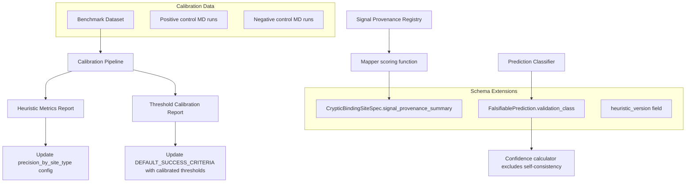

# Design Document: Cryptic Site Calibration System

## Overview

The Cryptic Site Calibration System provides the scientific validation layer for the Cryptic Binding Site Discovery System. It addresses five gaps identified in peer review:

1. The classification heuristic has no benchmark validation (precision/recall unknown)
2. MD success thresholds are arbitrary (no positive/negative control calibration)
3. Signal provenance (GNN vs. physics) is unlabeled, risking IP/patent confusion
4. Falsifiable predictions conflate independent physical validation with model self-consistency
5. No versioning of the heuristic makes historical comparisons impossible

The system introduces a benchmark dataset, a calibration pipeline, schema extensions for provenance and prediction independence, and a repeatable metrics reporting flow.

## Architecture



## Components and Interfaces

### 1. Benchmark Dataset

Location: `data/calibration/benchmark_cryptic_sites.json`

A curated JSON file containing experimentally confirmed sites:

```python
@dataclass
class BenchmarkSite:
    pdb_id: str
    chain: str
    residue_ids: list[str]
    ground_truth_type: str  # "cryptic_wedge", "structural_stent", etc.
    ground_truth_label: str  # "true_positive", "true_negative", "ambiguous"
    citation: str  # DOI or internal reference
    source: str  # "literature", "internal_validated", "pocketminer"
    notes: str
```

The dataset will include:
- Sites from CryptoSite/PocketMiner benchmark (Meller et al., 2023) with matching site_type annotations
- KRAS Asp12–Tyr32 lock (internal, patent-relevant)
- Known non-cryptic surface pockets as negatives

### 2. Signal Provenance Registry

Location: `agent/tools/cryptic/signal_provenance.py`

```python
from enum import Enum

class SignalProvenance(str, Enum):
    GNN_LEARNED = "GNN_learned"
    STRUCTURAL_PHYSICS = "structural_physics"

# Maps signal name → provenance
SIGNAL_PROVENANCE: dict[str, SignalProvenance] = {
    "epistemic_uncertainty": SignalProvenance.GNN_LEARNED,
    "cone_depth": SignalProvenance.GNN_LEARNED,
    "dehydron_density": SignalProvenance.GNN_LEARNED,
    "betweenness_centrality": SignalProvenance.STRUCTURAL_PHYSICS,
    "is_bridge": SignalProvenance.STRUCTURAL_PHYSICS,
}

def classify_provenance_gate(load_bearing_signals: list[str]) -> str:
    """Classify the overall provenance gate of a discovery.
    
    Returns: "GNN-gated", "physics-gated", or "hybrid-gated"
    """
    provenances = {SIGNAL_PROVENANCE[s] for s in load_bearing_signals if s in SIGNAL_PROVENANCE}
    if provenances == {SignalProvenance.GNN_LEARNED}:
        return "GNN-gated"
    elif provenances == {SignalProvenance.STRUCTURAL_PHYSICS}:
        return "physics-gated"
    else:
        return "hybrid-gated"
```

### 3. Validation Class Classifier

Location: `agent/tools/cryptic/prediction_classifier.py`

```python
class ValidationClass(str, Enum):
    INDEPENDENT_PHYSICS = "independent_physics"
    MODEL_SELF_CONSISTENCY = "model_self_consistency"
    EXPERIMENTAL = "experimental"

# Tools that invoke the same GNN → self-consistency
GNN_TOOLS = {"run_gnn_inference", "dtie_inference", "rerun_embedding", "gnn_repredict"}
# Tools that invoke MD → independent physics
MD_TOOLS = {"smd_runner", "md_validation", "openmm", "steered_md", "run_md"}
# Tools that reference experimental methods
EXPERIMENTAL_TOOLS = {"xray_validation", "nmr_shift", "cryo_em_density", "binding_assay"}

def classify_prediction_independence(test_tool: str) -> ValidationClass:
    """Auto-classify a prediction's validation independence from its test_tool."""
    tool_lower = test_tool.lower()
    if any(gnn_tool in tool_lower for gnn_tool in GNN_TOOLS):
        return ValidationClass.MODEL_SELF_CONSISTENCY
    elif any(md_tool in tool_lower for md_tool in MD_TOOLS):
        return ValidationClass.INDEPENDENT_PHYSICS
    elif any(exp_tool in tool_lower for exp_tool in EXPERIMENTAL_TOOLS):
        return ValidationClass.EXPERIMENTAL
    # Default: if unclear, conservatively mark as self-consistency
    return ValidationClass.MODEL_SELF_CONSISTENCY
```

### 4. Calibration Pipeline

Location: `scripts/calibrate_cryptic.py`

```python
async def run_heuristic_calibration(benchmark_path: str, db: Any) -> dict:
    """Run all benchmark sites through the mapper and compute metrics.
    
    Returns structured report with precision/recall/ROC-AUC per site_type.
    """

async def run_threshold_calibration(
    positive_sites: list[BenchmarkSite],
    negative_sites: list[BenchmarkSite],
    protocol: str,
    db: Any,
) -> dict:
    """Run positive/negative controls through SMD and recommend thresholds.
    
    Uses Youden's J statistic to find optimal separation point.
    Returns recommended threshold with confidence interval.
    """

def generate_calibration_report(
    heuristic_metrics: dict,
    threshold_metrics: dict,
    previous_report: dict | None = None,
) -> dict:
    """Generate structured JSON report with regression detection."""
```

### 5. Schema Extensions

Additions to `CrypticBindingSiteSpec`:

```python
class CrypticBindingSiteSpec(BaseModel):
    # ... existing fields ...
    
    # NEW: Signal provenance tracking
    signal_provenance_summary: dict[str, str] = Field(
        default_factory=dict,
        description="Maps signal_name → provenance class (GNN_learned or structural_physics)"
    )
    provenance_gate: str = Field(
        default="hybrid-gated",
        description="Overall provenance classification: GNN-gated, physics-gated, or hybrid-gated"
    )
    
    # NEW: Heuristic versioning
    heuristic_version: str = Field(
        default="1.0",
        description="Version of the site_type inference heuristic that produced this classification"
    )
```

Addition to `FalsifiablePrediction`:

```python
class FalsifiablePrediction(BaseModel):
    # ... existing fields ...
    
    # NEW: Validation independence
    validation_class: str = Field(
        default="model_self_consistency",
        description="Independence level: independent_physics, model_self_consistency, or experimental"
    )
```

Addition to `DEFAULT_SUCCESS_CRITERIA`:

```python
DEFAULT_SUCCESS_CRITERIA = {
    "SMD_three_phase": {
        "metric": "work_kcal_mol",
        "op": "<",
        "threshold": 25.0,
        "calibration_metadata": {
            "source": "provisional",  # or "calibrated"
            "date": None,
            "reference_sites": [],
            "pulling_rate_nm_per_ns": None,
            "force_constant_kJ_mol_nm2": None,
            "notes": "Uncalibrated default — requires validation against known positives"
        }
    },
    # ... etc
}
```

### 6. Confidence Calculator

Location: `agent/tools/cryptic/confidence.py`

```python
def compute_site_validation_confidence(
    predictions: list[FalsifiablePrediction],
) -> float:
    """Compute overall validation confidence, excluding self-consistency predictions.
    
    Only independent_physics and experimental predictions contribute.
    Returns 0.0–1.0 confidence score.
    """
    independent = [p for p in predictions if p.validation_class != "model_self_consistency"]
    if not independent:
        return 0.0
    passed = sum(1 for p in independent if p.status == "passed")
    return passed / len(independent)
```

## Data Models

### Benchmark Dataset Schema

```json
{
  "version": "1.0",
  "sites": [
    {
      "pdb_id": "4ake",
      "chain": "A",
      "residue_ids": ["A:130", "A:131", "A:132"],
      "ground_truth_type": "cryptic_wedge",
      "ground_truth_label": "true_positive",
      "citation": "doi:10.1038/s41467-023-36699-3",
      "source": "literature",
      "notes": "PocketMiner validated site"
    }
  ],
  "metadata": {
    "curated_date": "2026-06-18",
    "curator": "system",
    "n_positives": 20,
    "n_negatives": 10,
    "n_internal": 3
  }
}
```

### Calibration Report Schema

```json
{
  "version": "1.0",
  "timestamp": "2026-06-18T12:00:00Z",
  "heuristic_metrics": {
    "overall_roc_auc": 0.85,
    "per_site_type": {
      "cryptic_wedge": {"precision": 0.82, "recall": 0.75, "f1": 0.78, "n_samples": 8},
      "structural_stent": {"precision": 0.71, "recall": 0.60, "f1": 0.65, "n_samples": 5}
    },
    "heuristic_version": "1.0",
    "minimum_precision_threshold": 0.7,
    "flagged_types": ["structural_stent"]
  },
  "threshold_metrics": {
    "SMD_three_phase": {
      "recommended_threshold": 22.3,
      "sensitivity": 0.90,
      "specificity": 0.85,
      "positive_work_values": [12.4, 18.1, 20.5],
      "negative_work_values": [28.3, 35.1, 42.0],
      "pulling_rate_nm_per_ns": 0.5,
      "force_constant_kJ_mol_nm2": 1000.0,
      "source": "calibrated"
    }
  },
  "regression_flags": [],
  "previous_report_date": null
}
```

### Database Migration

Add column to `fact_cryptic_site`:

```sql
ALTER TABLE fact_cryptic_site
  ADD COLUMN heuristic_version TEXT DEFAULT '1.0',
  ADD COLUMN provenance_gate TEXT DEFAULT 'hybrid-gated';
```

## Correctness Properties

*A property is a characteristic or behavior that should hold true across all valid executions of a system — essentially, a formal statement about what the system should do. Properties serve as the bridge between human-readable specifications and machine-verifiable correctness guarantees.*

### Property 1: Calibration Report Structure Completeness

*For any* set of benchmark evaluation results (predictions vs. ground truth labels), the calibration report SHALL contain per-site-type precision, recall, and overall ROC-AUC fields, all of which are numeric values in [0, 1].

**Validates: Requirements 1.4**

### Property 2: Precision Threshold Flagging

*For any* site_type with computed precision below the minimum threshold (default 0.7), the system SHALL include that site_type in the flagged_types list and emit a corresponding warning when that site_type is used in a discovery.

**Validates: Requirements 1.5, 1.6**

### Property 3: Threshold Selection Separates Positives from Negatives

*For any* set of positive work values (all below some true threshold) and negative work values (all above that threshold) with no overlap, the threshold selection algorithm SHALL choose a value that correctly classifies all samples (sensitivity = 1.0, specificity = 1.0). For overlapping distributions, the selected threshold SHALL maximize Youden's J statistic (sensitivity + specificity - 1).

**Validates: Requirements 2.3**

### Property 4: Calibration Metadata Structural Completeness

*For any* entry in DEFAULT_SUCCESS_CRITERIA, the calibration_metadata field SHALL contain "source" (either "calibrated" or "provisional"), "date" (string or null), "reference_sites" (list), "pulling_rate_nm_per_ns" (float or null), and "force_constant_kJ_mol_nm2" (float or null).

**Validates: Requirements 2.4, 2.5**

### Property 5: Provisional Threshold Warning Emission

*For any* MD validation result where the threshold used has calibration_metadata.source == "provisional", the result dict SHALL contain a warning string indicating the threshold lacks empirical basis.

**Validates: Requirements 2.6**

### Property 6: Signal Provenance Annotation Completeness

*For any* signal name in DEFAULT_WEIGHTS (the multi-signal scoring weights), there SHALL exist a corresponding entry in SIGNAL_PROVENANCE mapping it to either GNN_learned or structural_physics. No signal shall be unclassified.

**Validates: Requirements 3.1, 3.2**

### Property 7: Provenance Classification Correctness

*For any* set of load-bearing signals, the provenance gate classification SHALL return "GNN-gated" if all signals are GNN_learned, "physics-gated" if all are structural_physics, and "hybrid-gated" if the set contains both.

**Validates: Requirements 3.3, 3.4, 3.5**

### Property 8: Validation Class Schema Constraint

*For any* FalsifiablePrediction, the validation_class field SHALL only accept values from {"independent_physics", "model_self_consistency", "experimental"}. Any other value SHALL raise a validation error.

**Validates: Requirements 4.1**

### Property 9: Validation Class Auto-Assignment

*For any* test_tool string that matches a GNN tool pattern, `classify_prediction_independence` SHALL return "model_self_consistency". For any test_tool matching an MD pattern, it SHALL return "independent_physics". For experimental patterns, it SHALL return "experimental".

**Validates: Requirements 4.2, 4.3**

### Property 10: Confidence Excludes Self-Consistency Predictions

*For any* list of FalsifiablePredictions where some have validation_class="model_self_consistency" and others have "independent_physics", the `compute_site_validation_confidence` function SHALL only count independent predictions. If all predictions are self-consistency, confidence SHALL be 0.0.

**Validates: Requirements 4.5**

### Property 11: Heuristic Version Round-Trip

*For any* valid CrypticBindingSiteSpec with a heuristic_version field set, serializing to JSON and deserializing SHALL preserve the heuristic_version value exactly.

**Validates: Requirements 5.1**

### Property 12: Calibration Report Regression Detection

*For any* pair of calibration reports where the new report has lower ROC-AUC or lower precision for any site_type compared to the previous report, the regression_flags list SHALL be non-empty and identify the degraded metrics.

**Validates: Requirements 6.3, 6.5**

## Error Handling

| Scenario | Behavior | User-Facing Message |
|----------|----------|---------------------|
| Benchmark file not found | Calibration script exits with error | "Benchmark dataset not found at {path}. Run data curation first." |
| Insufficient positive/negative samples | Report generated with warning | "Only {n} positives available (minimum 20 recommended). Metrics may be unreliable." |
| MD calibration run fails | Skip that site, log warning, continue | "Calibration MD run failed for {pdb_id}: {reason}. Excluded from threshold calculation." |
| No previous report for regression comparison | Skip regression detection | Report generated without regression_flags comparison |
| Unknown test_tool in prediction classifier | Default to model_self_consistency | Logged as info — conservative default |

## Testing Strategy

### Property-Based Testing

- **Library**: Hypothesis (Python)
- **Minimum iterations**: 100 per property
- **Tag format**: `Feature: cryptic-site-calibration, Property {N}: {title}`

Properties P1–P12 will be implemented as property-based tests:
- P1 (report structure), P2 (threshold flagging), P3 (threshold selection), P4 (metadata completeness), P5 (provisional warning), P6 (provenance completeness), P7 (provenance classification), P8 (validation class constraint), P9 (auto-assignment), P10 (confidence exclusion), P11 (version round-trip), P12 (regression detection)

### Unit Testing

Unit tests will cover:
- Benchmark dataset loading and validation
- Specific known calibration scenarios (KRAS site produces expected classification)
- Edge cases: empty benchmark set, all predictions self-consistency, single-sample calibration
- Integration: calibration script produces valid JSON report from synthetic data
