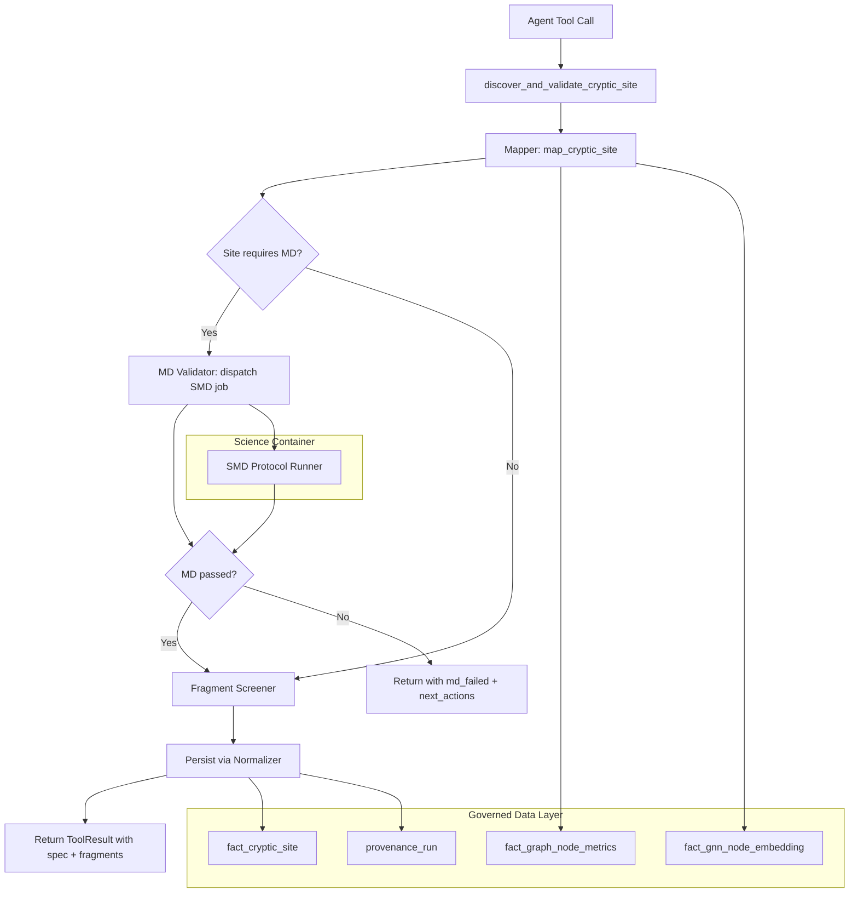

# Design Document: Cryptic Binding Site Discovery System

## Overview

The Cryptic Binding Site Discovery System introduces a new agent tool family (`cryptic`) that discovers, validates, and characterizes non-pocket binding sites in proteins. It follows the same architectural patterns as existing Tokyo Eye tools: async functions returning `ToolResult`, reads via governed views/fact tables, writes via the Normalizer, and heavy computation dispatched to the Science Container.

The system is built as three composable stages:
1. **Mapper** — identifies cryptic regions from Tokyo Eye signals
2. **MD Validator** — dispatches SMD protocols to validate physical plausibility
3. **Fragment Screener** — evaluates candidate molecules against validated constraints

Each stage is independently testable and callable, with the main `discover_and_validate_cryptic_site` tool orchestrating them as a pipeline.

## v1 Scope

**Ships in v1.0:**
- Full `CrypticBindingSiteSpec` schema (all site_types defined, extensible)
- Mapper with multi-signal scoring for `cryptic_wedge` and `structural_stent`
- Site type inference heuristic (v1 rule-based, returns inferred type + confidence score)
- MD Validator with **synchronous** execution (dispatch + wait via `wait_for_science_job`)
- SMD_three_phase protocol implementation (primary), SMD_stent_stabilization (secondary)
- Basic fragment screener (geometric filter + pharmacophore scoring, built-in fragment set)
- Agent tool registration, ToolResult integration, ViewportDirectives
- Persistence via Normalizer, provenance tracking
- Property-based test suite (all 17 properties)

**Deferred to v1.1+:**
- `dynamic_lid`, `allosteric_clamp`, `strain_relief_insert` full MD protocols (use fallback to three_phase in v1)
- Asynchronous fire-and-poll MD execution model
- Advanced fragment scoring (uncertainty-weighted, strain energy penalties)
- External fragment library integration (Enamine REAL, etc.)
- Agent-driven proposal of new site_types
- Confidence-weighted site type inference with ML

## Architecture



## Components and Interfaces

### 1. CrypticBindingSiteSpec (Pydantic Model)

Location: `science/dtie/common/cryptic_payloads.py`

This is the core data model — the "language" for describing cryptic sites. It follows the same pattern as `GNNOutputPayload` and `Phase3PersistencePayload`.

```python
from enum import Enum
from pydantic import BaseModel, Field
from typing import Any

class SiteType(str, Enum):
    CRYPTIC_WEDGE = "cryptic_wedge"
    STRUCTURAL_STENT = "structural_stent"
    DYNAMIC_LID = "dynamic_lid"
    ALLOSTERIC_CLAMP = "allosteric_clamp"
    STRAIN_RELIEF_INSERT = "strain_relief_insert"

class PharmacophoreAnchor(BaseModel):
    residue_id: str
    residue_name: str
    feature: str  # e.g., "aromatic_ring_centroid", "hbond_donor"
    role: str     # e.g., "pi_pi_wedge_anchor", "hbond_stabilizer"
    uncertainty_epistemic: float
    cone_depth: float
    strain_signal: str  # "LOW", "MODERATE", "HIGH", "EXTREME"

class DisplacementTarget(BaseModel):
    residue_id: str
    residue_name: str
    feature: str  # e.g., "sidechain_centroid_Cb"
    role: str     # e.g., "primary_displacement", "secondary_lateral"
    uncertainty_epistemic: float
    cone_depth: float
    strain_signal: str

class BedrockNode(BaseModel):
    residue_id: str
    graph_degree: int
    betweenness_centrality: float
    clustering_coefficient: float
    is_bridge: bool
    role: str = "load_bearing_node"

class GeometricConstraints(BaseModel):
    boundary_type: str = "hybrid_steric_hull"
    exclusion_hull_padding_angstrom: float = 2.0
    inclusion_vector_distance_angstrom: float = 4.8
    allowed_steric_clash_targets: list[str] = Field(default_factory=list)
    bounding_sphere_radius_angstrom: float | None = None
    centroid_spacing: dict[str, str] = Field(default_factory=dict)
    surface_accessibility: str = "ZERO"
    strain_energy_proxy: str = ""

class FalsifiablePrediction(BaseModel):
    prediction_id: str
    statement: str
    test_tool: str
    threshold: str
    status: str = "untested"  # "untested", "passed", "failed"

class MDValidationState(BaseModel):
    required: bool = True
    protocol: str = "SMD_three_phase"
    engine: str = "OpenMM"
    status: str = "pending"  # "pending", "running", "passed", "failed", "timeout"
    job_id: str | None = None
    work_kcal_mol: float | None = None
    duration_ms: int | None = None
    notes: str = ""

class CrypticBindingSiteSpec(BaseModel):
    schema_version: str = "1.1"
    site_id: str
    structure_id: str
    chain: str
    residue_ids: list[str]
    site_type: SiteType
    zone_classification: str
    accessibility_mode: str
    pharmacophore_anchors: dict[str, list[PharmacophoreAnchor]] = Field(default_factory=dict)
    displacement_targets: list[DisplacementTarget] = Field(default_factory=list)
    bedrock_clique: list[BedrockNode] = Field(default_factory=list)
    geometric_constraints: GeometricConstraints = Field(default_factory=GeometricConstraints)
    fragment_screening_profile: dict[str, Any] = Field(default_factory=dict)
    md_validation: MDValidationState = Field(default_factory=MDValidationState)
    falsifiable_predictions: list[FalsifiablePrediction] = Field(default_factory=list)
    extension_fields: dict[str, Any] = Field(default_factory=dict)

    def requires_md_validation(self) -> bool:
        return self.site_type in {
            SiteType.CRYPTIC_WEDGE,
            SiteType.STRUCTURAL_STENT,
            SiteType.DYNAMIC_LID,
            SiteType.ALLOSTERIC_CLAMP,
        }

    def get_md_protocol(self) -> str:
        protocol_map = {
            SiteType.CRYPTIC_WEDGE: "SMD_three_phase",
            SiteType.STRUCTURAL_STENT: "SMD_stent_stabilization",
            SiteType.DYNAMIC_LID: "SMD_lid_restraint",
            SiteType.ALLOSTERIC_CLAMP: "SMD_clamp_stabilization",
            SiteType.STRAIN_RELIEF_INSERT: "SMD_strain_relief",
        }
        return protocol_map.get(self.site_type, "SMD_three_phase")
```

Note: `md_validation` is a first-class typed field (not nested inside a generic `validation_metrics` dict). This makes it type-safe and directly accessible. The `falsifiable_predictions` list also lives at the top level of the spec rather than nested.

### 2. Mapper Module

Location: `agent/tools/cryptic/mapper.py`

Reads from: `fact_gnn_node_embedding`, `fact_graph_node_metrics`, `fact_graph_edge`

```python
async def map_cryptic_site(
    structure_id: str,
    seed_residues: list[str],
    site_type: SiteType | None = None,
    uncertainty_threshold: float = 9.5,
    cone_depth_threshold: float = 6.0,
    db: Any = None,
) -> CrypticBindingSiteSpec | None:
    """
    1. Fetch GNN embeddings for seed residues + spatial neighbors
    2. Filter by epistemic_uncertainty >= threshold AND cone_depth >= threshold
    3. Expand via graph edges to connected high-strain residues
    4. Classify anchors vs displacement targets vs bedrock
    5. Infer site_type if not provided
    6. Build and return CrypticBindingSiteSpec
    """
```

The Mapper uses a multi-signal scoring function:

| Signal | Source Table | Weight (v1) |
|--------|-------------|-------------|
| Epistemic uncertainty | fact_gnn_node_embedding | 0.35 |
| Cone depth | fact_gnn_node_embedding | 0.25 |
| Dehydron density (input_rho) | fact_gnn_node_embedding | 0.15 |
| Betweenness centrality | fact_graph_node_metrics | 0.15 |
| Is bridge node | fact_graph_node_metrics | 0.10 |

**Site type inference heuristic (v1):**

```python
def _infer_site_type(
    displacement_targets: list[DisplacementTarget],
    bedrock_nodes: list[BedrockNode],
    zone_flexibility: float,
) -> tuple[SiteType, float]:
    """Returns (inferred_type, confidence) where confidence is 0.0-1.0."""
    has_extreme_displacement = any(
        t.strain_signal == "EXTREME" for t in displacement_targets
    )
    high_betweenness_count = sum(
        1 for n in bedrock_nodes if n.betweenness_centrality > 0.15
    )

    if has_extreme_displacement and len(displacement_targets) >= 2:
        confidence = min(1.0, len(displacement_targets) * 0.3)
        return SiteType.CRYPTIC_WEDGE, confidence
    elif high_betweenness_count >= 3 and not has_extreme_displacement:
        confidence = min(1.0, high_betweenness_count * 0.2)
        return SiteType.STRUCTURAL_STENT, confidence
    elif zone_flexibility > 0.7:
        confidence = min(1.0, (zone_flexibility - 0.5) * 2.0)
        return SiteType.DYNAMIC_LID, confidence
    else:
        return SiteType.STRAIN_RELIEF_INSERT, 0.3  # low confidence fallback
```

### 3. MD Validator Module

Location: `agent/tools/cryptic/md_validator.py`

Dispatches to: Science Container via `start_science_job()` + `wait_for_science_job()`

In v1, execution is **synchronous** — the tool dispatches and waits for the result within a single call. The `wait_for_science_job` utility handles polling internally with a configurable timeout.

```python
async def validate_cryptic_site_md(
    spec: CrypticBindingSiteSpec,
    force: bool = False,
    timeout_seconds: int = 1800,
    db: Any = None,
) -> dict[str, Any]:
    """
    1. Check if MD is required (or forced)
    2. Determine protocol from site_type
    3. Dispatch async Science_Job via start_science_job()
    4. Wait for completion via wait_for_science_job() (synchronous in v1)
    5. Evaluate falsifiable predictions against output
    6. Return structured result with status + metrics
    """
```

**Protocol dispatch mapping:**

| Site Type | Protocol | Success Criteria (default) |
|-----------|----------|---------------------------|
| cryptic_wedge | SMD_three_phase | work < 25 kcal/mol |
| structural_stent | SMD_stent_stabilization | strain_delta < -1.5 |
| dynamic_lid | SMD_lid_restraint | loop_rmsd_reduction > 30% |
| allosteric_clamp | SMD_clamp_stabilization | domain_distance_var < 1.0 Å |
| strain_relief_insert | SMD_strain_relief | local_strain_drop > 20% |

The MD Validator dispatches using the existing `start_science_job()` pattern:

```python
from agent.tools.science_dispatch import start_science_job, get_science_job_status

job = start_science_job(
    module="science.dtie.cryptic.smd_runner",
    args=["--spec-json", spec_json_path, "--protocol", protocol],
    timeout=timeout_seconds,
    job_type="cryptic_md_validation",
    structure_id=spec.structure_id,
)
```

### 4. Fragment Screener Module

Location: `agent/tools/cryptic/fragment_screener.py`

```python
async def screen_fragments(
    spec: CrypticBindingSiteSpec,
    max_candidates: int = 20,
    compound_database: str = "built_in_fragments",
    db: Any = None,
) -> list[dict[str, Any]]:
    """
    1. Extract geometric envelope from spec.geometric_constraints
    2. Load fragment library (pluggable: built-in, Enamine REAL, custom)
    3. Filter by steric fit (bounding sphere, hull padding)
    4. Score by pharmacophore complementarity
    5. Return ranked candidates [{"smiles": ..., "score": ..., "reason": ...}]
    """
```

### 5. Agent Tool Entry Point

Location: `agent/tools/cryptic/tool.py`

```python
async def discover_and_validate_cryptic_site(
    structure_id: str,
    seed_residues: list[str],
    site_type: str | None = None,
    force_md_validation: bool = False,
    db: Any = None,
) -> ToolResult:
    """Main agent-facing tool. Returns ToolResult with stage tracking."""
```

### 6. Normalizer Payload

Location: `science/dtie/common/normalizer_payloads.py` (append)

```python
class CrypticSitePayload(BaseModel):
    """Payload for persisting cryptic binding site discoveries."""
    provenance: ProvenanceContext
    spec: CrypticBindingSiteSpec
    fragments_screened: int = 0
    top_candidates: list[dict[str, Any]] = Field(default_factory=list)
```

### 7. Tool Registration

In `agent/llm/agents.py`, add to the `research_scientist` specialist's tool family:

```python
ToolDefinition(
    name="discover_and_validate_cryptic_site",
    description="Discover and validate non-pocket / cryptic binding sites using strain, uncertainty, and topology signals. Automatically gates on MD validation for novel site types.",
    parameters={...},  # from CrypticBindingSiteSpec input schema
    handler=discover_and_validate_cryptic_site,
    family="cryptic",
)
```

## Data Models

### Database Schema (new table)

```sql
CREATE TABLE fact_cryptic_site (
    cryptic_site_id UUID PRIMARY KEY DEFAULT gen_random_uuid(),
    structure_id TEXT NOT NULL REFERENCES dim_structure(structure_id),
    run_id TEXT NOT NULL REFERENCES provenance_run(run_id),
    site_id TEXT NOT NULL,
    site_type TEXT NOT NULL,
    chain TEXT NOT NULL,
    residue_ids TEXT[] NOT NULL,
    zone_classification TEXT NOT NULL,
    accessibility_mode TEXT NOT NULL,
    spec_json JSONB NOT NULL,
    md_validation_status TEXT DEFAULT 'pending',
    md_job_id TEXT,
    fragments_screened INTEGER DEFAULT 0,
    hypothesis_status TEXT DEFAULT 'proposed',
    created_at TIMESTAMPTZ DEFAULT NOW(),
    updated_at TIMESTAMPTZ DEFAULT NOW(),
    UNIQUE(structure_id, site_id)
);

CREATE INDEX idx_cryptic_site_structure ON fact_cryptic_site(structure_id);
CREATE INDEX idx_cryptic_site_type ON fact_cryptic_site(site_type);
CREATE INDEX idx_cryptic_site_md_status ON fact_cryptic_site(md_validation_status);
```

### Governed Asset Registration

The Normalizer will register each discovery as:
```python
asset_type = "cryptic_binding_site"
asset_key = f"{structure_id}:{site_id}"
```

## File Structure

```
agent/tools/cryptic/
├── __init__.py
├── tool.py              # Main entry point (discover_and_validate_cryptic_site)
├── mapper.py            # Site detection and characterization
├── md_validator.py      # SMD dispatch and evaluation
└── fragment_screener.py # Fragment library screening

science/dtie/cryptic/
├── __init__.py
├── smd_runner.py        # CLI entry point for Science Container
└── protocols/
    ├── __init__.py
    ├── three_phase.py   # SMD_three_phase implementation
    ├── stent.py         # SMD_stent_stabilization
    ├── lid.py           # SMD_lid_restraint
    ├── clamp.py         # SMD_clamp_stabilization
    └── strain_relief.py # SMD_strain_relief

science/dtie/common/
└── cryptic_payloads.py  # CrypticBindingSiteSpec + related models
```

</text>
</invoke>

## Correctness Properties

*A property is a characteristic or behavior that should hold true across all valid executions of a system — essentially, a formal statement about what the system should do. Properties serve as the bridge between human-readable specifications and machine-verifiable correctness guarantees.*

### Property 1: Schema Round-Trip Consistency

*For any* valid `CrypticBindingSiteSpec` instance, serializing to JSON via `model_dump_json()` and deserializing back via `model_validate_json()` shall produce an object equal to the original.

**Validates: Requirements 1.4**

### Property 2: Invalid Site Type Rejection

*For any* string that is not a valid `SiteType` enum member, constructing a `CrypticBindingSiteSpec` with that string as `site_type` shall raise a Pydantic `ValidationError`.

**Validates: Requirements 1.5**

### Property 3: Schema Backward Compatibility

*For any* valid `CrypticBindingSiteSpec` serialized as JSON with fields removed (simulating an older schema_version), deserializing with the current model shall succeed by applying default values for missing optional fields.

**Validates: Requirements 1.6**

### Property 4: Mapper Threshold Filtering

*For any* set of residue embeddings with known epistemic_uncertainty and cone_depth values, the Mapper shall include only residues where both values meet or exceed their respective thresholds.

**Validates: Requirements 2.1**

### Property 5: Mapper Graph Expansion Connectivity

*For any* contact graph and seed residue set, all residues in the Mapper's expanded result shall be reachable from at least one seed residue via the graph's edge set.

**Validates: Requirements 2.2**

### Property 6: Multi-Signal Scoring Monotonicity

*For any* residue and scoring weights, increasing any single signal value (while holding others constant) shall not decrease the composite score.

**Validates: Requirements 2.3**

### Property 7: Site Type Inference Determinism

*For any* set of displacement targets and bedrock nodes with defined strain_signal and betweenness values, the `_infer_site_type` heuristic shall produce a deterministic `SiteType` that follows the documented decision tree: EXTREME displacement → wedge, high betweenness without displacement → stent, high flexibility → lid, else → strain_relief_insert.

**Validates: Requirements 2.4**

### Property 8: Graph Metrics Correctness

*For any* contact graph (as a list of edges), the computed betweenness_centrality, clustering_coefficient, degree, and is_bridge values shall match the values produced by the equivalent NetworkX computation on the same graph (with floating-point tolerance of 1e-9 for centrality metrics).

**Validates: Requirements 3.1, 3.2**

### Property 9: MD Validation Gating

*For any* `CrypticBindingSiteSpec` and any MD validation outcome, the pipeline shall proceed to fragment screening if and only if (a) MD validation passed, or (b) MD validation was not required for the site_type and force_md_validation is False.

**Validates: Requirements 4.1, 4.3, 4.4**

### Property 10: Force MD Override

*For any* `CrypticBindingSiteSpec` (including `strain_relief_insert` which normally skips MD), when `force_md_validation=True`, the MD validation step shall execute regardless of the site_type.

**Validates: Requirements 4.5**

### Property 11: Protocol Dispatch Mapping

*For any* valid `SiteType`, `get_md_protocol()` shall return the protocol name matching the documented mapping: cryptic_wedge → SMD_three_phase, structural_stent → SMD_stent_stabilization, dynamic_lid → SMD_lid_restraint, allosteric_clamp → SMD_clamp_stabilization, strain_relief_insert → SMD_strain_relief.

**Validates: Requirements 5.1**

### Property 12: Falsifiable Prediction Evaluation Completeness

*For any* `CrypticBindingSiteSpec` with N falsifiable_predictions and any MD result dict, after evaluation all N predictions shall have their `status` field updated to either "passed" or "failed" (none remain "untested").

**Validates: Requirements 5.4, 10.3**

### Property 13: Fragment Screening Monotonicity

*For any* set of fragments and geometric constraints, relaxing the constraints (increasing hull padding or bounding sphere radius) shall not decrease the number of fragments that pass the geometric filter.

**Validates: Requirements 6.1, 6.2**

### Property 14: Fragment Result Ordering

*For any* non-empty fragment screening result list, the items shall be sorted in non-increasing order by score.

**Validates: Requirements 6.3**

### Property 15: ToolResult Structural Completeness

*For any* invocation of `discover_and_validate_cryptic_site` (whether successful or failed), the returned `ToolResult` shall have: (a) `success` as a boolean, (b) `data` containing keys `spec`, `md_result`, `fragments`, `stage`, and `next_actions` when success is True, (c) `message` as a non-empty string.

**Validates: Requirements 7.2, 7.4, 8.1, 8.2**

### Property 16: Contextual Next Actions

*For any* tool result where MD validation failed, `next_actions` shall be non-empty and contain at least one suggestion referencing site_type alternatives. *For any* tool result where fragment screening yields fewer than 3 candidates, `next_actions` shall suggest trying alternative site_types.

**Validates: Requirements 8.3, 8.4, 8.5**

### Property 17: Idempotent Upsert

*For any* `CrypticBindingSiteSpec`, persisting the same spec twice (same structure_id + site_id) shall result in exactly one database row, with the second write updating rather than duplicating.

**Validates: Requirements 9.3**

## Error Handling

| Scenario | Behavior | User-Facing Message |
|----------|----------|---------------------|
| No database connection | Return `ToolResult(success=False)` immediately | "No database connection. Ensure the stack is running." |
| Structure not analyzed (no GNN data) | Return failure before mapping | "Structure {id} has no GNN results. Run the DTIE pipeline first." |
| No residues meet threshold near seeds | Mapper returns None | "No high-strain residues found near seeds {seeds}. Try relaxing thresholds or choosing different seeds." |
| MD validation timeout | Mark job "timeout", return partial | "MD validation timed out after {n}s. Partial results may be available." |
| MD validation failed | Stop pipeline, return spec with status | "MD validation failed: {reason}. Consider trying a different site_type." |
| Fragment library unavailable | Return empty fragments + warning | "Fragment library '{name}' not available. Screening skipped." |
| Science container not running | Job dispatch fails | "Science container not reachable. Is Docker running?" |

All errors follow the `ToolResult(success=False, message=...)` pattern. No exceptions propagate to the agent layer.

## Testing Strategy

### Property-Based Testing

- **Library**: Hypothesis (Python)
- **Minimum iterations**: 100 per property
- **Tag format**: `Feature: cryptic-site-discovery, Property {N}: {title}`

The following properties will be implemented as property-based tests:
- P1 (round-trip), P2 (rejection), P3 (backward compat), P4 (filtering), P5 (expansion connectivity), P6 (scoring monotonicity), P7 (inference determinism), P8 (graph metrics), P9 (gating), P10 (force override), P11 (protocol mapping), P12 (prediction evaluation), P13 (screening monotonicity), P14 (result ordering), P15 (ToolResult completeness), P16 (contextual next_actions), P17 (idempotent upsert)

### Unit Testing

Unit tests will cover:
- Specific known examples (5WHA A:78-82 wedge scenario)
- Edge cases: empty seed list, structure with no graph data, all residues below threshold
- Integration points: Normalizer payload validation, science job dispatch format
- Error conditions: missing DB, invalid parameters, science container timeout

### Test Organization

```
tests/
├── test_cryptic_schema_properties.py      # P1-P3: schema properties
├── test_cryptic_mapper_properties.py      # P4-P7: mapper properties
├── test_cryptic_graph_properties.py       # P8: graph correctness
├── test_cryptic_gating_properties.py      # P9-P12: MD gating + prediction
├── test_cryptic_screening_properties.py   # P13-P14: fragment screening
├── test_cryptic_tool_properties.py        # P15-P16: tool result
├── test_cryptic_persistence_properties.py # P17: idempotence
└── test_cryptic_unit.py                   # Unit tests + edge cases
```
