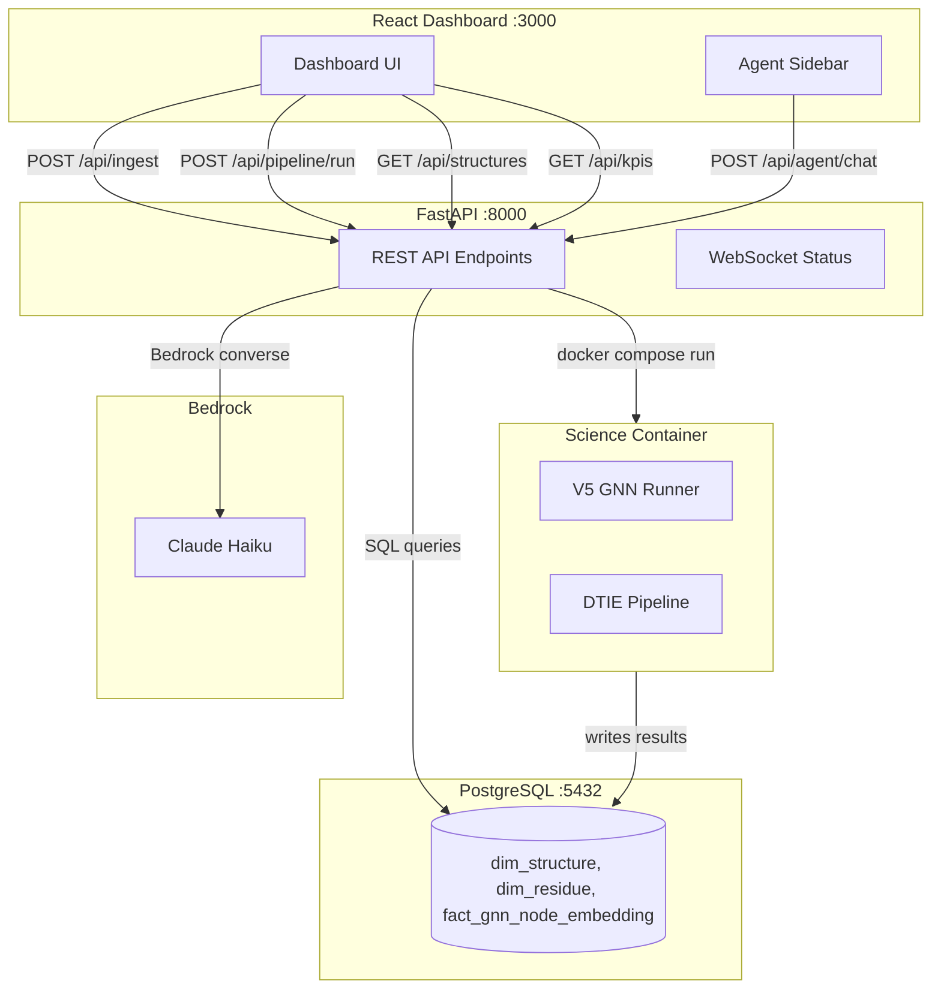

# Design Document

## Overview

The Tokyo Eye Dashboard is a React frontend that serves as the primary research workbench. It replaces the current Poincaré-only viewer with a full-featured dashboard that drives all mechanical operations (ingestion, pipeline, queries) via direct REST API calls, while the AI agent operates as a lightweight context-aware analyst sidebar.

The architecture separates concerns cleanly:
- **Frontend** → direct API calls → Backend → Science Container (for compute)
- **Agent** → receives pre-computed context → returns interpretation (no tools, no DB access)

Reference: `.kiro/specs/dashboard/mock2.html`

## Architecture



## Components and Interfaces

### Backend API (FastAPI)

New router: `agent/coordinator/routers/dashboard.py`

| Endpoint | Method | Purpose | LLM? |
|----------|--------|---------|------|
| `/api/ingest` | POST | Fetch from RCSB, parse CIF, populate DB | No |
| `/api/pipeline/run` | POST | Dispatch to science container | No |
| `/api/pipeline/status/{job_id}` | GET | Poll job progress | No |
| `/api/structures` | GET | List all structures with metadata | No |
| `/api/structures/{id}/embeddings` | GET | Per-residue Poincaré coordinates | No |
| `/api/structures/{id}/metrics` | GET | Graph topology metrics | No |
| `/api/kpis` | GET | System-wide statistics | No |
| `/api/agent/chat` | POST | Context-aware agent (lightweight) | Yes |

### Frontend (React + Vite)

Replaces the current `visualizer/frontend/` with a dashboard layout:

```
src/
  App.tsx                    # Main layout (nav + sidebar + content)
  components/
    NavBar.tsx               # Top nav with status indicators
    KPIBar.tsx               # Metrics strip
    PipelineControls.tsx     # Left sidebar (ingest, target, execute)
    ResultsTable.tsx         # Discovery ledger
    PoincareScatter.tsx      # 2D embedding scatter (Chart.js)
    ResidueBarChart.tsx      # 2D dehydron/centrality bars
    LatentSpace3D.tsx        # 3D point cloud (Three.js or Plotly)
    MolecularViewer.tsx      # 3D structure (3Dmol.js)
    AgentChat.tsx            # Chat sidebar
  lib/
    api.ts                   # REST client (fetch wrappers)
    types.ts                 # TypeScript interfaces
    context.ts               # React context for active structure
```

### Agent Chat (Lightweight Mode)

The agent receives a compact context payload with each message:

```typescript
interface AgentChatRequest {
  message: string;
  session_id: string;
  context: {
    active_structure_id: string;
    structure_title: string;
    residue_count: number;
    top_uncertainty_residues: Array<{id: string, value: number}>;
    source_leak_count: number;
    cone_depth_range: [number, number];
    current_visualization: string;  // "poincare_2d" | "molecular_3d" | etc.
  };
}
```

The agent has NO tools — just the system prompt + context + conversation history. Target: <4k tokens per exchange (context + response).

## Data Models

### API Response Types

```typescript
interface Structure {
  structure_id: string;
  pdb_id: string;
  title: string;
  resolution: number | null;
  method: string;
  source: string;
  chains: string[];
  residue_count: number;
  has_embeddings: boolean;
  last_run_id: string | null;
  ingested_at: string;
}

interface PipelineJob {
  job_id: string;
  structure_id: string;
  status: "queued" | "running" | "complete" | "failed";
  current_step: string;
  progress: number;  // 0-100
  started_at: string;
  completed_at: string | null;
  error: string | null;
}

interface EmbeddingData {
  structure_id: string;
  curvature: number;
  residues: Array<{
    residue_id: string;
    residue_index: number;
    chain_label: string;
    x: number;  // Poincaré disc x
    y: number;  // Poincaré disc y
    cone_depth: number;
    epistemic_uncertainty: number;
    aleatoric_uncertainty: number;
  }>;
}

interface KPIs {
  total_structures: number;
  mean_uncertainty: number;
  avg_inference_seconds: number;
  active_jobs: number;
  model_status: "ready" | "training" | "error";
  db_connected: boolean;
  science_container_available: boolean;
}
```

## Correctness Properties

*A property is a characteristic or behavior that should hold true across all valid executions of a system — essentially, a formal statement about what the system should do. Properties serve as the bridge between human-readable specifications and machine-verifiable correctness guarantees.*

Property 1: Ingest endpoint returns complete structure metadata
*For any* valid PDB ID submitted to `POST /api/ingest`, the response SHALL contain structure_id, pdb_id, residue_count > 0, and chains array with at least one entry
**Validates: Requirements 1.1**

Property 2: Pipeline status is monotonically progressing
*For any* pipeline job, successive calls to `GET /api/pipeline/status/{job_id}` SHALL return progress values that are non-decreasing, and status SHALL eventually reach "complete" or "failed"
**Validates: Requirements 1.3, 3.3**

Property 3: Structures endpoint reflects all ingested structures
*For any* sequence of N successful ingest calls, `GET /api/structures` SHALL return at least N entries, each with the required metadata fields
**Validates: Requirements 1.4**

Property 4: Embeddings endpoint returns correct residue count
*For any* structure with completed GNN inference, `GET /api/structures/{id}/embeddings` SHALL return a residues array whose length equals the structure's residue_count, and each entry SHALL have x, y, cone_depth, and uncertainty fields
**Validates: Requirements 1.5**

Property 5: Error responses are structured JSON
*For any* invalid input to any Backend_API endpoint, the response SHALL be JSON with "error" and "message" fields and an HTTP status code >= 400
**Validates: Requirements 1.8**

Property 6: Agent chat context includes active structure data
*For any* chat request sent while a structure is active, the request payload SHALL include context.active_structure_id, context.residue_count, and context.top_uncertainty_residues
**Validates: Requirements 5.2**

Property 7: Agent has no execution tools
*For any* agent configuration used by the dashboard chat endpoint, the tool list SHALL be empty (agent operates in pure reasoning mode)
**Validates: Requirements 5.3**

Property 8: Agent responses are bounded
*For any* agent chat response, the output token count SHALL be less than 2000
**Validates: Requirements 5.4**

Property 9: Agent conversation history persists within session
*For any* session with N messages sent, the Nth request SHALL include conversation history from the prior N-1 exchanges
**Validates: Requirements 5.6**

## Error Handling

| Scenario | Handling |
|----------|----------|
| RCSB unreachable during ingest | Return 502 with message "RCSB PDB unavailable" |
| Invalid PDB ID | Return 404 with message "Structure not found in RCSB" |
| Science container not running | Return 503 with message "Compute service unavailable" |
| Pipeline timeout (>10 min) | Mark job as "failed" with timeout message |
| DB connection lost | Return 503, frontend shows red status dot |
| Agent LLM timeout | Return partial response or "Analysis unavailable" |
| Malformed request body | Return 422 with validation error details |

## Testing Strategy

**Property-Based Testing Library:** Hypothesis (Python) for backend, fast-check (TypeScript) for frontend

**Unit Tests:**
- Each API endpoint handler tested with mock DB
- Frontend components tested with React Testing Library
- Agent context builder tested with various dashboard states

**Property Tests:**
- Backend API contracts (Properties 1-5): Generate random valid/invalid inputs, verify response schemas
- Agent contract (Properties 6-9): Generate random dashboard states, verify context payload structure and response bounds

**Integration Tests:**
- Full ingest → pipeline → query flow with real DB (docker compose)
- Frontend → Backend round-trip with test server

**Configuration:**
- Minimum 100 iterations per property test
- Tag format: **Feature: dashboard, Property {number}: {property_text}**
