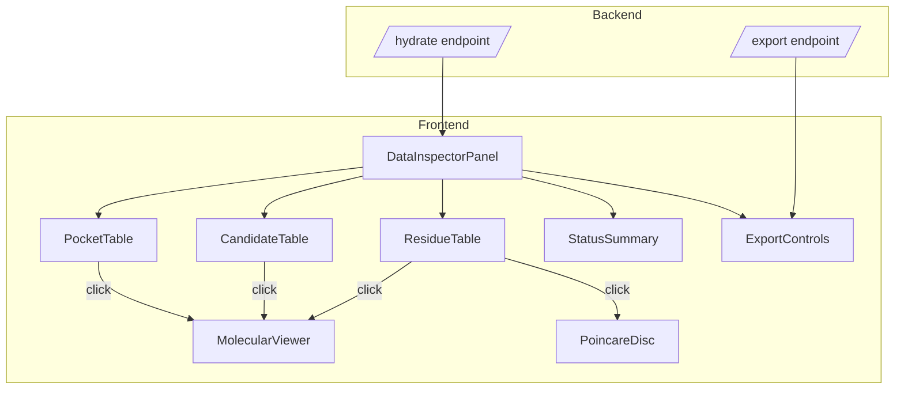

# Design Document: Data Inspector

## Overview

Adds a Data Inspector panel to the dashboard that surfaces all computed DTIE pipeline data in a browsable, searchable, exportable interface. Includes per-residue metrics tables merged from all phases, Phase 5 pharmacophore pocket discovery, Phase 6 drug candidate evaluation, new 3D viewer color modes for pockets and candidates, and comprehensive data export.

## Architecture



## Components and Interfaces

### DataInspectorPanel (New Tool Panel)

Top-level panel with four sections:

```typescript
type InspectorTab = "overview" | "residues" | "pockets" | "candidates";
```

#### Overview Tab
- Persistence status grid (8 phases, green/gray indicators with counts)
- Aggregate statistics card
- Quick links to non-empty sections

#### Residues Tab  
- Unified per-residue table with merged data from all sources
- Column visibility toggle (many columns, user picks which to show)
- Sort, filter, search controls
- Click-to-highlight

#### Pockets Tab (Phase 5)
- Pharmacophore pocket table
- Click to visualize in 3D viewer
- Show "Not computed" if phase5 not persisted

#### Candidates Tab (Phase 6)
- Drug candidate table with ADMET/selectivity filters
- Click to visualize in 3D viewer
- Summary counts card

### Merged Residue Data Model

The residue table merges data from multiple hydration sources by `residue_id`:

```typescript
interface MergedResidueRow {
  // Identity
  residue_id: string;
  chain_label: string;
  residue_index: number;
  residue_name: string | null;
  
  // Embeddings (Phase 1)
  cone_depth: number | null;
  epistemic_uncertainty: number | null;
  aleatoric_uncertainty: number | null;
  
  // Graph metrics
  betweenness: number | null;
  degree: number | null;
  clustering_coefficient: number | null;
  closeness: number | null;
  eigenvector_centrality: number | null;
  is_bridge: boolean | null;
  
  // Source leaks
  leak_score: number | null;
  
  // Resistance (derived from Phase 4)
  sensitivity_score: number | null;
  classification: "high_sensitivity" | "moderate" | "stable" | null;
  coupling_count: number | null;
  is_hinge: boolean | null;
}
```

The merge is performed client-side from hydration data using `residue_id` as the join key. Each source contributes its fields; missing data renders as "—".

### Merge Logic (Pure Function)

```typescript
function mergeResidueData(
  embeddings: ResidueEmbedding[] | null,
  graphMetrics: GraphMetricRow[] | null,
  sourceLeaks: SourceLeakRow[] | null,
  resistanceData: ResistanceResidue[] | null,
): MergedResidueRow[] {
  // Build a map keyed by residue_id
  // Fill from each source
  // Return sorted by residue_index
}
```

This is a pure function — easy to property-test.

### Pocket and Candidate Interfaces

```typescript
interface PharmacophoreRow {
  pocket_index: number;
  druggability_score: number;
  residue_count: number;
  volume_estimate: number;
  allosteric_coupling: number;
  center_x: number;
  center_y: number;
  center_z: number;
  residue_indices: string; // JSON array or comma-separated
}

interface DrugCandidateRow {
  pocket_index: number;
  combined_druggability: number;
  accessibility_score: number;
  binding_potential: number;
  admet_pass: boolean;
  selectivity_ratio: number;
  is_state_selective: boolean;
}
```

### 3D Viewer New Color Modes

Two new color modes added to `MolecularViewer`:

- **"pockets"**: Colors residues by which pocket they belong to (using Phase 5 `residue_indices`). Non-pocket residues are gray. Pocket residues colored by druggability (green → yellow → red gradient). Centroid spheres rendered for each pocket.

- **"drug_candidates"**: Colors pocket residues by `combined_druggability` score. ADMET-passed pockets get brighter coloring. Non-candidate residues are muted.

### Export Endpoint Enhancement

Expand the existing `/api/export` or add a new comprehensive endpoint:

```python
@router.get("/api/structures/{structure_id}/export")
async def export_all_data(structure_id: str, format: str = "csv"):
    """Export ALL computed data for a structure.
    
    Merges: embeddings + graph_metrics + source_leaks + resistance 
    into a per-residue CSV/JSON.
    Includes separate sections for pockets and candidates.
    Includes metadata header.
    """
```

### Agent Context Enhancement

When `active_panel === "data_inspector"`, the context payload includes:

```typescript
data_inspector: {
  phases_computed: string[];        // e.g. ["embeddings", "graph", "phase4", "phase5"]
  phase_counts: Record<string, number>;  // e.g. { embeddings: 537, pockets: 12 }
  top_druggability_pocket: number | null;  // best druggability score
  top_drug_candidate_score: number | null;
  admet_pass_rate: number | null;   // fraction of candidates passing ADMET
}
```

## Data Models

No new database tables. All data is already computed and stored in existing fact tables. The Data Inspector simply surfaces what's already in:
- `fact_gnn_node_embedding` (embeddings)
- `fact_graph_node_metrics` (graph)
- `fact_source_leak` (leaks)
- `fact_resistance_pathway` / `fact_resistance_spectral` (Phase 4)
- `fact_pharmacophore` (Phase 5)
- `fact_drug_candidate` (Phase 6)

The HydrationProvider already fetches all of this — the Data Inspector just renders it.

## Correctness Properties

*A property is a characteristic or behavior that should hold true across all valid executions of a system — essentially, a formal statement about what the system should do.*

### Property 1: Phase counts accuracy

*For any* hydration response containing computed phases, the displayed count for each phase shall match the actual number of records in that phase's data array (embeddings.residues.length, graphMetrics.length, source_leaks.length, phase5.pharmacophores.length, phase6.candidates.length).

**Validates: Requirements 1.1, 1.2, 1.4**

### Property 2: Residue merge completeness

*For any* combination of embedding data (N residues), graph metrics (M residues), source leaks (K residues), and resistance data (L residues), the merged table shall contain exactly the number of unique residue_ids across all sources, and each row shall include all available fields from every source where that residue appears.

**Validates: Requirements 2.1, 2.5**

### Property 3: Table sort correctness

*For any* merged residue table and any sortable column, sorting by that column shall produce rows in strictly non-decreasing (ascending) or non-increasing (descending) order for that column's values, with null values sorted to the end.

**Validates: Requirements 2.2, 3.3**

### Property 4: Filter correctness

*For any* merged residue table and any filter criteria (chain, uncertainty range, depth range, classification), all rows in the filtered result shall satisfy the filter predicate, and no row satisfying the predicate shall be excluded.

**Validates: Requirements 2.3, 4.3**

### Property 5: Drug candidate counts accuracy

*For any* Phase 6 data with N candidates, the summary shall report total_candidates=N, admet_passed_count equal to the number of candidates where admet_pass is true, and state_selective_count equal to the number where is_state_selective is true.

**Validates: Requirements 4.4**

### Property 6: Export completeness

*For any* structure with computed data across multiple phases, the exported CSV/JSON shall contain one row per unique residue with all available fields from all sources, plus metadata including structure_id, export timestamp, and phase completion flags. When Phase 5/6 data exists, the export shall include a separate pockets/candidates section.

**Validates: Requirements 5.2, 5.3, 5.4**

### Property 7: Data inspector context payload

*For any* dashboard state where the Data Inspector panel is active and hydration data is available, the agent context payload shall include phases_computed listing all persisted phases, phase_counts with correct record counts, and (when phase5/6 data exists) the top druggability and candidate scores.

**Validates: Requirements 7.1, 7.2**

## Error Handling

- Phase data not computed: show "Not computed — run pipeline with Phase X enabled" message
- Partial data (e.g., embeddings but no graph): merge function handles gracefully, missing columns show "—"
- Export with large dataset (5000+ residues): stream response, show progress indicator
- Hydration fails: show error state with retry button, don't crash panel
- Phase 5/6 data with malformed residue_indices: skip pocket with warning

## Testing Strategy

**Property-Based Testing Library:** Hypothesis (Python) for backend export logic; fast-check (TypeScript) or Hypothesis-equivalent for frontend merge/sort/filter if needed.

**Approach:**
- Property tests (backend): Export completeness, phase counts (Properties 1, 5, 6)
- Property tests (frontend logic): Merge correctness, sort correctness, filter correctness (Properties 2, 3, 4)
- Unit tests: 3D viewer color mode rendering with mock pocket data
- Integration tests: Full hydration → panel → export flow

**Tag format:** `Feature: data-inspector, Property {number}: {property_text}`

Each property test runs minimum 100 iterations.
