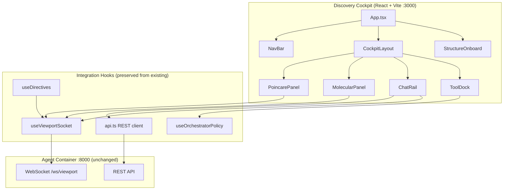
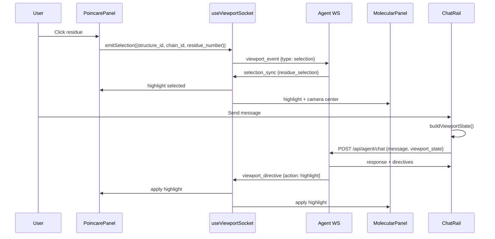

# Design Document: Discovery Cockpit Frontend

## Overview

Replaces the current `visualizer/frontend/` with a new React + Tailwind CSS implementation following the Discovery Cockpit design prototype. The build approach is: chrome first (layout, panels, navigation, chat rail), wire to live WebSocket + REST, then slot in the existing Visualizer2D/3D components. All backend protocol contracts are preserved — the frontend is a consumer of orchestrator state push, not an independent state owner.

The existing `visualizer/frontend/src/lib/` integration hooks (useViewportSocket, api.ts, useDirectives, context.ts) are preserved and adapted. The component tree is rebuilt.

## Architecture



### Component Communication Flow



## Components and Interfaces

### 1. App.tsx (Root)

```typescript
// Root component — manages global state derived from backend
interface AppState {
  structureId: string | null;
  connectionStatus: 'connected' | 'disconnected' | 'reconnecting';
  // All below derived from backend state_snapshot push
  discoveryPhase: DiscoveryPhase;
  hypothesisLifecycle: HypothesisLifecycleState;
  plannerPolicy: PlannerPolicy;
  selectedResidue: ResidueSelection | null;
}
```

### 2. CockpitLayout

```typescript
// 3-panel responsive layout with CSS Grid
interface CockpitLayoutProps {
  leftPanel: ReactNode;    // PoincarePanel
  centerPanel: ReactNode;  // MolecularPanel
  rightPanel: ReactNode;   // ChatRail
  toolDock: ReactNode;     // ToolDock (collapsible)
  navBar: ReactNode;       // NavBar
}
```

Layout grid: `grid-cols-[320px_1fr_380px]` with breakpoints collapsing to stacked at <1024px.

### 3. NavBar

```typescript
interface NavBarProps {
  structureId: string | null;
  pdbId: string | null;
  discoveryPhase: DiscoveryPhase;
  hypothesisLifecycle: HypothesisLifecycleState;
  connectionStatus: string;
  onStructureSearch: () => void;
}
```

Displays: structure badge, phase stepper (6 dots with labels), lifecycle badge, connection indicator.

### 4. PoincarePanel

```typescript
interface PoincarePanelProps {
  structureId: string;
  colorMode: PoincareColorMode;
  selectedResidue: ResidueSelection | null;
  highlightedResidues: string[];
  mobiusFocusEnabled: boolean;
  onResidueClick: (residueId: string) => void;
  onColorModeChange: (mode: PoincareColorMode) => void;
  onBrushSelect: (residueIds: string[]) => void;
}

type PoincareColorMode = 
  | 'cone_depth' | 'epistemic_uncertainty' | 'aleatoric_uncertainty'
  | 'plasticity' | 'allosteric' | 'resistance';
```

Reuses existing `PoincareScatter.tsx` canvas rendering logic, wrapped in new panel chrome with color mode selector and detail tooltip.

### 5. MolecularPanel

```typescript
interface MolecularPanelProps {
  structureId: string;
  colorMode: MolecularColorMode;
  selectedResidue: ResidueSelection | null;
  highlightedResidues: string[];
  onResidueClick: (residueId: string) => void;
  onColorModeChange: (mode: MolecularColorMode) => void;
}

type MolecularColorMode =
  | 'spectrum' | 'cone_depth' | 'epistemic' | 'aleatoric'
  | 'plasticity' | 'allosteric' | 'resistance';
```

Reuses existing `MolecularViewer.tsx` Three.js logic (cartoon representation, camera animation), wrapped in new panel chrome.

### 6. ChatRail

```typescript
interface ChatRailProps {
  structureId: string | null;
  discoveryPhase: DiscoveryPhase;
  hypothesisLifecycle: HypothesisLifecycleState;
  viewportStateBuilder: () => ViewportState;
}

interface ViewportState {
  poincare: { color_mode: string; selected_residue: string | null; brush_selection: string[] };
  viewer_3d: { color_mode: string; highlighted_residues: string[] };
  data_summary: { residue_count: number; pipeline_status: string; /* ... */ };
  active_panel: string | null;
}
```

Sends viewport_state with each message. Renders directive annotations inline. Supports streaming.

### 7. ToolDock

```typescript
interface ToolDockProps {
  allowedTools: string[];
  blockedTools: string[];
  activePanel: string | null;
  onPanelSelect: (panel: string) => void;
}
```

Collapsible sidebar showing phase-gated tools. Blocked tools shown grayed with tooltip explaining prerequisite.

**Control Console — Pipeline Audit** (`PrototypeControlConsolePanel` + `PipelineAuditReadout`):

When a structure is active, displays `geometric_readiness` (hyperbolic ready, learned κ, curvature ready) from `GET /api/structures/{id}/readiness` and the last 12 pipeline audit events from `GET /api/structures/{id}/audit`. See `docs/audit/PIPELINE_AUDIT.md`.

### 8. StructureOnboard

```typescript
interface StructureOnboardProps {
  onStructureLoaded: (structureId: string) => void;
}
```

Modal/overlay for PDB ID input, ingestion progress, and quick-select from previously ingested structures.

## Data Models

### Backend Protocol Types (preserved)

```typescript
// WebSocket messages FROM backend
type ServerMessage =
  | { type: 'state_snapshot'; payload: StateSnapshot }
  | { type: 'phase_transition'; payload: { phase: DiscoveryPhase; source: string } }
  | { type: 'hypothesis_transition'; payload: { lifecycle: HypothesisLifecycleState } }
  | { type: 'selection_sync'; payload: { residue_selection: ResidueSelection } }
  | { type: 'selection_error'; payload: { error: string } }
  | { type: 'viewport_directive'; payload: ViewportDirective };

// WebSocket messages TO backend
type ClientMessage =
  | { type: 'viewport_register'; payload: { session_id: string; structure_id: string } }
  | { type: 'viewport_event'; payload: { event_type: 'selection'; residue_selection: ResidueSelection } };

interface StateSnapshot {
  discovery_phase: DiscoveryPhase;
  hypothesis_lifecycle: HypothesisLifecycleState;
  planner_policy: PlannerPolicy;
  structure_scope: { structure_id: string; known_residues: string[] };
  selected_residue: ResidueSelection | null;
}

interface ViewportDirective {
  action: 'highlight' | 'focus' | 'set_metric' | 'clear';
  residue_ids?: string[];
  color?: string;
  style?: string;
  metric?: string;
  message?: string;  // announcement text (inspect-preview-commit)
}

interface ResidueSelection {
  structure_id: string;
  chain_id: string;
  residue_number: number;
  source: 'user' | 'agent' | 'sync';
}
```

### Tailwind Theme Extension

```javascript
// tailwind.config.js theme extension
{
  colors: {
    bg: { DEFAULT: '#07080C', surface: '#0F1117', elevated: '#161822' },
    teal: { DEFAULT: '#5DDBC2', dim: '#2A7A6B', bright: '#7EECD6' },
    magenta: { DEFAULT: '#C026D3', dim: '#7B1A85', bright: '#E040F0' },
    slate: { DEFAULT: '#1E2130', light: '#2A2E42', lighter: '#3A3F56' },
    text: { primary: '#E8E8ED', secondary: '#9CA3AF', muted: '#6B7280' },
  }
}
```

## Correctness Properties

*A property is a characteristic or behavior that should hold true across all valid executions of a system — essentially, a formal statement about what the system should do. Properties serve as the bridge between human-readable specifications and machine-verifiable correctness guarantees.*

### Property 1: State derivation from backend

*For any* state_snapshot message received from the backend, the rendered discovery phase indicator, hypothesis lifecycle badge, and tool dock availability SHALL exactly match the values in the snapshot. The frontend SHALL NOT display a phase or lifecycle that was not pushed by the backend.

**Validates: Requirements 5.1, 5.2, 5.6**

### Property 2: Selection sync round-trip

*For any* residue click event in any viewport, the selection SHALL propagate through the backend and result in all viewports highlighting the same canonical residue. The residue highlighted in the Poincaré disc and the residue highlighted in the 3D viewer SHALL have the same (structure_id, chain_id, residue_number).

**Validates: Requirements 6.1, 6.2, 6.3**

### Property 3: Viewport state payload completeness

*For any* chat message sent, the viewport_state payload SHALL contain all required fields (poincare.color_mode, poincare.selected_residue, viewer_3d.color_mode, viewer_3d.highlighted_residues, data_summary, active_panel). No required field SHALL be undefined (nullable fields may be null).

**Validates: Requirements 4.1, 8.4**

### Property 4: Directive application correctness

*For any* viewport_directive received with action `highlight`, the specified residue_ids SHALL be visually distinguished in both the Poincaré disc and 3D viewer. *For any* directive with action `set_metric`, the Poincaré color mode SHALL change to the specified metric.

**Validates: Requirements 2.4, 2.5, 3.2, 3.3**

### Property 5: Tool dock phase gating

*For any* backend-pushed PlannerPolicy, the tool dock SHALL show exactly the tools in `allowed_tools` as enabled and the tools in `blocked_tools` as disabled. No tool outside these lists SHALL appear in the dock.

**Validates: Requirements 5.3**

### Property 6: Reconnection state recovery

*For any* WebSocket disconnection followed by reconnection, the frontend SHALL display the correct state within one render cycle of receiving the reconnection state_snapshot. The displayed state after reconnection SHALL be identical to what another client connected to the same session sees.

**Validates: Requirements 5.4, 5.5**

## Error Handling

| Scenario | Behavior |
|----------|----------|
| WebSocket disconnects | Show connection indicator, auto-reconnect with exponential backoff (1s, 2s, 4s, max 30s) |
| WebSocket reconnects | Request full state_snapshot, re-render all derived state |
| Selection references non-existent residue | Display inline error toast, do not crash viewers |
| Structure not loaded (chat attempted) | Send chat without viewport_state, no error |
| Ingestion fails (404 PDB ID) | Show error in StructureOnboard with message from backend |
| Directive targets unavailable residue | Log warning, ignore gracefully, show toast |
| Embedding data not yet available | Show Poincaré panel in loading state, rest of cockpit functional |
| API timeout | Show error toast, allow retry |

## Testing Strategy

### Property-Based Testing

Library: **fast-check** (TypeScript)

Configuration: minimum 100 runs per property.

Tag format: `// Feature: discovery-cockpit-frontend, Property N: <title>`

Strategy generators:
- `arbResidueSelection()` — generates valid (structure_id, chain_id, residue_number)
- `arbStateSnapshot()` — generates valid StateSnapshot with consistent phase/lifecycle combinations
- `arbViewportDirective()` — generates valid directives with realistic action/residue combinations
- `arbPlannerPolicy()` — generates policies with allowed/blocked tool lists from known tool names
- `arbViewportState()` — generates realistic viewport state payloads

### Unit Tests (Vitest)

- Component rendering: verify NavBar shows correct phase, ToolDock filters correctly
- Hook behavior: useViewportSocket reconnection logic, useDirectives application
- ViewportState builder: verify payload shape matches backend expectations
- Selection propagation: verify event emission format

### Integration Tests (Playwright)

- Full flow: load structure → Poincaré renders → click residue → 3D viewer highlights
- Chat: send message with viewport state → receive response → directive applied
- Reconnection: disconnect WS → reconnect → verify state restored
- Ingestion: submit PDB ID → progress shown → viewers populate

### Test Organization

```
visualizer/frontend/src/
├── lib/__tests__/
│   ├── useViewportSocket.test.ts
│   ├── useDirectives.test.ts
│   ├── viewportState.property.test.ts     # Property tests
│   └── api.test.ts
├── components/__tests__/
│   ├── NavBar.test.tsx
│   ├── ToolDock.test.tsx
│   ├── ChatRail.test.tsx
│   └── CockpitLayout.test.tsx
└── e2e/
    ├── selection-sync.spec.ts
    ├── ingestion-flow.spec.ts
    └── directive-application.spec.ts
```

## Build Approach (Implementation Order)

1. **Chrome first** — CockpitLayout, NavBar, ToolDock with mock state. Get layout + Tailwind theme working.
2. **Wire WebSocket** — Connect useViewportSocket, verify state_snapshot renders correctly in NavBar/ToolDock.
3. **Chat rail** — Port AgentChat with viewport_state builder, verify context enrichment round-trip.
4. **Slot viewers** — Mount existing PoincareScatter and MolecularViewer inside new panel chrome.
5. **Selection sync** — Wire click handlers through WS, verify cross-viewport highlighting.
6. **Directives** — Wire useDirectives to apply highlight/focus/set_metric/clear.
7. **Structure onboarding** — Build StructureOnboard component, wire to POST /api/ingest.
