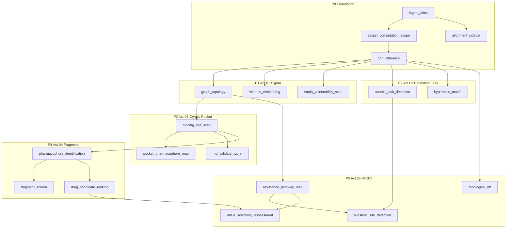

# Design: Discovery Story Pathway & Compute Job Registry

**Companion to:** `requirements.md` in this folder  
**Version:** 0.2  
**Date:** June 25, 2026

---

## 1. Overview

This design specifies the **compute job registry** — how jobs map to Discovery Story acts, resource classes, and readiness probes. It supersedes the DTIE-centric DAG in `ingest-compute-contract` §6 as the orchestration model.

**Canonical catalog in code:** `science/compute/registry.py` (validated at import). This document mirrors that registry; when they diverge, the Python module wins until the next doc sync.

### 1.1 Implementation status (June 2026)

| Area | State |
|------|--------|
| Job registry + DAG validation | **Live** — `science/compute/registry.py` |
| Pathway scheduler | **Live** — `science/compute/scheduler.py` delegates to monolith then peeled jobs |
| Atomic dispatch | **Live** — `POST /compute/jobs/{job_id}` → `science/compute/runner_dispatch.py` |
| Act-scoped readiness | **Live** — `data/act_readiness.py`, `GET .../readiness` returns `acts`, `current_act`, `pathway` |
| Agent compute policy | **Live** — `ALLOW_AGENT_COMPUTE=false` strips pipeline/GNN tools |
| Monolith remainder | **`gnn_inference` only** — `DTIEOrchestrator._run_gnn` in `science/dtie/v5/orchestrator/pipeline.py` |
| Post-peel tail | **`buffering_atlas`** (+ allosteric when not peeled) via `POST /compute/post-source-leak-phases` |
| Act 01 Signal | **Fully atomic** — all three jobs peeled |
| Peeled atomic jobs | **15** — see list below |

**Peeled jobs** (scheduler runs via `ScienceClient.run_compute_job` after monolith):

`graph_topology`, `witness_embedding`, `strain_vulnerability_scan`, `source_leak_detection`, `hyperbolic_motifs`, `binding_site_scan`, `pocket_pharmacophore_map`, `md_validate_top_n`, `pharmacophore_identification`, `fragment_screen` (stub), `drug_candidate_ranking`, `topological_lift`, `resistance_pathway_map`, `allosteric_site_detection`

**Not yet peeled:** `gnn_inference` (GPU monolith core), `allele_selectivity_assessment` (partial, no runner). Foundation jobs (`ingest_dims`, `assign_computation_scope`, `alignment_sidecar`) run in the ingest path, not the science monolith.

**Next peel target:** `gnn_inference` → then retire or thin `DTIEOrchestrator.run()` to a compatibility shim.

---

## 2. Job registry (normative catalog)

### 2.1 Registry columns

| Column | Meaning |
|--------|---------|
| `job_id` | Stable identifier for scheduler, `pipeline_job.modules`, provenance |
| `discovery_act` | `foundation`, `signal`, `persistent_leak`, `cryptic_pocket`, `fragment`, `verdict`, or `sidecar` |
| `resource_class` | `cpu_light`, `cpu_heavy`, `gpu` |
| `priority_group` | P0–P5 (macro band) |
| `requires` | Job IDs that must complete first |
| `produces` | Artifact keys (readiness probes) |
| `tier` | 1 = required for act/pathway completion; 2 = optional (degraded) |
| `status` | `implemented`, `partial`, `planned` |
| `legacy_alias` | Former DTIE / phase name |
| `runner` | Implementation entry point (`science/compute/runners/` for peeled jobs) |
| `dispatch` | `ingest` \| `monolith` \| `atomic` \| `planned` — how onboard runs the job today |

### 2.2 Full job table

Synced with `science/compute/registry.py` as of June 2026.

| job_id | discovery_act | resource_class | P | requires | produces | tier | status | legacy_alias | runner / dispatch |
|--------|---------------|----------------|---|----------|----------|------|--------|--------------|-------------------|
| `ingest_dims` | foundation | cpu_light | P0 | — | `dims` | 1 | implemented | ingest-full | `science/api/routers/ingest.py` / ingest |
| `assign_computation_scope` | foundation | cpu_light | P0 | `ingest_dims` | `scope` | 1 | implemented | — | ingest path / ingest |
| `alignment_sidecar` | sidecar | cpu_light | P0 | `ingest_dims` | `alignment` | 2 | implemented | — | alignment worker / ingest |
| `gnn_inference` | foundation | gpu | P0 | `assign_computation_scope` | `gnn_hyp`, `gnn_euc` | 1 | implemented | `gnn_inference_v6` | `V6GNNRunner` / **monolith** |
| `graph_topology` | signal | cpu_heavy | P1 | `gnn_inference` | `graph` | 1 | implemented | Phase 3 graph | `runners/graph_topology.py` / **atomic** |
| `witness_embedding` | signal | cpu_heavy | P1 | `gnn_inference` | `witness_embedding` | 1 | implemented | `phase1_witness_embedding` | `runners/witness_embedding.py` / **atomic** |
| `strain_vulnerability_scan` | signal | cpu_heavy | P1 | `gnn_inference` | `strain_vulnerability` | 1 | implemented | `phase2_vulnerability_scan` | `runners/strain_vulnerability_scan.py` / **atomic** |
| `source_leak_detection` | persistent_leak | cpu_light | P2 | `gnn_inference` | `source_leaks` | 1 | implemented | `dtie_core` | `runners/source_leak_detection.py` / **atomic** |
| `hyperbolic_motifs` | persistent_leak | cpu_heavy | P2 | `gnn_inference` | `motifs` | 2 | implemented | — | `runners/hyperbolic_motifs.py` + `motifs/discovery.py` / **atomic** |
| `binding_site_scan` | cryptic_pocket | cpu_heavy | P3 | `gnn_inference`, `graph_topology` | `binding_scan` | 1 | implemented | Scan_Phase | `runners/binding_site_scan.py` / **atomic** |
| `pocket_pharmacophore_map` | cryptic_pocket | cpu_light | P3 | `binding_site_scan` | `pocket_pharmacophore` | 2 | partial | phase5 subset | `runners/pocket_pharmacophore_map.py` / **atomic** |
| `md_validate_top_n` | cryptic_pocket | gpu | P3 | `binding_site_scan` | `md_validation` | 2 | partial | MD validate | `runners/md_validate_top_n.py` → `smd_runner` / **atomic** |
| `pharmacophore_identification` | fragment | cpu_heavy | P4 | `binding_site_scan` | `pharmacophores` | 2 | implemented | `phase5_pharmacophore` | `runners/pharmacophore_identification.py` / **atomic** |
| `fragment_screen` | fragment | gpu | P4 | `pharmacophore_identification` | `fragment_hits` | 2 | planned | — | `runners/fragment_screen.py` (stub) / **atomic** |
| `drug_candidate_ranking` | fragment | cpu_heavy | P4 | `pharmacophore_identification` | `drug_candidates` | 2 | partial | phase6a–6d | `runners/drug_candidate_ranking.py` / **atomic** |
| `topological_lift` | verdict | cpu_heavy | P5 | `gnn_inference` | `buffering_atlas` | 2 | implemented | `phase35_topological_lift` | `runners/topological_lift.py` / **atomic** |
| `resistance_pathway_map` | verdict | cpu_heavy | P5 | `gnn_inference`, `graph_topology` | `resistance_pathway` | 2 | implemented | `phase4_resistance_mapping` | `runners/resistance_pathway_map.py` / **atomic** |
| `allosteric_site_detection` | verdict | cpu_light | P5 | `source_leak_detection`, `resistance_pathway_map` | `allosteric_sites` | 2 | implemented | allosteric derived | `runners/allosteric_site_detection.py` / **atomic** |
| `allele_selectivity_assessment` | verdict | cpu_light | P5 | `drug_candidate_ranking`, `resistance_pathway_map` | `allele_selectivity` | 2 | partial | phase6d / ASAR | — / **monolith** (not peeled) |

**Notes:**

- Act 01 jobs (`graph_topology`, `witness_embedding`, `strain_vulnerability_scan`) are **tier 1** in the registry (scheduler failure semantics). Act-scoped readiness still treats `witness_embedding` and `strain_vulnerability` as **optional** for act `complete` vs `degraded` (`data/act_readiness.py`).
- `source_leaks` replaces artifact key `dtie_core`; probes accept both during migration.
- `binding_site_scan` persists via Normalizer (`normalize_binding_site_scan`); peeled runner wraps `run_full_structure_scan`.
- `md_validate_top_n` uses `smd_runner` only (not `compute.py` shortcuts).
- `buffering_atlas` is produced by post–source-leak monolith tail today; target is a dedicated atomic job after `topological_lift` peel is complete.
- `fragment_screen` records provenance only until fragment chemistry path is implemented.

## 3. Compute DAG



### 3.1 Parallelism rules

1. After `gnn_inference`, **P1 and P2 jobs** may run in parallel (subject to worker pool).
2. `alignment_sidecar` runs parallel to the GNN branch from `ingest_dims`.
3. `binding_site_scan` requires `graph_topology` — not just GNN.
4. GPU jobs (`gnn_inference`, `md_validate_top_n`, `fragment_screen`) share a `gpu` queue; CPU saturation must not block act 02 completion while act 03 MD waits.
5. **Act boundaries are soft for scheduling, hard for UX** — act 03 UI may show "running" while MD is pending even if scan is complete.

### 3.2 Priority groups

| Group | Acts / jobs | Scheduling intent |
|-------|-------------|-------------------|
| P0 | Foundation | Block everything until `gnn_hyp` exists |
| P1 | Signal | Viewport-usable strain/topology context |
| P2 | Persistent Leak | Source leaks for agent + briefing |
| P3 | Cryptic Pocket | Binding inventory + MD |
| P4 | Fragment | Ligand/fragment ranking (partial) |
| P5 | Verdict | Resistance, buffering, selectivity |

---

## 4. Resource classes

| Class | Typical jobs | Concurrency hint |
|-------|--------------|------------------|
| `cpu_light` | scope, leaks, alignment | High |
| `cpu_heavy` | graph, witness, scan, resistance, pharmacophore | Medium (thread pool) |
| `gpu` | GNN, MD, fragment screen | Low (1–2 per GPU) |

Scheduler pseudocode:

```python
@dataclass(frozen=True)
class ComputeJob:
    job_id: str
    discovery_act: str
    resource_class: str
    priority_group: int
    requires: frozenset[str]
    produces: frozenset[str]
    tier: int
    runner: Callable[..., Awaitable[JobResult]]


async def schedule_pathway(structure_id: str, pathway_id: str = "discovery_story") -> None:
    jobs = jobs_for_pathway(pathway_id)
    completed: set[str] = set()
    while len(completed) < len(jobs):
        runnable = [
            j for j in jobs
            if j.job_id not in completed
            and j.requires <= completed
        ]
        # Group by resource_class; dispatch parallel within class
        for batch in batch_by_resource_class(runnable):
            await asyncio.gather(*[run_job(structure_id, j) for j in batch])
            completed |= {j.job_id for j in batch}
```

---

## 5. Artifact keys & probe mapping

### 5.1 Migration aliases

| New key (target) | Legacy key | Probe table / condition |
|------------------|------------|-------------------------|
| `source_leaks` | `dtie_core` | `fact_source_leak` |
| `strain_vulnerability` | part of `dtie_phases` | `fact_phase2_vulnerability` |
| `witness_embedding` | part of `dtie_phases` | witness / persistence facts |
| `resistance_pathway` | part of `dtie_phases` | resistance facts |
| `pharmacophores` | part of `dtie_phases` | pharmacophore facts |
| `drug_candidates` | part of `dtie_phases` | drug candidate facts |
| `buffering_atlas` | part of `dtie_phases` | lift / buffering facts |
| `binding_scan` | (unchanged) | `fact_binding_site_scan` |
| `md_validation` | (unchanged) | `fact_cryptic_site.md_validation_status` |

During migration, `data/readiness.py` SHALL accept legacy keys in API responses and map internally.

### 5.2 Act → artifact checklist

| Act | Required artifacts (tier 1 target) | Optional (tier 2) |
|-----|-----------------------------------|-------------------|
| Foundation | `dims`, `scope`, `gnn_hyp` | `alignment` |
| signal | `graph` | `witness_embedding`, `strain_vulnerability` |
| persistent_leak | `source_leaks` | `motifs` |
| cryptic_pocket | `binding_scan` | `pocket_pharmacophore`, `md_validation` |
| fragment | — (deferred) | `pharmacophores`, `drug_candidates`, `fragment_hits` |
| verdict | — (tier 2 today) | `buffering_atlas`, `resistance_pathway`, `allosteric_sites`, `allele_selectivity` |

---

## 6. Provenance shape (target)

```json
{
  "run_id": "job_scan_4uj1_a1b2c3",
  "structure_id": "4uj1",
  "pathway": "discovery_story",
  "job_id": "binding_site_scan",
  "discovery_act": "cryptic_pocket",
  "code_version": "git:abc123",
  "checkpoint_sha256": "...",
  "parent_run_id": "onboard_xyz"
}
```

Retire monolithic `pipeline_name: DTIE-v5` for new runs. `parent_run_id` links jobs to onboard `computation_run_id`.

---

## 7. `pipeline_job.modules` schema

```json
{
  "job_id": "binding_site_scan",
  "discovery_act": "cryptic_pocket",
  "priority_group": 3,
  "resource_class": "cpu_heavy",
  "status": "complete",
  "artifacts_produced": ["binding_scan"],
  "provenance_run_id": "scan_4uj1_deadbeef",
  "started_at": "2026-06-25T12:00:00Z",
  "completed_at": "2026-06-25T12:01:04Z",
  "error": null
}
```

Dashboard progress UI renders **act rail** by grouping modules on `discovery_act`.

---

## 8. Readiness API extension

Add to `GET /api/structures/{id}/readiness` (backward compatible):

```python
ACT_JOB_MAP: dict[str, list[str]] = {
    "signal": ["graph_topology", "witness_embedding", "strain_vulnerability_scan"],
    "persistent_leak": ["source_leak_detection", "hyperbolic_motifs"],
    "cryptic_pocket": ["binding_site_scan", "pocket_pharmacophore_map", "md_validate_top_n"],
    "fragment": ["pharmacophore_identification", "fragment_screen", "drug_candidate_ranking"],
    "verdict": ["topological_lift", "resistance_pathway_map", "allosteric_site_detection", "allele_selectivity_assessment"],
}


def derive_act_status(act_id: str, tier1: dict, tier2: dict, modules: list) -> str:
    ...
```

`current_act` = lowest-numbered act not `complete`.

---

## 9. Peeling plan (from monolith)

| Step | Action | Status |
|------|--------|--------|
| 1 | Extract `JOB_REGISTRY` constant module | **Done** — `science/compute/registry.py` |
| 2 | Wrap orchestrator sections as atomic runners | **Done** — 15 jobs in `science/compute/runners/` |
| 3 | Scheduler: monolith + `POST /compute/jobs/{job_id}` | **Done** — `science/compute/scheduler.py` |
| 4 | Rename artifact probes + API aliases | **Done** — `data/readiness.py` |
| 5 | Act-scoped readiness fields | **Done** — `data/act_readiness.py` |
| 6 | Peel `gnn_inference` | **Pending** — last monolith science core |
| 7 | Peel `allele_selectivity_assessment` | **Pending** |
| 8 | Atomic `buffering_atlas` job (replace post-peel tail) | **Pending** |
| 9 | Remove `dtie_phases_orchestrator` stage concept | **Pending** |
| 10 | `structure_computation_run` / `stage` DB tables | **Deferred** |

`DTIEOrchestrator` remains a **compatibility façade**: `run()` executes GNN inference; peeled jobs run via the pathway scheduler. Skip flags on `PipelineConfig` (`run_graph_topology`, `run_phase2`, `detect_source_leaks`, etc.) prevent duplicate work.

## 10. Code layout (current)

```
science/compute/
    registry.py              # JOB_REGISTRY, ACT_JOB_MAP, PATHWAY_JOBS (canonical)
    scheduler.py             # Pathway executor: monolith bundle + peeled jobs
    runner_dispatch.py       # JOB_RUNNERS, PEELED_JOBS, dispatch_compute_job
    runners/                 # One module per peeled job_id
    jobs/                    # Phase logic (graph, witness, motifs, …)
    motifs/discovery.py      # Shared hyperbolic motif clustering
    gnn_loader.py            # Reconstruct GNNInferenceResult from DB
    gnn_witness_inputs.py    # Phase 1 v4 inputs from governed embeddings
data/
    readiness.py             # Artifact probes
    act_readiness.py         # derive_act_status, ACT_JOB_MAP
science/dtie/v5/orchestrator/pipeline.py   # Monolith: gnn_inference (+ skip flags)
science/dtie/ingest/orchestrator.py        # Onboard → scheduler.run_pathway
```

Runners delegate into `science/dtie/v5/...` and `science/dtie/v4/...` until a science package rename (deferred).

## 11. Testing strategy

| Test | Validates |
|------|-----------|
| `test_job_registry_dag_is_acyclic` | No cycles in requires edges |
| `test_act_signal_requires_gnn` | Hard dep |
| `test_scan_requires_graph` | binding_site_scan blocked without graph |
| `test_readiness_act_scoped_signal_complete` | Act 01 probes |
| `test_provenance_records_job_id` | No DTIE monolith name |
| `test_pathway_viewport_explore_subset` | Only P0–P2 jobs enqueued |

---

## 12. Related files (current)

| Concern | Path |
|---------|------|
| Job registry (canonical) | `science/compute/registry.py` |
| Pathway scheduler | `science/compute/scheduler.py` |
| Atomic job dispatch | `science/api/routers/compute.py` → `POST /compute/jobs/{job_id}` |
| Monolith (GNN only) | `science/dtie/v5/orchestrator/pipeline.py` |
| Ingest → pathway | `science/dtie/ingest/orchestrator.py` |
| Readiness + acts | `data/readiness.py`, `data/act_readiness.py` |
| Binding scan | `agent/tools/cryptic/scan_phase.py` (via `runners/binding_site_scan.py`) |
| Ingest contract | `docs/specs/ingest-compute-contract/` |
| Onboard UI act rail | `visualizer/frontend/src/components/onboard/` |