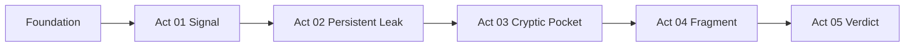

# Discovery Story Pathway

**Repository:** tokyo-eye-agenticpoincare  
**Version:** 0.1 (draft)  
**Date:** June 25, 2026  
**Status:** Normative — defines user mental model and compute orchestration ontology  
**Owner:** Platform / science architecture  
**Companion:** `design.md` (job registry, DAG, migration)

---

## 1. Purpose

Tokyo Eye teaches users a **discovery path** — a causal chain from structural strain to a load verdict. That path is encoded in the **Discovery Story** (`visualizer/frontend-refactor/Tokyo Eye - Discovery Story.html`) and must become the **authoritative vocabulary** for:

- Onboarding compute ordering and progress UI
- Structure readiness (act-scoped, not monolithic)
- Workbench briefing panels and agent context
- Job registry membership and priority groups

**DTIE is deprecated** as a user-facing term, pathway name, and orchestration concept. Former DTIE pipeline stages become **atomic compute jobs** with explicit dependencies. Pathways are composed from Discovery Story **acts**, not phase numbers.

Related normative docs:

- `docs/specs/ingest-compute-contract/requirements.md` — ingest orchestrator authority, agent policy
- `docs/specs/discovery-story-pathway/design.md` — job catalog and DAG
- `AGENTS.md` — single write path, provenance

---

## 2. Glossary

| Term | Definition |
|------|------------|
| **Discovery Story** | Interactive narrative teaching the five-act discovery path (Signal → Verdict). Cover metaphor: *a loaded spring*. |
| **Act** | One chapter of the Discovery Story. Has a question, user outcome, and required job bundle. |
| **Foundation** | Pre-act jobs (ingest, scope, GNN substrate). Not a Story act. |
| **Pathway** | Named progression through acts. Default: `discovery_story` (acts 01→05). |
| **Compute job** | Atomic, reusable unit of science work with `requires`, `produces`, `resource_class`, and `priority_group`. |
| **Artifact** | Persisted governed output probed for readiness (e.g. `source_leaks`, `binding_scan`). |
| **Act readiness** | Per-act status: `pending` \| `running` \| `complete` \| `degraded` \| `failed` \| `not_implemented`. |
| **Resource class** | Scheduler queue: `cpu_light`, `cpu_heavy`, `gpu`. |
| **Priority group** | Macro ordering band (P0–P5). Jobs in a lower group must not block completion of earlier acts unless hard-deps require it. |

---

## 3. Deprecation: DTIE

| Retired | Replacement |
|---------|-------------|
| "DTIE pipeline", "run DTIE", "DTIE phases" | Discovery Story acts + compute jobs |
| `dtie_phases_orchestrator` (monolith stage) | Individual jobs from job registry |
| `dtie_core` (artifact key) | `source_leaks` (alias retained in probes during migration) |
| `dtie_phases` (artifact key) | Act-scoped artifact keys (see design §5) |
| `pipeline_name: dtie_v5` in new provenance | `pathway: discovery_story`, `job_id: <atomic>` |
| Agent tools category "Read — DTIE" | "Read — discovery signals" (rename in follow-up) |
| UI copy "Phases 1–8", "DTIE v6" | Act titles and questions |

**Historical rows** in `provenance_run` and fact tables may retain legacy labels. **New runs** SHALL NOT introduce DTIE as a pathway or pipeline name.

---

## 4. Discovery Story acts (normative)

Each act answers one question. Acts are **user-facing**; jobs are **implementation-facing**.

### Cover (narrative only — not a compute act)

| Field | Value |
|-------|-------|
| Metaphor | *A loaded spring* |
| Role | Motivation — why the structure is worth investigating (e.g. oncogenic KRAS) |
| Compute | None |

### Act 01 — Signal

| Field | Value |
|-------|-------|
| ID | `signal` |
| Number | 01 |
| Title | Signal |
| Question | Where is it strained? |
| User outcome | User sees hyperbolic embedding, strain/vulnerability map, and topological witness context for the fold |
| Color (Story UI) | `#5DDBC2` |
| Required jobs | `graph_topology`, `witness_embedding`, `strain_vulnerability_scan` |
| Tier | Act complete when all three jobs' tier-1 artifacts exist |

### Act 02 — Persistent Leak

| Field | Value |
|-------|-------|
| ID | `persistent_leak` |
| Number | 02 |
| Title | Persistent Leak |
| Question | Which leaks hold? |
| User outcome | User sees governed source-leak residues ranked by cone depth × uncertainty |
| Color | `#DC5CE9` |
| Required jobs | `source_leak_detection` |
| Optional jobs | `hyperbolic_motifs` (tier 2 — absence → act `degraded`, not `failed`) |

### Act 03 — Cryptic Pocket

| Field | Value |
|-------|-------|
| ID | `cryptic_pocket` |
| Number | 03 |
| Title | Cryptic Pocket |
| Question | Where is the backdoor? |
| User outcome | User sees ranked binding/cryptic sites, pocket pharmacophore hints, MD validation status on top candidates |
| Color | `#5DDBC2` |
| Required jobs | `binding_site_scan` |
| Follow-on jobs | `pocket_pharmacophore_map`, `md_validate_top_n` |
| Note | Legacy Story label "Phase 4" was incorrect; pocket discovery is scan + MD, not resistance mapping |

### Act 04 — Fragment

| Field | Value |
|-------|-------|
| ID | `fragment` |
| Number | 04 |
| Title | Fragment |
| Question | What fits the lock? |
| User outcome | User sees fragment/candidate ranking by ligand efficiency against prioritized pockets |
| Color | `#ECA53A` |
| Required jobs | `pharmacophore_identification`, `drug_candidate_ranking` |
| Planned jobs | `fragment_screen` (not yet implemented — act may be `not_implemented`) |
| Status | **Partial** — Story UI exists; backend fragment screen is not production-ready |

### Act 05 — Verdict

| Field | Value |
|-------|-------|
| ID | `verdict` |
| Number | 05 |
| Title | Verdict |
| Question | Worth loading? |
| User outcome | User sees buffering atlas, resistance pathway, allele-selectivity (ASAR) — is this target worth a loaded-spring investment? |
| Color | `#DC5CE9` |
| Required jobs | `topological_lift`, `resistance_pathway_map`, `allosteric_site_detection` |
| Optional jobs | `allele_selectivity_assessment` (tier 2) |

---

## 5. Foundation (pre-act)

Foundation jobs run before Act 01. They are not Story chapters.

| Job | Question answered (internal) | Produces |
|-----|------------------------------|----------|
| `ingest_dims` | Is the structure in the governed dim layer? | `dims` |
| `assign_computation_scope` | Which chains/residues are in scope? | `scope` |
| `gnn_inference` | What is the hyperbolic substrate? | `gnn_hyp`, `gnn_euc` |
| `alignment_sidecar` | How does this structure align to family/UniProt? | `alignment` (tier 2, parallel) |

**Invariant:** No act job may start until `gnn_inference` completes (except `alignment_sidecar`, which only requires `dims`).

---

## 6. Pathways

### 6.1 Primary pathway: `discovery_story`

Default onboard pathway. Executes foundation → acts 01→05 in dependency order. Within each act, jobs may run in parallel when the DAG allows.



### 6.2 Secondary pathways (future)

| Pathway ID | Acts included | Use case |
|------------|---------------|----------|
| `viewport_explore` | Foundation + 01 + 02 | Fast onboard for embedding/leak exploration |
| `pocket_only` | Foundation + 03 | Re-scan pockets on structures with existing GNN elsewhere |
| `verdict_refresh` | 05 only | Recompute resistance/selectivity after new mutant structures |

Secondary pathways reuse the **same atomic jobs**; only act membership and tier rules differ.

---

## 7. Readiness model (act-scoped)

Global `readiness_status` (`ready` \| `degraded` \| `failed` \| `running`) is retained for backward compatibility. **New consumers** SHALL prefer act-scoped status.

### 7.1 Response shape (target)

```json
{
  "structure_id": "4uj1",
  "pathway": "discovery_story",
  "readiness_status": "degraded",
  "current_act": 3,
  "acts": {
    "signal": { "status": "complete", "jobs_complete": 3, "jobs_total": 3 },
    "persistent_leak": { "status": "complete", "jobs_complete": 1, "jobs_total": 1 },
    "cryptic_pocket": { "status": "running", "jobs_complete": 1, "jobs_total": 3 },
    "fragment": { "status": "not_implemented" },
    "verdict": { "status": "pending" }
  },
  "foundation": {
    "dims": true,
    "scope": true,
    "gnn_hyp": true,
    "alignment": true
  },
  "computation_run_id": "onboard_abc123"
}
```

### 7.2 Act status rules

| Act status | Condition |
|------------|-----------|
| `pending` | Hard dependencies for the act not satisfied |
| `running` | At least one act job in progress |
| `complete` | All required tier-1 artifacts for the act present |
| `degraded` | Required complete; optional tier-2 missing |
| `failed` | Required job failed after retries |
| `not_implemented` | Act has planned jobs with no runner (Act 04 partial) |

### 7.3 Global status derivation

1. If foundation incomplete → `running` or `failed`
2. If acts 01–03 required artifacts incomplete → not `ready`
3. If act 04 is `not_implemented` → global may still be `degraded` when 01–03 + 05 complete
4. `ready` = foundation + acts 01–03 complete + act 05 complete + no tier-1 failures

Act 04 promotion to tier-1 is a **product decision** deferred until `fragment_screen` ships.

---

## 8. Roles (unchanged authority)

Authority matches `ingest-compute-contract`:

- **Ingest orchestrator** enqueues jobs; **agent** reads only
- **Operator** may force recompute per job or full pathway

When readiness is incomplete, agent context SHALL cite **act + question** (e.g. "Cryptic Pocket — Where is the backdoor? — binding scan running"), not "DTIE phase 4".

---

## 9. UI alignment

| Surface | Alignment rule |
|---------|----------------|
| Discovery Story HTML | Act titles, questions, colors are canonical; remove DTIE phase subtitles on port |
| Workbench briefing panel | Phase tabs map 1:1 to acts (rename RESIDUE → Signal, etc.) |
| Onboarding progress | Show act rail + per-job modules, not "DTIE pipeline %" |
| Agent system prompt | Inject `current_act` and question when structure loaded |

---

## 10. Acceptance criteria

1. THE platform SHALL define exactly five discovery acts plus foundation, matching Discovery Story `actMeta` (01–05).
2. THE compute job registry SHALL list every job with `discovery_act`, `requires`, `produces`, `resource_class`, and `priority_group`.
3. NEW provenance runs for onboard compute SHALL record `pathway=discovery_story` and atomic `job_id` — not `DTIE-v5` pipeline monolith.
4. THE readiness API SHALL expose act-scoped status (additive fields; existing tier1/tier2 keys remain during migration).
5. DOCUMENTATION and UI copy SHALL NOT introduce DTIE as a pathway name after this spec is ratified.
6. ATOMIC jobs SHALL be independently re-runnable by the ingest orchestrator (idempotent upserts).
7. ACT 03 required artifact `binding_scan` SHALL be produced only by job `binding_site_scan`, not agent dispatch.
8. ACT 05 jobs SHALL NOT be required for viewport exploration pathway `viewport_explore`.

---

## 11. Migration tracker

| Item | Current state | Target |
|------|---------------|--------|
| Monolith `DTIEOrchestrator.run()` | Single `/compute/pipeline` call | Job scheduler invoking atomic runners |
| Artifact keys `dtie_core`, `dtie_phases` | `data/readiness.py` | Aliased to act artifacts; rename probes |
| Story UI "Phases 1–8" | Bundled HTML | Act questions only |
| `pipeline_job.modules` | Opaque step names | `job_id` from registry |
| Briefing panel phases | RESIDUE, TOPOLOGY, … | Signal, Persistent Leak, … |

---

## 12. Document history

| Version | Date | Change |
|---------|------|--------|
| 0.1 | 2026-06-25 | Initial pathway spec; DTIE deprecated; acts + job mapping |
