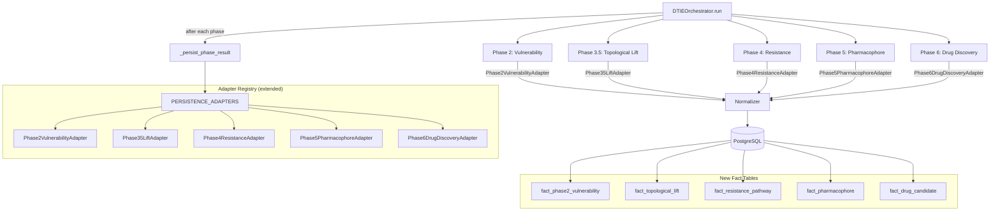

# Design Document: Full Phase Persistence Audit

## Overview

The v5 orchestrator runs phases 2, 3.5, 4, 5, and 6 but only persists source-leak detection and allosteric site results. Phases 2-6 compute rich scientific outputs (vulnerability doorways, lifted sites, resistance pathways, pharmacophores, drug candidates) that are discarded after the API response. This design closes the gap by creating persistence adapters, Normalizer methods, database tables, and orchestrator wiring for all remaining phases — following the exact pattern already proven by the source-leak and allosteric site adapters.

The approach extends the existing `PhasePersistenceAdapter` protocol and `PERSISTENCE_ADAPTERS` registry. Each phase gets a dedicated adapter, a Pydantic payload model, a Normalizer method, and a fact table with idempotent upsert semantics.

## Architecture



## Components and Interfaces

### New Adapters

All adapters follow the existing `PhasePersistenceAdapter` protocol from `science/dtie/common/phase_persistence.py`. Each lives in `science/dtie/common/adapters/`.

#### Phase2VulnerabilityAdapter (`phase2_vulnerability_adapter.py`)

```python
class Phase2VulnerabilityAdapter:
    spec = PhasePersistenceSpec(
        phase_name="phase2_vulnerability_scan",
        tier=1,
        produces_residue_level_data=True,
    )

    async def persist(self, phase_result, provenance, normalizer):
        doorways = phase_result.outputs.get("doorways", [])
        payload = Phase2VulnerabilityPayload(
            provenance=provenance,
            doorways=[
                VulnerabilityDoorway(
                    residue_id=f"{phase_result.structure_id}:{d['chain_label']}:{d['residue_index']}",
                    cone_depth=d["cone_depth"],
                    epistemic_uncertainty=d["epistemic_uncertainty"],
                    aleatoric_uncertainty=d.get("aleatoric_uncertainty", 0.0),
                )
                for d in doorways
            ],
            epistemic_median=phase_result.outputs.get("epistemic_median", 0.0),
            depth_threshold=phase_result.outputs.get("depth_threshold", 1.0),
            total_residues=phase_result.outputs.get("total_residues", 0),
        )
        return await normalizer.normalize_phase2_vulnerability(payload)
```

#### Phase35LiftAdapter (`phase35_lift_adapter.py`)

```python
class Phase35LiftAdapter:
    spec = PhasePersistenceSpec(
        phase_name="phase35_topological_lift",
        tier=2,
        produces_residue_level_data=False,
    )

    async def persist(self, phase_result, provenance, normalizer):
        sites = phase_result.outputs.get("lifted_sites", [])
        payload = TopologicalLiftPayload(
            provenance=provenance,
            lifted_sites=[
                LiftedSite(
                    site_index=s["site_index"],
                    lifted_x=s["barycenter_xyz"][0],
                    lifted_y=s["barycenter_xyz"][1],
                    lifted_z=s["barycenter_xyz"][2],
                    vertex_count=s["vertex_count"],
                    source_method=s.get("source", "unknown"),
                )
                for s in sites
            ],
            method=phase_result.outputs.get("method", "v5_native_ca_lift"),
        )
        return await normalizer.normalize_topological_lift(payload)
```

#### Phase4ResistanceAdapter (`phase4_resistance_adapter.py`)

```python
class Phase4ResistanceAdapter:
    spec = PhasePersistenceSpec(
        phase_name="phase4_resistance_mapping",
        tier=1,
        produces_residue_level_data=True,
    )

    async def persist(self, phase_result, provenance, normalizer):
        pathways = phase_result.outputs.get("pathways", [])
        spectral = phase_result.outputs.get("spectral", {})
        payload = ResistancePathwayPayload(
            provenance=provenance,
            pathways=[
                ResistancePathway(
                    source_node=p["source_node"],
                    target_node=p["target_node"],
                    source_residue=p["source_residue"],
                    target_residue=p["target_residue"],
                    effective_resistance=p["r_eff"],
                    coupling_strength=p["coupling_strength"],
                )
                for p in pathways
            ],
            lambda_2=spectral.get("lambda_2", 0.0),
            hinge_residues=spectral.get("hinge_residues", []),
            graph_nodes=phase_result.outputs.get("graph_nodes", 0),
            graph_edges=phase_result.outputs.get("graph_edges", 0),
        )
        return await normalizer.normalize_resistance_pathways(payload)
```

#### Phase5PharmacophoreAdapter (`phase5_pharmacophore_adapter.py`)

```python
class Phase5PharmacophoreAdapter:
    spec = PhasePersistenceSpec(
        phase_name="phase5_pharmacophore",
        tier=1,
        produces_residue_level_data=True,
    )

    async def persist(self, phase_result, provenance, normalizer):
        pharmacophores = phase_result.outputs.get("pharmacophores", [])
        payload = PharmacophorePayload(
            provenance=provenance,
            pharmacophores=[
                PharmacophoreRecord(
                    pocket_index=p["pocket_index"],
                    center_x=p["center_xyz"][0],
                    center_y=p["center_xyz"][1],
                    center_z=p["center_xyz"][2],
                    druggability_score=p["druggability_score"],
                    residue_count=p["residue_count"],
                    residue_indices=p["residue_indices"],
                    allosteric_coupling=p.get("allosteric_coupling", 0.0),
                    volume_estimate=p.get("volume_estimate_A3", 0.0),
                )
                for p in pharmacophores
            ],
            druggability_threshold=phase_result.outputs.get("druggability_threshold", 0.0),
        )
        return await normalizer.normalize_pharmacophores(payload)
```

#### Phase6DrugDiscoveryAdapter (`phase6_drug_discovery_adapter.py`)

```python
class Phase6DrugDiscoveryAdapter:
    spec = PhasePersistenceSpec(
        phase_name="phase6_drug_discovery",
        tier=1,
        produces_residue_level_data=True,
    )

    async def persist(self, phase_result, provenance, normalizer):
        pockets = phase_result.outputs.get("scored_pockets", [])
        payload = DrugCandidatePayload(
            provenance=provenance,
            candidates=[
                DrugCandidate(
                    pocket_index=p["pocket_index"],
                    center_x=p["center_xyz"][0],
                    center_y=p["center_xyz"][1],
                    center_z=p["center_xyz"][2],
                    accessibility_score=p["accessibility_score"],
                    binding_potential=p["binding_potential"],
                    admet_pass=p["admet_pass"],
                    selectivity_ratio=p["selectivity_ratio"],
                    is_state_selective=p["is_state_selective"],
                    combined_druggability=p["combined_druggability"],
                )
                for p in pockets
            ],
            admet_passed_count=phase_result.outputs.get("admet_passed_count", 0),
            state_selective_count=phase_result.outputs.get("state_selective_count", 0),
        )
        return await normalizer.normalize_drug_candidates(payload)
```

### Orchestrator Wiring

The orchestrator already has `_persist_phase_result()` which looks up the adapter registry. The only change needed is adding `_persist_phase_result` calls after each phase completes:

```python
# After Phase 2
if phase_results.get("phase2") and phase_results["phase2"].success:
    await self._persist_phase_result(phase_results["phase2"], run_id, gnn_run_id, config)

# After Phase 3.5
if phase_results.get("phase35") and phase_results["phase35"].success:
    await self._persist_phase_result(phase_results["phase35"], run_id, gnn_run_id, config)

# After Phase 4
if phase_results.get("phase4") and phase_results["phase4"].success:
    await self._persist_phase_result(phase_results["phase4"], run_id, gnn_run_id, config)

# After Phase 5
if phase_results.get("phase5") and phase_results["phase5"].success:
    await self._persist_phase_result(phase_results["phase5"], run_id, gnn_run_id, config)

# After Phase 6
if phase_results.get("phase6_drug_discovery") and phase_results["phase6_drug_discovery"].success:
    await self._persist_phase_result(phase_results["phase6_drug_discovery"], run_id, gnn_run_id, config)
```

### Registry Extension

`ensure_adapters_registered()` in `phase_persistence.py` gains the new adapters:

```python
def ensure_adapters_registered() -> None:
    global _registry_initialized
    if _registry_initialized:
        return

    # Existing Tier 1
    from science.dtie.common.adapters.phase3_adapter import Phase3PersistenceAdapter
    from science.dtie.common.adapters.source_leak_adapter import SourceLeakAdapter
    from science.dtie.common.adapters.allosteric_site_adapter import AllostericSiteAdapter
    # New adapters
    from science.dtie.common.adapters.phase2_vulnerability_adapter import Phase2VulnerabilityAdapter
    from science.dtie.common.adapters.phase35_lift_adapter import Phase35LiftAdapter
    from science.dtie.common.adapters.phase4_resistance_adapter import Phase4ResistanceAdapter
    from science.dtie.common.adapters.phase5_pharmacophore_adapter import Phase5PharmacophoreAdapter
    from science.dtie.common.adapters.phase6_drug_discovery_adapter import Phase6DrugDiscoveryAdapter

    register_adapter(Phase3PersistenceAdapter())
    register_adapter(SourceLeakAdapter())
    register_adapter(AllostericSiteAdapter())
    register_adapter(Phase2VulnerabilityAdapter())
    register_adapter(Phase35LiftAdapter())
    register_adapter(Phase4ResistanceAdapter())
    register_adapter(Phase5PharmacophoreAdapter())
    register_adapter(Phase6DrugDiscoveryAdapter())

    _registry_initialized = True
```

## Data Models

### New Payload Types (`science/dtie/common/normalizer_payloads.py`)

```python
# Phase 2: Vulnerability
class VulnerabilityDoorway(BaseModel):
    residue_id: str
    cone_depth: float
    epistemic_uncertainty: float
    aleatoric_uncertainty: float = 0.0

class Phase2VulnerabilityPayload(BaseModel):
    provenance: ProvenanceContext
    doorways: list[VulnerabilityDoorway]
    epistemic_median: float
    depth_threshold: float
    total_residues: int
    computed_at: datetime = Field(default_factory=_utcnow)

# Phase 3.5: Topological Lift
class LiftedSite(BaseModel):
    site_index: int
    lifted_x: float
    lifted_y: float
    lifted_z: float
    vertex_count: int
    source_method: str = "unknown"

class TopologicalLiftPayload(BaseModel):
    provenance: ProvenanceContext
    lifted_sites: list[LiftedSite]
    method: str
    computed_at: datetime = Field(default_factory=_utcnow)

# Phase 4: Resistance Pathways
class ResistancePathway(BaseModel):
    source_node: int
    target_node: int
    source_residue: int
    target_residue: int
    effective_resistance: float
    coupling_strength: float

class ResistancePathwayPayload(BaseModel):
    provenance: ProvenanceContext
    pathways: list[ResistancePathway]
    lambda_2: float
    hinge_residues: list[int]
    graph_nodes: int
    graph_edges: int
    computed_at: datetime = Field(default_factory=_utcnow)

# Phase 5: Pharmacophore
class PharmacophoreRecord(BaseModel):
    pocket_index: int
    center_x: float
    center_y: float
    center_z: float
    druggability_score: float
    residue_count: int
    residue_indices: list[int]
    allosteric_coupling: float = 0.0
    volume_estimate: float = 0.0

class PharmacophorePayload(BaseModel):
    provenance: ProvenanceContext
    pharmacophores: list[PharmacophoreRecord]
    druggability_threshold: float
    computed_at: datetime = Field(default_factory=_utcnow)

# Phase 6: Drug Candidates
class DrugCandidate(BaseModel):
    pocket_index: int
    center_x: float
    center_y: float
    center_z: float
    accessibility_score: float
    binding_potential: float
    admet_pass: bool
    selectivity_ratio: float
    is_state_selective: bool
    combined_druggability: float

class DrugCandidatePayload(BaseModel):
    provenance: ProvenanceContext
    candidates: list[DrugCandidate]
    admet_passed_count: int
    state_selective_count: int
    computed_at: datetime = Field(default_factory=_utcnow)
```

### Database Migration (`data/aurora/migrations/039_phase_persistence_tier2.sql`)

```sql
-- Phase 2: Vulnerability Doorways
CREATE TABLE IF NOT EXISTS fact_phase2_vulnerability (
    vulnerability_id    TEXT PRIMARY KEY DEFAULT gen_random_uuid()::text,
    run_id              TEXT NOT NULL REFERENCES provenance_run(run_id),
    structure_id        TEXT NOT NULL REFERENCES dim_structure(structure_id),
    residue_id          TEXT NOT NULL REFERENCES dim_residue(residue_id),
    cone_depth          DOUBLE PRECISION NOT NULL,
    epistemic_uncertainty DOUBLE PRECISION NOT NULL,
    aleatoric_uncertainty DOUBLE PRECISION DEFAULT 0.0,
    depth_threshold     DOUBLE PRECISION,
    computed_at         TIMESTAMPTZ DEFAULT NOW()
);
CREATE UNIQUE INDEX IF NOT EXISTS uq_phase2_natural ON fact_phase2_vulnerability(run_id, residue_id);
CREATE INDEX IF NOT EXISTS idx_phase2_structure ON fact_phase2_vulnerability(structure_id);
CREATE INDEX IF NOT EXISTS idx_phase2_run ON fact_phase2_vulnerability(run_id);
CREATE INDEX IF NOT EXISTS idx_phase2_residue ON fact_phase2_vulnerability(residue_id);

-- Phase 3.5: Topological Lift
CREATE TABLE IF NOT EXISTS fact_topological_lift (
    lift_id             TEXT PRIMARY KEY DEFAULT gen_random_uuid()::text,
    run_id              TEXT NOT NULL REFERENCES provenance_run(run_id),
    structure_id        TEXT NOT NULL REFERENCES dim_structure(structure_id),
    site_index          INTEGER NOT NULL,
    lifted_x            DOUBLE PRECISION,
    lifted_y            DOUBLE PRECISION,
    lifted_z            DOUBLE PRECISION,
    vertex_count        INTEGER,
    source_method       TEXT,
    computed_at         TIMESTAMPTZ DEFAULT NOW()
);
CREATE UNIQUE INDEX IF NOT EXISTS uq_lift_natural ON fact_topological_lift(run_id, site_index);
CREATE INDEX IF NOT EXISTS idx_lift_structure ON fact_topological_lift(structure_id);
CREATE INDEX IF NOT EXISTS idx_lift_run ON fact_topological_lift(run_id);

-- Phase 4: Resistance Pathways
CREATE TABLE IF NOT EXISTS fact_resistance_pathway (
    pathway_id          TEXT PRIMARY KEY DEFAULT gen_random_uuid()::text,
    run_id              TEXT NOT NULL REFERENCES provenance_run(run_id),
    structure_id        TEXT NOT NULL REFERENCES dim_structure(structure_id),
    source_node         INTEGER NOT NULL,
    target_node         INTEGER NOT NULL,
    source_residue      INTEGER NOT NULL,
    target_residue      INTEGER NOT NULL,
    effective_resistance DOUBLE PRECISION NOT NULL,
    coupling_strength   DOUBLE PRECISION NOT NULL,
    computed_at         TIMESTAMPTZ DEFAULT NOW()
);
CREATE UNIQUE INDEX IF NOT EXISTS uq_pathway_natural
    ON fact_resistance_pathway(run_id, source_node, target_node);
CREATE INDEX IF NOT EXISTS idx_pathway_structure ON fact_resistance_pathway(structure_id);
CREATE INDEX IF NOT EXISTS idx_pathway_run ON fact_resistance_pathway(run_id);

-- Phase 4: Spectral summary (one row per run)
CREATE TABLE IF NOT EXISTS fact_resistance_spectral (
    spectral_id         TEXT PRIMARY KEY DEFAULT gen_random_uuid()::text,
    run_id              TEXT NOT NULL REFERENCES provenance_run(run_id),
    structure_id        TEXT NOT NULL REFERENCES dim_structure(structure_id),
    lambda_2            DOUBLE PRECISION,
    hinge_residues      JSONB,
    graph_nodes         INTEGER,
    graph_edges         INTEGER,
    computed_at         TIMESTAMPTZ DEFAULT NOW()
);
CREATE UNIQUE INDEX IF NOT EXISTS uq_spectral_natural ON fact_resistance_spectral(run_id);

-- Phase 5: Pharmacophore
CREATE TABLE IF NOT EXISTS fact_pharmacophore (
    pharmacophore_id    TEXT PRIMARY KEY DEFAULT gen_random_uuid()::text,
    run_id              TEXT NOT NULL REFERENCES provenance_run(run_id),
    structure_id        TEXT NOT NULL REFERENCES dim_structure(structure_id),
    pocket_index        INTEGER NOT NULL,
    center_x            DOUBLE PRECISION,
    center_y            DOUBLE PRECISION,
    center_z            DOUBLE PRECISION,
    druggability_score  DOUBLE PRECISION,
    residue_count       INTEGER,
    residue_indices     JSONB,
    allosteric_coupling DOUBLE PRECISION DEFAULT 0.0,
    volume_estimate     DOUBLE PRECISION DEFAULT 0.0,
    computed_at         TIMESTAMPTZ DEFAULT NOW()
);
CREATE UNIQUE INDEX IF NOT EXISTS uq_pharmacophore_natural
    ON fact_pharmacophore(run_id, pocket_index);
CREATE INDEX IF NOT EXISTS idx_pharmacophore_structure ON fact_pharmacophore(structure_id);
CREATE INDEX IF NOT EXISTS idx_pharmacophore_run ON fact_pharmacophore(run_id);

-- Phase 6: Drug Candidates
CREATE TABLE IF NOT EXISTS fact_drug_candidate (
    candidate_id        TEXT PRIMARY KEY DEFAULT gen_random_uuid()::text,
    run_id              TEXT NOT NULL REFERENCES provenance_run(run_id),
    structure_id        TEXT NOT NULL REFERENCES dim_structure(structure_id),
    pocket_index        INTEGER NOT NULL,
    center_x            DOUBLE PRECISION,
    center_y            DOUBLE PRECISION,
    center_z            DOUBLE PRECISION,
    accessibility_score DOUBLE PRECISION,
    binding_potential   DOUBLE PRECISION,
    admet_pass          BOOLEAN,
    selectivity_ratio   DOUBLE PRECISION,
    is_state_selective  BOOLEAN,
    combined_druggability DOUBLE PRECISION,
    computed_at         TIMESTAMPTZ DEFAULT NOW()
);
CREATE UNIQUE INDEX IF NOT EXISTS uq_candidate_natural
    ON fact_drug_candidate(run_id, pocket_index);
CREATE INDEX IF NOT EXISTS idx_candidate_structure ON fact_drug_candidate(structure_id);
CREATE INDEX IF NOT EXISTS idx_candidate_run ON fact_drug_candidate(run_id);
```

## Correctness Properties

*A property is a characteristic or behavior that should hold true across all valid executions of a system — essentially, a formal statement about what the system should do. Properties serve as the bridge between human-readable specifications and machine-verifiable correctness guarantees.*

### Property 1: Universal persistence invocation

*For any* phase that completes successfully and has a registered persistence adapter, the orchestrator should invoke that adapter's `persist` method exactly once.

**Validates: Requirements 1.1, 2.1, 3.1, 4.1, 5.1, 6.1**

### Property 2: Metadata flag set on successful persistence

*For any* phase where persistence succeeds, the PhaseResult's metadata dict should contain `"persisted": True`.

**Validates: Requirements 1.3, 2.3, 3.3, 4.3, 5.3**

### Property 3: Phase 2 vulnerability round-trip

*For any* valid Phase2VulnerabilityPayload with random doorway residues, writing it through the Normalizer and then querying `fact_phase2_vulnerability` by run_id should return records with matching residue_id, cone_depth, and epistemic_uncertainty values.

**Validates: Requirements 1.2**

### Property 4: Topological lift round-trip

*For any* valid TopologicalLiftPayload with random lifted sites, writing it through the Normalizer and then querying `fact_topological_lift` by run_id should return records with matching site_index, lifted_x/y/z, and vertex_count.

**Validates: Requirements 2.2**

### Property 5: Resistance pathway round-trip

*For any* valid ResistancePathwayPayload with random pathways, writing it through the Normalizer and then querying `fact_resistance_pathway` by run_id should return records with matching source/target nodes and effective_resistance values.

**Validates: Requirements 3.2**

### Property 6: Pharmacophore round-trip

*For any* valid PharmacophorePayload with random pharmacophore records, writing it through the Normalizer and then querying `fact_pharmacophore` by run_id should return records with matching pocket_index, druggability_score, and residue_indices.

**Validates: Requirements 4.2**

### Property 7: Drug candidate round-trip

*For any* valid DrugCandidatePayload with random candidates, writing it through the Normalizer and then querying `fact_drug_candidate` by run_id should return records with matching pocket_index, combined_druggability, admet_pass, and is_state_selective.

**Validates: Requirements 5.2**

### Property 8: Idempotent upserts across all new tables

*For any* valid payload for phases 2, 3.5, 4, 5, or 6, writing it through the Normalizer N times (N >= 1) should result in exactly one record per natural key in the corresponding fact table.

**Validates: Requirements 6.1 (implicit idempotency requirement)**

### Property 9: Hydration endpoint returns persisted data

*For any* structure with persisted phase data, the hydration endpoint should return non-empty results for each phase type that has data, and a single phase query failure should not block other phase data from being returned.

**Validates: Requirements 7.1, 7.2, 7.3, 7.4, 7.5**

## Error Handling

- **Persistence failure (Tier 1, enforced):** Phase marked as failed, error in `metadata["persistence_error"]`, warning added. Pipeline continues but reports degraded.
- **Persistence failure (Tier 2, enforced):** Warning logged, phase remains successful. Tier 2 phases (Phase 3.5) don't block the pipeline.
- **Invalid residue_id:** NormalizerError raised, transaction rolled back, adapter propagates as persistence failure.
- **Database connection failure:** Normalizer's atomic transaction rolls back. Existing retry logic handles transient failures.
- **Missing adapter:** `_persist_phase_result` returns early (no-op). Validation step logs warning if phase is Tier 1.

## Testing Strategy

**Property-Based Testing Library:** Hypothesis (Python) — already in use.

**Dual approach:**
- Unit tests: Specific examples, edge cases (empty doorway lists, zero pathways, no pharmacophores)
- Property tests: Universal properties across randomly generated payloads (minimum 100 iterations)

**Test tag format:** `Feature: full-phase-persistence-audit, Property {number}: {property_text}`

**Key test areas:**
1. Round-trip persistence tests per fact table (write → read → compare)
2. Idempotency tests (write same payload twice, verify single record per natural key)
3. Orchestrator integration tests (verify `_persist_phase_result` called for each phase)
4. Hydration endpoint tests (verify all phase data returned, error isolation)
5. Registry completeness test (all 8 adapters registered after `ensure_adapters_registered()`)
