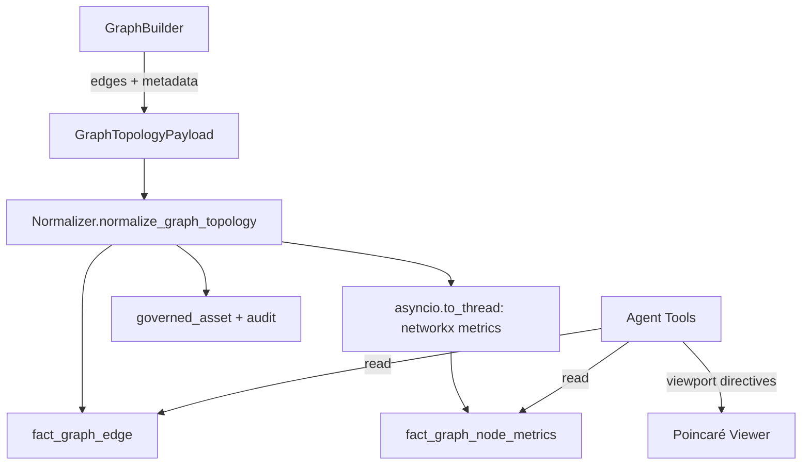

# Design Document: Graph Topology Compare

## Overview

This feature extends the Tokyo Eye platform to persist molecular contact graph topology (edges and per-node metrics) and expose agent tools for querying, comparing, and analyzing graph structure. The design follows existing patterns: writes go through the Normalizer, science code uses adapters, and tools return `ToolResult` with optional viewport directives.

The compute flow is:
```
Structure ingested → GraphBuilder builds contact graph →
  edges persisted via Normalizer (normalize_graph_topology) →
  networkx computes metrics in asyncio.to_thread →
  metrics persisted via Normalizer →
  agent queries via Graph_Tools
```

## Architecture



### Component Responsibilities

| Component | Responsibility |
|-----------|---------------|
| `data/aurora/migrations/031_graph_topology.sql` | Schema DDL |
| `science/dtie/common/normalizer_payloads.py` | Pydantic payload models |
| `data/normalizer/core.py` | Governed write path (new `normalize_graph_topology`) |
| `science/dtie/common/graph_builder.py` | Extended to emit edge data for persistence |
| `agent/tools/graph_tools.py` | 5 agent tools for querying graph data |
| `agent/llm/agents.py` | Tool registration under `GRAPH_TOOLS` |

## Components and Interfaces

### 1. Migration: `031_graph_topology.sql`

Creates two fact tables with natural-key unique indexes and foreign keys to existing dimension tables.

### 2. Payload Models (in `normalizer_payloads.py`)

```python
class GraphEdge(BaseModel):
    source_residue_id: str
    target_residue_id: str
    edge_type: str  # Literal['h_bond', 'contact', 'covalent', 'disulfide', 'salt_bridge']
    distance_angstrom: float | None = None
    hyperbolic_distance: float | None = None
    weight: float = 1.0
    metadata: dict[str, Any] | None = None

class GraphTopologyPayload(BaseModel):
    provenance: ProvenanceContext
    structure_id: str
    edges: list[GraphEdge]  # min_length=1
    computed_at: datetime = Field(default_factory=_utcnow)
```

Validation: both `source_residue_id` and `target_residue_id` must pass `validate_residue_id()`.

### 3. Normalizer Path: `normalize_graph_topology`

Follows the same pattern as `normalize_gnn_output`:
1. Ensure provenance run exists
2. Validate all residue_ids in edges
3. Begin transaction
4. Upsert edges to `fact_graph_edge`
5. Compute metrics via `asyncio.to_thread(_compute_graph_metrics, edges)`
6. Upsert metrics to `fact_graph_node_metrics`
7. Register governed assets
8. Commit
9. Log audit

The `_compute_graph_metrics` helper builds a networkx graph from the edges and computes: degree, betweenness_centrality, clustering, closeness_centrality, eigenvector_centrality, bridges (via `nx.bridges`), and conductance (via Fiedler vector approximation).

### 4. GraphBuilder Extension

`GraphBuilder.build_graph` already computes edges. We add a method `extract_edges_for_persistence` that returns a list of `GraphEdge` objects from the `ProteinGraph`, classifying edges by type (contact by default, with H-bond detection from distance + angle criteria).

### 5. Agent Tools (`agent/tools/graph_tools.py`)

Five async functions, each accepting a `db` parameter and returning `ToolResult`:

| Tool | Query Pattern |
|------|--------------|
| `get_graph_metrics` | SELECT from `fact_graph_node_metrics` with optional residue/metric filters |
| `compare_graphs` | JOIN two structures' edges and metrics, compute diffs |
| `get_hbond_network` | SELECT from `fact_graph_edge` WHERE edge_type = 'h_bond' |
| `find_graph_bridges` | SELECT from `fact_graph_node_metrics` WHERE is_bridge = TRUE |
| `get_shortest_paths` | Load edges into networkx, compute shortest_path in `asyncio.to_thread` |

All tools that return residue sets also emit `ViewportDirective` highlights.

## Data Models

### fact_graph_edge

| Column | Type | Notes |
|--------|------|-------|
| edge_id | TEXT PK | UUID |
| run_id | TEXT FK | → provenance_run |
| structure_id | TEXT FK | → dim_structure |
| source_residue_id | TEXT FK | → dim_residue |
| target_residue_id | TEXT FK | → dim_residue |
| edge_type | TEXT | h_bond, contact, covalent, disulfide, salt_bridge |
| distance_angstrom | DOUBLE PRECISION | Euclidean Cα distance |
| hyperbolic_distance | DOUBLE PRECISION | Poincaré distance (if available) |
| weight | DOUBLE PRECISION | Default 1.0 |
| metadata | JSONB | Extensible (angle, energy, etc.) |
| computed_at | TIMESTAMPTZ | |

Natural key: `(run_id, source_residue_id, target_residue_id, edge_type)`

### fact_graph_node_metrics

| Column | Type | Notes |
|--------|------|-------|
| metric_id | TEXT PK | UUID |
| run_id | TEXT FK | → provenance_run |
| structure_id | TEXT FK | → dim_structure |
| residue_id | TEXT FK | → dim_residue |
| degree | INTEGER | Node degree |
| betweenness | DOUBLE PRECISION | Betweenness centrality |
| clustering_coefficient | DOUBLE PRECISION | Local clustering |
| closeness | DOUBLE PRECISION | Closeness centrality |
| eigenvector_centrality | DOUBLE PRECISION | Eigenvector centrality |
| is_bridge | BOOLEAN | Articulation point |
| conductance | DOUBLE PRECISION | Fiedler-based conductance |
| computed_at | TIMESTAMPTZ | |

Natural key: `(run_id, residue_id)`

## Correctness Properties

*A property is a characteristic or behavior that should hold true across all valid executions of a system — essentially, a formal statement about what the system should do. Properties serve as the bridge between human-readable specifications and machine-verifiable correctness guarantees.*

### Property 1: Edge persistence round trip

*For any* valid `GraphTopologyPayload` with N edges, after calling `normalize_graph_topology`, querying `fact_graph_edge` for that run_id should return exactly N edges with matching source_residue_id, target_residue_id, edge_type, and distance values.

**Validates: Requirements 1.1**

### Property 2: Idempotent graph topology writes

*For any* valid `GraphTopologyPayload`, calling `normalize_graph_topology` twice with identical data should produce the same database state as calling it once — no duplicate rows in `fact_graph_edge` or `fact_graph_node_metrics`.

**Validates: Requirements 1.2, 2.2**

### Property 3: Invalid residue_id rejection

*For any* `GraphTopologyPayload` containing at least one edge with a residue_id that does not match the canonical format, `normalize_graph_topology` should raise `NormalizerError` and leave no partial data in `fact_graph_edge`.

**Validates: Requirements 1.3**

### Property 4: Node metrics computation correctness

*For any* valid graph (set of edges), after `normalize_graph_topology` completes, the persisted metrics in `fact_graph_node_metrics` should match independently-computed networkx metrics (degree, betweenness_centrality, clustering, closeness_centrality, eigenvector_centrality, bridges) for the same graph.

**Validates: Requirements 2.1**

### Property 5: Graph metrics query filtering

*For any* structure with persisted metrics and any subset of residue_ids or metric_types, `get_graph_metrics` should return only rows matching the filter — the result set contains no residues outside the filter and no metric columns outside the requested types.

**Validates: Requirements 3.1, 3.2, 3.3**

### Property 6: Edge diff correctness

*For any* two structures A and B with persisted edges, `compare_graphs` should return: gained = edges in B not in A (by natural key minus run_id), lost = edges in A not in B, changed = edges in both with different weights. The union of gained + lost + unchanged should equal the full edge sets.

**Validates: Requirements 4.1**

### Property 7: Metric diff with canonical alignment

*For any* two structures with persisted metrics, `compare_graphs` should return metric deltas only for residues whose canonical residue_id (chain + residue_index) appears in both structures, and each delta should equal `metric_B - metric_A`.

**Validates: Requirements 4.2, 4.3**

### Property 8: H-bond network filtering

*For any* structure with mixed edge types and any optional residue_ids filter, `get_hbond_network` should return only edges where `edge_type = 'h_bond'`, and when a residue filter is applied, every returned edge should have at least one endpoint in the specified set.

**Validates: Requirements 5.1, 5.2**

### Property 9: Bridge detection correctness

*For any* graph, the residues returned by `find_graph_bridges` should exactly match the set of articulation points computed independently by `networkx.articulation_points` on the same edge set.

**Validates: Requirements 6.1**

### Property 10: Shortest path correctness

*For any* two connected residues in a persisted graph, `get_shortest_paths` should return a valid path (each consecutive pair is connected by an edge) whose total distance equals the sum of `distance_angstrom` along the path, and whose length matches `networkx.shortest_path_length` with weight='distance_angstrom'.

**Validates: Requirements 7.1, 7.2**

### Property 11: Governance invariants

*For any* successful `normalize_graph_topology` call, the system should have: (a) a `provenance_run` record for the run_id, (b) `governed_asset` records for all created edge and metric assets, and (c) a `normalization_audit` record with status='success'.

**Validates: Requirements 9.2, 9.3, 9.4**

## Error Handling

| Scenario | Behavior |
|----------|----------|
| Invalid residue_id in edge | Reject entire batch, raise `NormalizerError`, log audit with status='validation_error' |
| Database write failure | Rollback transaction, raise `NormalizerError`, log audit with status='write_error' |
| networkx computation failure | Rollback (edges + metrics are atomic), raise `NormalizerError` |
| No edges found for structure in tool query | Return `ToolResult(success=True, data={edges: [], count: 0})` with informative message |
| No path between residues | Return empty path list with `disconnected=True` flag |
| Structure not found | Return `ToolResult(success=False, message="...")` |

## Testing Strategy

### Property-Based Testing

Library: **Hypothesis** (Python)

Each correctness property maps to a single property-based test with minimum 100 iterations. Tests use Hypothesis strategies to generate:
- Random valid `GraphTopologyPayload` instances (random residue_ids, edge types, distances)
- Random subsets for filter testing
- Pairs of graphs with known differences for diff testing

Tag format: `# Feature: graph-topology-compare, Property N: <title>`

### Unit Tests

Unit tests cover:
- Specific examples with known graph structures (e.g., a 4-residue linear chain)
- Edge cases: empty residue filter, single-node graph, fully disconnected graph
- Error conditions: invalid edge_type, missing structure_id
- Integration: mock DB verifying SQL parameters

### Test Organization

```
tests/
  test_graph_topology_normalizer.py    # Properties 1-4, 11 (normalizer path)
  test_graph_tools.py                  # Properties 5-10 (agent tools)
```

Both files use a mock `DatabaseConnection` that stores data in-memory dictionaries, allowing property tests to verify round-trip behavior without a real database.
