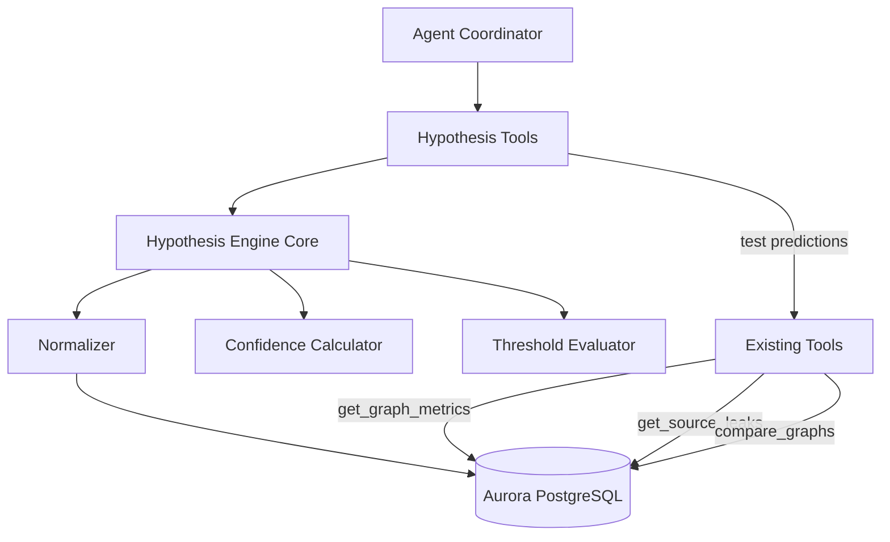
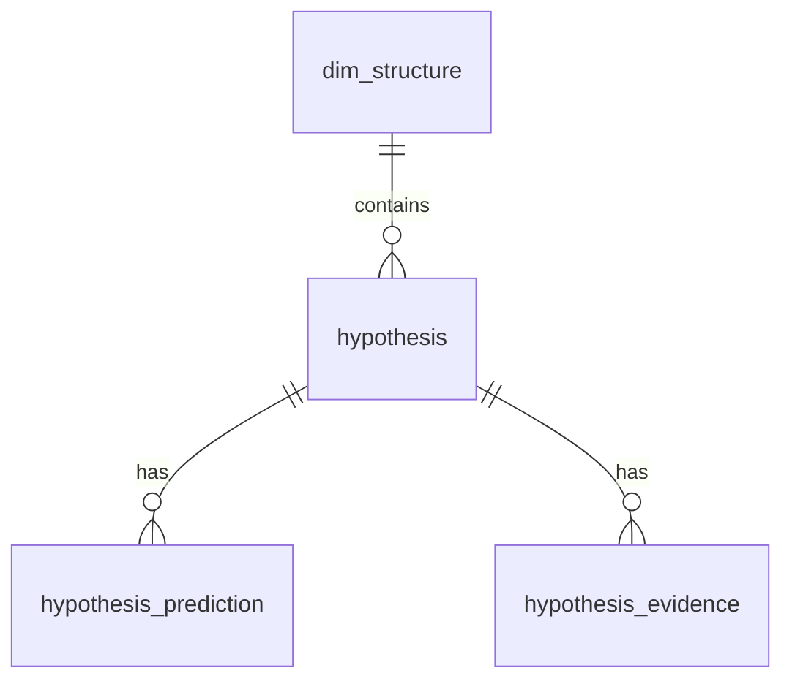

# Design Document: Hypothesis Engine

## Overview

The Hypothesis Engine adds structured scientific reasoning to the Tokyo Eye agent. It provides a data model, persistence layer, tool set, and guardrails for proposing, testing, and tracking scientific hypotheses about protein structures.

The engine integrates with the existing architecture:
- Data writes go through the Normalizer (single governed write path)
- Tools follow the existing `ToolResult` pattern from `agent/tools/dtie/tools.py`
- Hypothesis testing calls existing agent tools (graph metrics, source leaks, etc.)
- The agent's coordinator wires hypothesis tools alongside existing DTIE/data/graph tools

## Architecture



The hypothesis engine sits between the agent tools layer and the normalizer. When testing predictions, it dispatches calls to existing tools and collects results as evidence.

## Components and Interfaces

### 1. Data Models (`agent/tools/hypothesis/models.py`)

Pydantic models defining the hypothesis domain:

```python
from pydantic import BaseModel, Field
from enum import Enum
from datetime import datetime, timezone

class HypothesisStatus(str, Enum):
    PROPOSED = "proposed"
    GATHERING = "gathering"
    SUPPORTED = "supported"
    CONTRADICTED = "contradicted"
    INCONCLUSIVE = "inconclusive"

class Prediction(BaseModel):
    prediction_id: str
    statement: str
    test_tool: str | None = None
    test_params: dict | None = None
    threshold: str | None = None
    result: str | None = None
    passed: bool | None = None
    tested_at: datetime | None = None

class Evidence(BaseModel):
    evidence_id: str
    source_tool: str
    source_run_id: str | None = None
    supports: bool
    strength: float = Field(ge=0.0, le=1.0, default=0.5)
    description: str
    gathered_at: datetime = Field(default_factory=lambda: datetime.now(timezone.utc))

class Hypothesis(BaseModel):
    hypothesis_id: str
    structure_id: str
    statement: str
    mechanism: str | None = None
    predictions: list[Prediction] = Field(default_factory=list)
    evidence: list[Evidence] = Field(default_factory=list)
    status: HypothesisStatus = HypothesisStatus.PROPOSED
    confidence: float = Field(ge=0.0, le=1.0, default=0.5)
    created_by: str = "agent"
    created_at: datetime = Field(default_factory=lambda: datetime.now(timezone.utc))
    updated_at: datetime = Field(default_factory=lambda: datetime.now(timezone.utc))
```

### 2. Confidence Calculator (`agent/tools/hypothesis/confidence.py`)

Pure function for confidence calculation:

```python
def calculate_confidence(evidence: list[Evidence]) -> float:
    """Calculate confidence from evidence list.
    
    Returns supporting_strength / (supporting + contradicting).
    Returns 0.5 when no evidence or zero total strength.
    """
    if not evidence:
        return 0.5
    
    supporting = sum(e.strength for e in evidence if e.supports)
    contradicting = sum(e.strength for e in evidence if not e.supports)
    total = supporting + contradicting
    
    if total == 0:
        return 0.5
    
    return supporting / total


def apply_decay(confidence: float, days_stale: int) -> float:
    """Decay confidence toward 0.5 by 10% per day.
    
    Formula: confidence + (0.5 - confidence) * (1 - 0.9^days_stale)
    """
    if days_stale <= 0:
        return confidence
    decay_factor = 1 - (0.9 ** days_stale)
    return confidence + (0.5 - confidence) * decay_factor


def determine_status(
    confidence: float, evidence_count: int, current_status: HypothesisStatus
) -> HypothesisStatus:
    """Determine hypothesis status from confidence and evidence count.
    
    Transitions:
    - confidence > 0.7 and evidence >= 2 → supported
    - confidence < 0.3 and evidence >= 2 → contradicted
    - otherwise keep current (or gathering if testing)
    """
    if evidence_count < 2:
        return current_status
    if confidence > 0.7:
        return HypothesisStatus.SUPPORTED
    if confidence < 0.3:
        return HypothesisStatus.CONTRADICTED
    return current_status
```

### 3. Threshold Evaluator (`agent/tools/hypothesis/threshold.py`)

Evaluates prediction results against thresholds:

```python
def evaluate_threshold(threshold: str, result_value: Any) -> bool:
    """Evaluate a threshold expression against a result value.
    
    Supported formats:
    - "metric > 0.15"
    - "metric < 0.5"
    - "metric >= 10"
    - "count == 3"
    - "value != 0"
    
    Returns True if the result passes the threshold.
    """
```

### 4. Hypothesis Tools (`agent/tools/hypothesis/tools.py`)

Five tools following the existing `ToolResult` pattern:

- `propose_hypothesis` — Create with falsifiability guardrail
- `test_hypothesis` — Execute predictions via existing tools
- `get_hypotheses` — List/filter hypotheses
- `add_evidence` — Manual evidence addition
- `evaluate_confidence` — Recalculate and update status

### 5. Normalizer Integration

A new normalizer path `normalize_hypothesis` in `data/normalizer/core.py` handles writes to the hypothesis tables. Follows the same pattern as `normalize_graph_topology`:
- Provenance enforcement
- Atomic transaction
- Asset registration in `governed_asset`
- Audit trail logging

### 6. Database Migration (`032_hypothesis_engine.sql`)

Three new tables following the project's governed schema conventions.

## Data Models

### Database Schema

```sql
CREATE TABLE hypothesis (
    hypothesis_id   TEXT PRIMARY KEY,
    structure_id    TEXT NOT NULL REFERENCES dim_structure(structure_id),
    statement       TEXT NOT NULL,
    mechanism       TEXT,
    status          TEXT NOT NULL DEFAULT 'proposed',
    confidence      DOUBLE PRECISION DEFAULT 0.5,
    created_by      TEXT NOT NULL DEFAULT 'agent',
    created_at      TIMESTAMPTZ DEFAULT NOW(),
    updated_at      TIMESTAMPTZ DEFAULT NOW()
);

CREATE TABLE hypothesis_prediction (
    prediction_id   TEXT PRIMARY KEY,
    hypothesis_id   TEXT NOT NULL REFERENCES hypothesis(hypothesis_id),
    statement       TEXT NOT NULL,
    test_tool       TEXT,
    test_params     JSONB,
    threshold       TEXT,
    result          TEXT,
    passed          BOOLEAN,
    tested_at       TIMESTAMPTZ
);

CREATE TABLE hypothesis_evidence (
    evidence_id     TEXT PRIMARY KEY,
    hypothesis_id   TEXT NOT NULL REFERENCES hypothesis(hypothesis_id),
    source_tool     TEXT NOT NULL,
    source_run_id   TEXT,
    supports        BOOLEAN NOT NULL,
    strength        DOUBLE PRECISION DEFAULT 0.5,
    description     TEXT NOT NULL,
    gathered_at     TIMESTAMPTZ DEFAULT NOW()
);
```

### Indexes

- `hypothesis(structure_id)` — filter by structure
- `hypothesis(status)` — filter by status
- `hypothesis_prediction(hypothesis_id)` — join predictions
- `hypothesis_evidence(hypothesis_id)` — join evidence

### Relationships



## Correctness Properties

*A property is a characteristic or behavior that should hold true across all valid executions of a system — essentially, a formal statement about what the system should do. Properties serve as the bridge between human-readable specifications and machine-verifiable correctness guarantees.*

### Property 1: Falsifiability guardrail rejects hypotheses without predictions

*For any* hypothesis creation attempt with zero predictions, the Hypothesis_Engine should reject the creation and return an error. Conversely, for any hypothesis with at least one prediction, creation should succeed.

**Validates: Requirements 1.2**

### Property 2: Confidence calculation formula

*For any* list of Evidence objects, the confidence should equal `sum(e.strength for supporting) / (sum(e.strength for supporting) + sum(e.strength for contradicting))`. When the list is empty or total strength is zero, confidence should be 0.5.

**Validates: Requirements 3.3, 7.1, 7.2, 7.3**

### Property 3: Status transitions based on confidence and evidence count

*For any* hypothesis with confidence > 0.7 and at least 2 evidence records, the status should be `supported`. For any hypothesis with confidence < 0.3 and at least 2 evidence records, the status should be `contradicted`. For any hypothesis with fewer than 2 evidence records, the status should not transition regardless of confidence.

**Validates: Requirements 4.1, 4.2**

### Property 4: Confidence decay toward 0.5 over time

*For any* hypothesis confidence value and number of stale days > 0, the decayed confidence should be closer to 0.5 than the original. After infinite days, confidence should converge to exactly 0.5. The decay formula `confidence + (0.5 - confidence) * (1 - 0.9^days)` should be monotonically approaching 0.5.

**Validates: Requirements 4.3**

### Property 5: Threshold evaluation correctness

*For any* numeric threshold expression (e.g., "value > X") and numeric result, the evaluation should return True if and only if the comparison holds. The evaluator should be consistent with Python's numeric comparison semantics.

**Validates: Requirements 2.2**

### Property 6: Hypothesis retrieval with filtering

*For any* set of hypotheses stored for a structure, querying by structure_id should return all of them. Querying with a status filter should return exactly those hypotheses matching that status.

**Validates: Requirements 5.1, 5.2**

### Property 7: Contradiction detection on prediction flip

*For any* hypothesis with a previously-passing prediction, if re-evaluation shows the prediction now fails, contradicting evidence should be added and the confidence should decrease.

**Validates: Requirements 6.2**

### Property 8: Serialization round-trip

*For any* valid Hypothesis object (including nested Predictions and Evidence), serializing to JSON and deserializing back should produce an equivalent object.

**Validates: Requirements 8.1, 8.2**

### Property 9: Hypothesis creation produces correct defaults

*For any* valid hypothesis creation input (with at least one prediction), the resulting Hypothesis should have status `proposed`, confidence 0.5, a non-empty hypothesis_id, and the provided structure_id and statement.

**Validates: Requirements 1.1**

## Error Handling

| Error Condition | Behavior |
|---|---|
| Hypothesis created without predictions | Reject with `FalsifiabilityError` explaining the requirement |
| Invalid structure_id (not in dim_structure) | Return `ToolResult(success=False)` with message |
| Prediction references non-existent tool | Mark prediction as untestable, exclude from confidence |
| Tool call fails during testing | Log error, mark prediction untestable, continue with others |
| Database write failure | Rollback transaction, log audit, raise `NormalizerError` |
| Invalid threshold format | Return parse error, mark prediction untestable |
| Confidence out of [0, 1] range | Clamp to bounds (defensive) |

## Testing Strategy

### Property-Based Testing

Library: **Hypothesis** (Python) — already used in this project (`.hypothesis/` directory exists).

Configuration: minimum 100 examples per property test.

Each property test will be tagged with:
```python
# Feature: hypothesis-engine, Property N: <property_text>
```

### Unit Tests

Unit tests cover:
- Specific threshold expressions (e.g., "betweenness > 0.15" with value 0.23 → True)
- Edge cases: empty evidence, zero-strength evidence, single prediction
- Error paths: invalid structure_id, missing tool, malformed threshold
- Integration: propose → test → evaluate lifecycle with mock DB

### Test Organization

- `tests/test_hypothesis_confidence.py` — Property tests for confidence calculation, decay, status transitions
- `tests/test_hypothesis_threshold.py` — Property tests for threshold evaluation
- `tests/test_hypothesis_models.py` — Property tests for serialization round-trip, creation defaults, falsifiability
- `tests/test_hypothesis_tools.py` — Unit/integration tests for the tool functions
