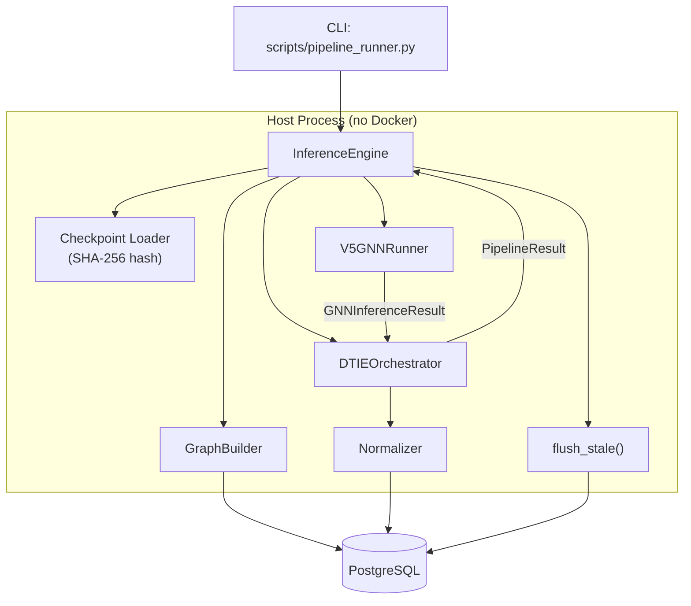

# Design Document: In-Process Pipeline Runner

## Overview

The In-Process Pipeline Runner (`InferenceEngine`) provides a host-native execution path for the DTIE v5 pipeline, eliminating container drift by running GNN inference and downstream phases in the same Python process as the developer's validated code. It wraps the existing `V5GNNRunner` and `DTIEOrchestrator`, adds checkpoint version hashing for staleness detection, and provides forced upsert/flush capabilities to clean up stale database records.

The key architectural insight: the existing `V5GNNRunner` and `DTIEOrchestrator` are already designed for in-process use (they're async Python classes). The missing piece is a unified entrypoint that:
1. Manages its own DB connection lifecycle
2. Tags all writes with the checkpoint version hash
3. Provides CLI ergonomics matching `run_pipeline_smoke.py`
4. Offers a stale-data flush utility

## Architecture



## Components and Interfaces

### InferenceEngine

The primary class. Thin orchestration layer that composes existing components.

```python
class InferenceEngine:
    def __init__(
        self,
        checkpoint_path: str = "checkpoints_v5/v5_stage4_11prot.pt",
        device: str = "cpu",
        db: DatabaseConnection | None = None,
        force_overwrite: bool = False,
    ): ...

    @property
    def checkpoint_version_hash(self) -> str:
        """SHA-256 of the checkpoint file bytes."""
        ...

    async def run(
        self,
        structure_id: str,
        source_leak_only: bool = False,
        flush_before_run: bool = False,
    ) -> PipelineResult:
        """Execute the full pipeline in-process."""
        ...
```

### flush_stale

A standalone utility function (also callable from CLI).

```python
async def flush_stale(
    db: DatabaseConnection,
    structure_id: str,
    current_checkpoint_hash: str,
) -> FlushResult:
    """Delete results where checkpoint_version_hash != current_checkpoint_hash.
    
    Returns:
        FlushResult with per-table deletion counts.
    """
    ...
```

### FlushResult

```python
@dataclass
class FlushResult:
    structure_id: str
    current_hash: str
    deleted_counts: dict[str, int]  # table_name → rows deleted
    total_deleted: int
```

### ProvenanceContext Extension

The existing `ProvenanceContext` already has a `metadata` dict. The InferenceEngine will populate:
- `metadata["checkpoint_version_hash"]` — SHA-256 of checkpoint bytes
- `checkpoint_uri` — absolute path to the checkpoint file

No schema changes needed; the metadata field is already JSONB.

## Data Models

### Checkpoint Version Tracking

The checkpoint hash is stored in two places:
1. **ProvenanceContext.metadata** — per-write, stored in `provenance_run.metadata` JSONB column
2. **PipelineResult.metadata** — returned to caller for inspection

No new tables required. The existing `provenance_run` table's `metadata` JSONB column accommodates the hash.

### Flush Query Pattern

```sql
-- Identify stale runs for a structure
SELECT run_id FROM provenance_run
WHERE structure_id = :structure_id
  AND (metadata->>'checkpoint_version_hash') IS DISTINCT FROM :current_hash;

-- Delete from fact tables by stale run_ids
DELETE FROM fact_source_leak WHERE run_id = ANY(:stale_run_ids);
DELETE FROM fact_allosteric_site_residue WHERE run_id = ANY(:stale_run_ids);
DELETE FROM fact_allosteric_site WHERE run_id = ANY(:stale_run_ids);
DELETE FROM fact_phase3_persistence WHERE run_id = ANY(:stale_run_ids);
DELETE FROM governed_asset WHERE run_id = ANY(:stale_run_ids);
```

## Correctness Properties

*A property is a characteristic or behavior that should hold true across all valid executions of a system — essentially, a formal statement about what the system should do. Properties serve as the bridge between human-readable specifications and machine-verifiable correctness guarantees.*

### Property 1: Checkpoint hash determinism

*For any* byte sequence written to a file, computing the checkpoint version hash twice on the same file SHALL produce identical SHA-256 hex digests.

**Validates: Requirements 1.3**

### Property 2: Checkpoint metadata propagation

*For any* pipeline execution with a valid checkpoint, the returned PipelineResult SHALL contain `checkpoint_version_hash` in its metadata, AND the ProvenanceContext passed to the Normalizer SHALL contain both `checkpoint_version_hash` in metadata and the absolute `checkpoint_uri`.

**Validates: Requirements 3.1, 3.2, 3.4**

### Property 3: Pipeline result completeness matches config

*For any* PipelineConfig, the returned PipelineResult SHALL contain a phase_results entry for every phase that was enabled in the config, and when `source_leak_only=True`, the result SHALL contain only GNN inference and source-leak detection phases.

**Validates: Requirements 2.2, 2.3**

### Property 4: Idempotent upsert safety

*For any* valid Normalizer payload, writing it twice with the same natural key (run_id + residue_id for nodes, run_id + site_id for sites) SHALL succeed without error and produce the same asset count on both writes.

**Validates: Requirements 4.1, 4.2**

### Property 5: Run ID uniqueness

*For any* two invocations of `InferenceEngine.run()` (even with identical structure_id and checkpoint), the generated run_ids SHALL be distinct.

**Validates: Requirements 4.3**

### Property 6: CLI argument parsing

*For any* valid combination of CLI arguments (structure, checkpoint path, device in {cpu, cuda}, flags), the argument parser SHALL produce a config object with the correct values and defaults applied for omitted arguments.

**Validates: Requirements 6.1**

### Property 7: CLI output completeness

*For any* successful pipeline execution via CLI, the JSON output SHALL contain all required fields: run_id, structure_id, checkpoint_version_hash, num_nodes, phases_run, and assets_created.

**Validates: Requirements 6.2**

### Property 8: Flush stale correctness

*For any* set of provenance_run records with mixed checkpoint_version_hash values, calling `flush_stale` with a target hash SHALL delete exactly those records whose hash does not match, and the reported deletion counts SHALL equal the actual rows removed.

**Validates: Requirements 7.1, 7.2**

### Property 9: Force overwrite removes prior results

*For any* structure with existing results in the database, running with `force_overwrite=True` SHALL result in only the new run's records existing for that structure after completion.

**Validates: Requirements 4.4**

## Error Handling

| Scenario | Behavior |
|----------|----------|
| Checkpoint file missing | `FileNotFoundError` with path |
| DB connection failure | `ConnectionError` with redacted URL (password replaced with `***`) |
| GNN inference OOM | `RuntimeError` with device info, GPU cache cleared |
| Phase failure (non-GNN) | Phase marked failed in PipelineResult, pipeline continues |
| Normalizer write failure | `NormalizerError` with run_id, transaction rolled back |
| `flush_stale` without structure_id | `ValueError("structure_id required")` |
| Invalid PDB ID (no residues in DB) | `ValueError` with structure_id |

Credential redaction pattern for connection errors:
```python
import re
redacted = re.sub(r'://[^:]+:[^@]+@', '://***:***@', database_url)
```

## Testing Strategy

### Property-Based Testing

Library: **Hypothesis** (already used throughout the project — see `.hypothesis/` directory)

Configuration: minimum 100 examples per property test.

Each property test will be tagged with:
```python
# Feature: in-process-pipeline-runner, Property N: <property text>
```

### Unit Tests

- Checkpoint hash computation (specific known files)
- CLI argument parsing edge cases (missing required args, invalid device)
- Credential redaction in error messages
- FlushResult construction

### Integration Tests

- Full pipeline execution against test DB (single structure)
- Force overwrite behavior with pre-seeded data
- Flush stale with mixed-version records

### Test Isolation

Property tests will use:
- In-memory mock DB (the existing `DatabaseConnection` protocol enables this)
- Temporary checkpoint files (random bytes for hash tests)
- No real GNN inference in property tests (mock the V5GNNRunner)

Integration tests will use:
- Real PostgreSQL (docker-compose test DB)
- Real checkpoint files from `checkpoints_v5/`
