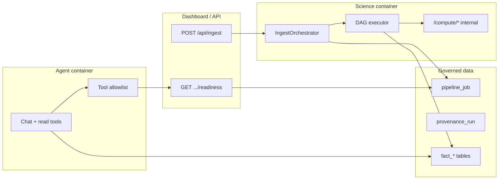

# Design Document: Ingest–Compute Contract

**Companion to:** `requirements.md` in this folder  
**Version:** 0.2  
**Date:** June 25, 2026  
**Pathway model:** `docs/specs/discovery-story-pathway/`

---

## 1. Overview

This design describes how to implement the normative ingest–compute contract: a single **IngestOrchestrator** owns structure onboarding, a **readiness model** gates agent and UI consumers, and **mechanical enforcement** prevents the agent from scheduling science jobs.

**Job catalog and discovery-act mapping** are defined in `docs/specs/discovery-story-pathway/design.md` (mirror of `science/compute/registry.py`). The monolith retains **`gnn_inference` only**; 15 science jobs dispatch atomically via `POST /compute/jobs/{job_id}`.

---

## 2. Components



| Component | Location (target) | Responsibility |
|-----------|-------------------|----------------|
| `IngestOrchestrator` | `science/dtie/ingest/orchestrator.py` (new) | Enqueue DAG after `ingest-full`; track stages |
| `StructureReadiness` | `data/readiness.py` (new) | Derive status from artifact probes |
| Dashboard ingest | `agent/coordinator/routers/dashboard.py` | Call orchestrator; never agent pipeline |
| Agent allowlist | `agent/llm/tool_policy.py` (new) | Deny compute tools when `ALLOW_AGENT_COMPUTE=false` |
| Readiness API | `agent/coordinator/routers/structures.py` (new) | Expose checklist to UI and agent context |
| Pipeline audit API | `agent/coordinator/routers/audit.py` | Query `audit_pipeline_events`; retention endpoint |

---

## 3. Readiness model

### 3.1 Probe functions

Each artifact key maps to an existence/count probe (read-only SQL or view):

```python
ARTIFACT_PROBES: dict[str, Callable] = {
    "dims": lambda sid, db: _count_dim_residue(sid) > 0,
    "scope": lambda sid, db: _has_scope(sid),
    "gnn_hyp": lambda sid, db: _latest_hyp_run(sid) is not None,
    "graph": lambda sid, db: _has_graph_metrics(sid),
    "source_leaks": lambda sid, db: _has_source_leaks(sid),  # alias: dtie_core
    "binding_scan": lambda sid, db: _has_binding_scan(sid),
    # tier 2 ...
}
```

### 3.2 Derived status

```python
def derive_readiness(tier1: dict[str, bool], tier2: dict[str, bool], job: PipelineJob | None) -> str:
    if job and job.status in ("queued", "running"):
        return "running"
    if not all(tier1.values()):
        return "failed" if job and job.status == "failed" else "running"
    if not all(tier2.values()):
        return "degraded"
    return "ready"
```

### 3.3 Response shape

```json
{
  "structure_id": "4uj1",
  "readiness_status": "degraded",
  "computation_run_id": "job_abc123",
  "tier1": {
    "dims": true,
    "scope": true,
    "gnn_hyp": true,
    "graph": true,
    "dtie_core": true,
    "binding_scan": false
  },
  "tier2": { "alignment": true, "md_validation": false },
  "missing_artifacts": ["binding_scan"],
  "degraded_reasons": ["binding_site_scan stage not run or produced zero rows"],
  "pipeline_job": {
    "status": "running",
    "current_step": "binding_site_scan",
    "progress": 72
  }
}
```

Materialized view candidate: `mv_structure_readiness` refreshed after each stage complete event.

---

## 4. DAG executor

### 4.1 Stage definition

```python
@dataclass(frozen=True)
class ComputeStage:
    stage_id: str
    requires: frozenset[str]   # artifact keys
    produces: frozenset[str]
    runner: Callable[..., Awaitable[None]]
    tier: int  # 1 or 2
    timeout_seconds: int = 3600
    max_retries: int = 2
```

### 4.2 Execution loop (serial Phase A)

```python
async def run_dag(structure_id: str, job_id: str) -> None:
    completed: set[str] = set()
    stages = TOPOLOGICAL_SORT(STAGE_REGISTRY)

    for stage in stages:
        if not stage.requires <= completed:
            raise OrchestratorError(f"Unsatisfied requires for {stage.stage_id}")
        await _run_stage_with_retry(structure_id, job_id, stage)
        completed |= stage.produces
        await _emit_event("structure.stage.complete", ...)
        await _update_job_modules(job_id, stage.stage_id, "complete")

    await _finalize_readiness(structure_id, job_id)
```

### 4.3 Parallel Phase B

After `ingest_dims`:

- Branch A: `assign_computation_scope` → `gnn_inference_v6` → …
- Branch B: `alignment_sidecar`

Join before stages that need both (none today). `graph_topology` may start when `gnn_hyp` completes even if DTIE phases still running.

Use `asyncio.gather` with explicit join points — not unbounded pub/sub.

---

## 5. Agent enforcement

### 5.1 Environment

| Variable | Default (prod) | Effect |
|----------|----------------|--------|
| `ALLOW_AGENT_COMPUTE` | `false` | When false, compute tools not registered |
| `ENVIRONMENT` | `prod` | Additional hard deny in prod even if flag mis-set |

### 5.2 Tool registration

```python
COMPUTE_TOOLS = frozenset({"run_full_pipeline", "run_gnn_inference"})

def filter_tools_for_policy(tools: list[ToolDefinition]) -> list[ToolDefinition]:
    if os.getenv("ALLOW_AGENT_COMPUTE", "false").lower() in ("1", "true"):
        return tools
    return [t for t in tools if t.name not in COMPUTE_TOOLS]
```

### 5.3 System prompt injection

When readiness ≠ `ready`, prepend to agent context:

```
Structure 4uj1 readiness: degraded. Missing: binding_scan.
Do not run compute jobs. Direct the user to ingest status or operator recompute.
```

---

## 6. Science API classification

Add router metadata or path prefix:

| Prefix | Visibility |
|--------|------------|
| `/compute/ingest-full` | Callable from agent API (ingest only) |
| `/compute/pipeline`, `/compute/gnn`, `/compute/cryptic-scan`, `/compute/md-validate` | `internal=True` — require `X-TokyoEyes-Caller: ingest-orchestrator` |
| `/health` | Public to ops |

Middleware rejects internal routes from agent container IP / missing header.

---

## 7. MD validation in the DAG

Stage `md_validate_top_n`:

1. Read top N `fact_cryptic_site` by `site_rank` where `md_validation_status = 'pending'`.
2. For each site: build spec JSON, call `science.dtie.cryptic.smd_runner` (never `compute.py` shortcut).
3. Apply calibrated thresholds from `data/calibration/calibrated_thresholds.json`.
4. Update `md_validation_status` via state machine (same as `agent/tools/cryptic/tool.py`).
5. Persist `fact_md_validation` through Normalizer (future).

Config: `MD_VALIDATE_TOP_N` (default 3), `MD_VALIDATE_MIN_DRUGGABILITY` (default 0.5).

---

## 8. `pipeline_job` extensions

Current schema (`038_pipeline_jobs.sql`) supports `modules` JSONB. Extend module entries:

```json
{
  "stage_id": "binding_site_scan",
  "status": "complete",
  "started_at": "...",
  "completed_at": "...",
  "provenance_run_id": "scan_...",
  "error": null
}
```

Optional future migration: rename conceptually to `structure_computation_run` but keep `pipeline_job` for backward compat.

---

## 9. Event transport (Phase C, optional)

| Phase | Mechanism |
|-------|-----------|
| A | DB poll + `pipeline_job` updates |
| B | `pg_notify('structure_events', payload)` |
| C | Redis/SNS fan-out to WebSocket layer |

Events are **derived from** stage completion writes, not used to trigger ordering in Phase A/B.

---

## 10. Testing strategy

| Test | Validates |
|------|-----------|
| `test_agent_tool_policy_denies_compute` | No compute tools when flag false |
| `test_readiness_failed_when_no_gnn` | Tier-1 probe |
| `test_dag_requires_ordering` | Scan cannot run before GNN |
| `test_ingest_enqueues_dag` | POST /api/ingest → job queued |
| `test_agent_missing_data_message` | No pipeline suggestion in response |

---

## 11. Related implementation files (current)

| Area | Current path | Target state |
|------|--------------|--------------|
| Ingest | `science/api/routers/ingest.py` | Unchanged for dims |
| Pipeline | `science/dtie/v5/orchestrator/pipeline.py` | Invoked as DAG stage |
| Binding scan | `agent/tools/cryptic/scan_phase.py` | DAG stage `binding_site_scan` |
| MD (canonical) | `science/dtie/cryptic/smd_runner.py` | DAG stage `md_validate_top_n` |
| MD (legacy) | `science/api/routers/compute.py` `_run_steered_md` | Deprecate |
| Agent compute | `agent/llm/agents.py` | Remove from prod registry |
| Pipeline audit | `shared/audit/`, `agent/coordinator/routers/audit.py` | See `docs/audit/PIPELINE_AUDIT.md` |

---

## 12. Pipeline runtime audit

Compute orchestration emits structured audit events (not governed scientific facts) for operational visibility over time. This complements `pipeline_job.modules` progress JSON and `normalization_audit` write records.

**Canonical reference:** [`docs/audit/PIPELINE_AUDIT.md`](../../audit/PIPELINE_AUDIT.md)

Summary: events fire at ingest (geometric notes), pathway start/complete/fail, per-job dispatch (preconditions, curvature, enforcement), and readiness (deduped). Correlated via `pipeline_job_id`. Queried via API, `make audit-*` targets, and Control Console UI.
