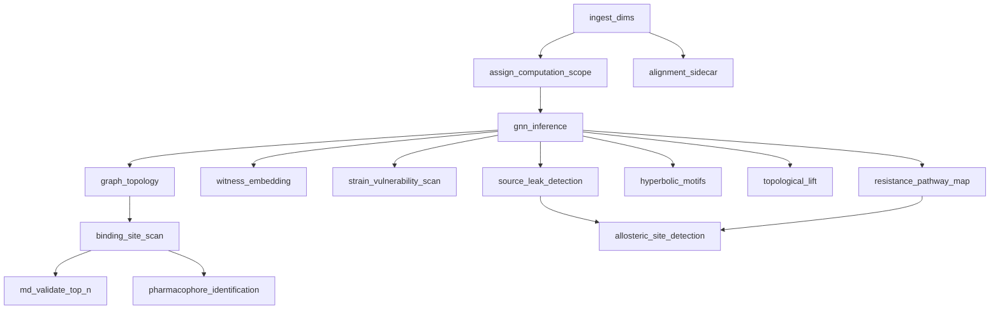

# Ingest–Compute Contract

**Repository:** tokyo-eye-agenticpoincare  
**Version:** 0.2 (draft)  
**Date:** June 25, 2026  
**Status:** Normative — supersedes ad-hoc “agent can run pipeline” behavior  
**Owner:** Platform / data governance  
**Pathway model:** `docs/specs/discovery-story-pathway/requirements.md` (DTIE deprecated)

---

## 1. Purpose

Tokyo Eye structures enter the system through **ingestion**. All scientific computation for a structure is produced during **onboarding** (ingest + compute DAG). The **agent consumes** pre-computed, governed data — it does not schedule science jobs.

This contract exists because compute escape hatches (`run_full_pipeline`, `run_gnn_inference`, standalone `/compute/*` calls from the agent) were added during development and repeatedly undermined data trust, provenance, and UX consistency.

**If the agent needs to kick off a compute job, that is a defect upstream of the agent.**

Related normative docs:

- `AGENTS.md` — single write path, provenance
- `docs/specs/structure-ingestion-normalization/requirements.md` — dim ingest, scope, alignment
- `docs/specs/binding-site-scan-at-ingestion/requirements.md` — cryptic/binding scan at onboard
- `docs/specs/discovery-story-pathway/requirements.md` — acts, job registry, pathway ontology (**DTIE retired**)
- `docs/specs/science-container-api/requirements.md` — science HTTP surface (internal)
- `docs/audit/WRITE_PATH_INVENTORY.md` — governed write-path audit
- `docs/audit/PIPELINE_AUDIT.md` — pipeline runtime audit (geometric enforcement, curvature, preconditions)

---

## 2. Glossary

| Term | Definition |
|------|------------|
| **Structure ingest** | Download BinaryCIF, parse dims (`dim_structure`, `dim_chain`, `dim_residue`, `dim_atom`), scope, alignment sidecar inputs. No GNN. |
| **Structure onboarding** | Ingest **plus** the full compute DAG for that structure. This is the default user-facing “add structure” operation. |
| **Ingest orchestrator** | The sole component allowed to enqueue and run structure-scoped science jobs. Lives in the science container / ingest worker — not the LLM agent. |
| **Compute DAG** | Directed acyclic graph of atomic **jobs** with explicit `requires` edges (see §6; catalog in discovery-story-pathway design). |
| **Discovery act** | User-facing chapter of the Discovery Story pathway (Signal → Verdict). Jobs map to acts. |
| **Pathway** | Named job progression; default onboard pathway is `discovery_story`. |
| **Structure readiness** | A governed summary: `ready \| degraded \| failed \| running` plus per-artifact checklist. |
| **Agent** | LLM coordinator + read-mostly tools. May annotate and visualize; must not schedule science compute. |
| **Operator** | Human or automation with elevated privileges (force re-ingest, force recompute, calibration). Not exposed to the agent in production. |
| **Science API** | HTTP surface on the science container. **Internal** to ingest orchestrator and operator tools — not an agent toolbelt. |
| **Artifact** | A persisted, queryable output required for readiness (e.g. hyperbolic embeddings run, graph metrics, binding-site scan). |

---

## 3. Roles and authority

### 3.1 Ingest orchestrator (authoritative for compute)

**May:**

- Run the full compute DAG after structure ingest
- Retry failed stages idempotently
- Mark structure readiness (`running` → `ready` / `degraded` / `failed`)
- Emit stage events for dashboard / WebSocket consumers
- Invoke alignment sidecar in parallel where the DAG allows

**Must not:**

- Serve interactive agent chat
- Expose user-facing “run pipeline on demand” without operator auth

### 3.2 Agent (authoritative for interpretation, not compute)

**May:**

- Read all governed artifacts for structures in `ready` or `degraded` state
- Query binding sites, residues, leaks, provenance, run summaries
- Highlight / focus / set metrics in the viewport
- Write **annotations and hypotheses** through the Normalizer (user-authored metadata, not science recomputation)

**Must not:**

- Call `run_full_pipeline`, `run_gnn_inference`, or any wrapper that dispatches GNN, discovery jobs (graph, leaks, binding scan, motifs, MD validation, etc.)
- Call `ScienceClient.run_pipeline`, `run_gnn`, `run_cryptic_scan`, `run_md_validate`, or equivalent
- Suggest “let me run the pipeline” as remediation — must report ingest/readiness failure instead

### 3.3 Operator / dev (elevated, gated)

**May (when `ENVIRONMENT=dev` or explicit operator role):**

- Force re-ingest (`force_reingest`)
- Force full recompute for a structure
- Run calibration scripts (`make calibrate-cryptic`, etc.)
- Enable `SMD_STUB_MODE` for pipeline plumbing tests

**Must not:**

- Be registered as agent tools in production

---

## 4. Core invariants

These are non-negotiable platform rules.

| ID | Invariant |
|----|-----------|
| **I1** | All science **facts** are written only through `data/normalizer/core.py` (see `AGENTS.md`). |
| **I2** | All structure-scoped **computation** is enqueued only by the ingest orchestrator (or operator recompute) — never by the agent. |
| **I3** | Every compute stage produces a `provenance_run` before writing facts (provenance gate in strict environments). |
| **I4** | Structure **readiness** is stored and queryable; clients check readiness before assuming artifacts exist. |
| **I5** | Missing artifacts are **upstream failures**, not agent-recoverable gaps. The agent returns actionable readiness errors, not compute actions. |
| **I6** | Idempotent re-runs of the same stage for the same structure are safe (ON CONFLICT / upsert semantics). |
| **I7** | Expensive optional stages (e.g. MD validation of top-N binding sites) are **ingest-DAG stages**, not agent tools. |

---

## 5. Onboarding lifecycle

### 5.1 User-facing flow

```
POST /api/ingest  (dashboard)
    → science POST /compute/ingest-full     [structure ingest]
    → ingest orchestrator enqueues compute DAG
    → returns structure_id + computation_run_id + status URL
```

Duplicate PDB submit → idempotent return of existing structure + current readiness. When foundation is present but discovery compute is incomplete or the latest job failed, **re-queue** the discovery pathway (audit-only for writes; new `pipeline_job`).

### 5.2 Readiness states

| State | Meaning | Agent behavior |
|-------|---------|----------------|
| `running` | Compute DAG in progress | Read partial data if explicitly supported; otherwise “onboarding in progress” |
| `ready` | All **tier-1** artifacts present | Full read + visualization |
| `degraded` | Tier-1 present; some tier-2 optional artifacts missing | Read available data; surface `degraded_reasons` |
| `failed` | Tier-1 artifact missing after retries | No science claims; report failed stage + error |

### 5.3 Tier definitions

**Tier 1 (required for `ready`):**

| Artifact key | Description | Typical consumer |
|--------------|-------------|------------------|
| `dims` | Structure, chains, residues, atoms ingested | Everything |
| `scope` | `structure_computation_scope` | Graph builder |
| `gnn_hyp` | Hyperbolic GNN embeddings (`*_hyp` run) | Viewport, scan, leaks |
| `graph` | Contact graph edges + node metrics | Topology, scan classification |
| `source_leaks` | Source-leak detection persisted (`dtie_core` alias during migration) | Agent, dashboard |
| `binding_scan` | `fact_binding_site_scan` + ranked `fact_cryptic_site` rows | Binding-site queries |

**Tier 2 (optional; absence → `degraded` not `failed`):**

| Artifact key | Description |
|--------------|-------------|
| `witness_embedding` | Phase 1 v4 hyperbolic witness selection (`fact_phase_output`) |
| `strain_vulnerability` | Phase 2 vulnerability scan |
| `motifs` | Hyperbolic motif analysis (`fact_hyperbolic_motif`) |
| `pocket_pharmacophore` | Pocket-scoped pharmacophore map |
| `pharmacophores` | Full pharmacophore identification (Act 04) |
| `drug_candidates` | Drug candidate ranking (Act 04) |
| `resistance_pathway` | Phase 4 resistance mapping (Act 05) |
| `buffering_atlas` | Topological lift / buffering (Act 05) |
| `allosteric_sites` | Derived allosteric network facade (Act 05) |
| `allele_selectivity` | Allele selectivity assessment (Act 05, partial) |
| `alignment` | UniProt mapping + family superposition |
| `md_validation` | SMD results for top-N binding sites |
| `fragment_hits` | Fragment screen (planned) |
| `discovery_extended` | **Legacy alias** — maps to per-act keys above during migration |
| `dtie_phases` | **Legacy alias** — same |

Tier lists may grow; new features default to **tier 2** until promoted.

---

## 6. Compute DAG

The ingest orchestrator executes a **DAG of atomic jobs**, not a monolithic pipeline. Jobs declare `requires` and `produces`. The **canonical job catalog** is `science/compute/registry.py`; narrative spec in `docs/specs/discovery-story-pathway/design.md`.

Default onboard **pathway:** `discovery_story` (acts 01 Signal → 05 Verdict).

**Runtime model (June 2026):** `science/compute/scheduler.run_pathway` runs `gnn_inference` via the monolith (`POST /compute/pipeline`), then dispatches **15 peeled jobs** via `POST /compute/jobs/{job_id}`. Act 01 (Signal) is fully atomic.

### 6.1 Job graph (summary — see discovery-story-pathway for full registry)



### 6.2 Job table (implementation snapshot)

| Job ID | Act | Requires | Produces | Dispatch |
|--------|-----|----------|----------|----------|
| `ingest_dims` | foundation | — | `dims` | ingest |
| `assign_computation_scope` | foundation | `ingest_dims` | `scope` | ingest |
| `alignment_sidecar` | sidecar | `ingest_dims` | `alignment` | ingest (parallel) |
| `gnn_inference` | foundation | `scope` | `gnn_hyp`, `gnn_euc` | **monolith** |
| `graph_topology` | signal | `gnn_inference` | `graph` | atomic |
| `witness_embedding` | signal | `gnn_inference` | `witness_embedding` | atomic |
| `strain_vulnerability_scan` | signal | `gnn_inference` | `strain_vulnerability` | atomic |
| `source_leak_detection` | persistent_leak | `gnn_inference` | `source_leaks` | atomic |
| `binding_site_scan` | cryptic_pocket | `gnn_inference`, `graph_topology` | `binding_scan` | atomic |
| `md_validate_top_n` | cryptic_pocket | `binding_site_scan` | `md_validation` | atomic |
| `hyperbolic_motifs` | persistent_leak | `gnn_inference` | `motifs` | atomic |
| `allele_selectivity_assessment` | verdict | `drug_candidate_ranking`, `resistance_pathway_map` | `allele_selectivity` | monolith (not peeled) |

Full registry (19 jobs): `science/compute/registry.py`. Peeled set: `science/compute/runner_dispatch.PEELED_JOBS` (15 jobs).

`DTIEOrchestrator` is a **compatibility façade** for GNN inference and post–source-leak tail phases; science phases are peeled to atomic runners.

### 6.3 Parallelism rules

1. **Order dependencies are hard** — a stage must not start until all `requires` artifacts are `complete`.
2. **Parallelism is opt-in per edge** — e.g. `alignment_sidecar` ∥ `gnn_inference`; `graph_topology` ∥ `source_leak_detection` after GNN.
3. **No agent-visible races** — readiness flips to `ready` only when tier-1 checklist passes atomically from the consumer’s view.
4. **Pub/sub is transport, not orchestration** — events (`stage.complete`, `stage.failed`) may be published for UI; the orchestrator (or DB job graph) remains source of truth for ordering.

### 6.4 Orchestration implementation (recommended)

**Phase A (minimal):** Single worker, serial DAG executor, `pipeline_job` + extended `modules` JSON for per-stage status.

**Phase B:** DB-backed job graph (`structure_computation_run`, `structure_computation_stage`) with retry and parallel branches.

**Phase C:** Event bus (Redis/SNS/pg_notify) for fan-out to dashboard WebSocket — optional scaling layer.

Do not skip Phase A in favor of pub/sub alone.

---

## 7. Agent tool policy

### 7.1 Allowed agent tools (production)

| Category | Tools |
|----------|-------|
| Read — discovery signals | `get_source_leaks`, `get_high_uncertainty_residues`, `get_residue_state`, `compare_wt_mutant` |
| Read — binding | `query_binding_sites` |
| Read — data | `export_structure_data`, `get_allosteric_sites`, `get_provenance_lineage`, `search_residues`, `list_structures`, `get_run_summary`, `compare_runs` |
| Write — user metadata | `annotate_structure` |
| Visualize | `highlight_residues`, `set_metric`, `focus_residues`, `clear_highlights` |
| Plot | `generate_plot` |

### 7.2 Forbidden agent tools (production)

| Tool / action | Replacement |
|---------------|-------------|
| `run_full_pipeline` | Operator recompute; fix ingest orchestrator |
| `run_gnn_inference` | Same |
| `validate_site_md` / `validate_top_sites_md` as agent tools | MD stage in ingest DAG; agent reads status |
| Direct `ScienceClient.run_*` from agent code paths | Remove |

### 7.3 Agent response when data is missing

When readiness ≠ `ready` or a specific artifact is absent, the agent **shall** return a `ToolResult` or chat message containing:

- `structure_id`
- `readiness_status`
- `missing_artifacts[]`
- `computation_run_id` / `pipeline_job_id` if `running` or `failed`
- `suggested_operator_action` (e.g. “check ingest job logs”) — **not** “run pipeline”

---

## 8. API and network boundaries

### 8.1 Public (dashboard + agent)

| Endpoint class | Examples | Compute? |
|----------------|----------|----------|
| Ingest | `POST /api/ingest` | Triggers onboarding only |
| Readiness | `GET /api/structures/{id}/readiness` (to be implemented) | No |
| Hydrate / query | `/api/dashboard/hydrate`, agent read tools | No |
| Chat | `/api/chat` | No science compute |
| Annotations | annotate tools | Normalizer metadata only |

### 8.2 Internal (science container — ingest orchestrator only)

| Endpoint | Purpose |
|----------|---------|
| `POST /compute/ingest-full` | Dim ingest |
| `POST /compute/pipeline` | **Internal** — GNN monolith bundle (+ skip flags for peeled jobs) |
| `POST /compute/jobs/{job_id}` | **Internal** — single atomic peeled job |
| `POST /compute/post-source-leak-phases` | **Internal** — buffering / allosteric tail after peeled leaks |
| `POST /compute/cryptic-scan` | **Internal** — operator/debug; DAG uses `binding_site_scan` |
| `POST /compute/md-validate` | **Internal** — operator/debug; DAG uses `md_validate_top_n` |
| `POST /compute/gnn` | **Internal** — subsumed by `gnn_inference` in monolith |

Production: agent container network policy **must not** route to internal compute endpoints.

### 8.3 Operator-only (dashboard, gated)

| Endpoint | Gate |
|----------|------|
| `POST /api/pipeline/run` | Operator role or `ENVIRONMENT=dev` |
| `force_reingest=true` | Operator role |

---

## 9. Events and observability

### 9.1 Stage events (recommended schema)

```json
{
  "event": "structure.stage.complete",
  "structure_id": "4uj1",
  "computation_run_id": "onboard_abc123",
  "stage_id": "binding_site_scan",
  "artifact": "binding_scan",
  "duration_ms": 4200,
  "provenance_run_id": "scan_4uj1_deadbeef"
}
```

Consumers: dashboard progress UI, WebSocket sync bus, structured logs.

### 9.2 Logging

Each stage logs: `structure_id`, `stage_id`, `run_id`, `status`, `duration_ms`, `artifacts_produced`, `error` (if failed).

---

## 10. Failure and retry

| Condition | Behavior |
|-----------|----------|
| Stage transient failure (OOM, timeout) | Retry up to N times with backoff; then `failed` |
| Stage permanent failure (missing dims, bad scope) | `failed`; no downstream stages |
| Partial tier-2 failure | `degraded` if tier-1 complete |
| Checkpoint / code version change | Operator-triggered recompute; new `provenance_run` lineage |

Re-ingest of existing PDB (no `force_reingest`) → **audit-only** for dimension writes; **no** re-download or re-parse. Discovery pathway **may re-queue** when `dims` + `scope` are present and (`gnn_hyp` is absent OR latest `pipeline_job` failed/timed out). Operator `force_reingest` still does not rewrite dimensions (science container behavior unchanged).

---

## 11. Current violations (migration tracker)

Known gaps vs this contract as of June 2026:

| Violation | Location | Status |
|-----------|----------|--------|
| Agent has `run_full_pipeline`, `run_gnn_inference` | `agent/llm/agents.py`, `agent/tools/dtie/tools.py` | **Mitigated** — `ALLOW_AGENT_COMPUTE=false` + `compute_tool_policy.py` |
| Dashboard `POST /api/pipeline/run` | `agent/coordinator/routers/dashboard.py` | Operator-only (verify gate) |
| On-demand cryptic scan not in DAG | `science/api/routers/compute.py` | **Fixed** — `binding_site_scan` peeled + scheduled |
| MD dual paths | `compute.py` vs `smd_runner` | **Fixed** for DAG — `md_validate_top_n` uses `smd_runner` |
| Scan persists via direct SQL | `agent/tools/cryptic/scan_phase.py` | **Fixed** — `normalize_binding_site_scan` |
| No readiness API | — | **Fixed** — `GET /api/structures/{id}/readiness` + act fields |
| `AGENTS.md` lists compute tools as agent tools | `AGENTS.md` | **Fixed** — read-only discovery signals documented |
| Monolith still runs GNN | `DTIEOrchestrator._run_gnn` | **Open** — peel `gnn_inference` next |
| `allele_selectivity_assessment` not atomic | monolith | **Open** — no runner yet |
| `structure_computation_run` DB tables | — | **Deferred** |
| Standalone `/graph-topology` bypasses Normalizer in places | `compute.py` | **Open** — refactor to shared job path |

---

## 12. Acceptance criteria (contract-level)

1. WHEN a structure is onboarded via `POST /api/ingest`, THE system SHALL enqueue the full tier-1 compute DAG without agent involvement.
2. WHEN the agent is invoked in production, THE agent tool registry SHALL contain **zero** compute-scheduling tools.
3. WHEN readiness is `failed` or a tier-1 artifact is missing, THE agent SHALL NOT offer to run pipeline or GNN inference.
4. WHEN binding sites are queried, THE agent SHALL read `fact_cryptic_site` populated by ingest DAG stage `binding_site_scan`.
5. WHEN MD validation results are needed, THEY SHALL be produced by ingest stage `md_validate_top_n` (or prior operator recompute) — not agent dispatch.
6. THE ingest orchestrator SHALL enforce DAG `requires` ordering before starting each stage.
7. THE alignment sidecar SHALL be allowed to run in parallel with the GNN branch after `ingest_dims` completes.
8. ALL new structure-scoped science features SHALL be specified as DAG stages with artifact keys before agent integration.

---

## 13. Implementation sequence (informative)

1. ~~Ratify this contract (review + link from `AGENTS.md`).~~ **Done**
2. ~~Add `structure_readiness` model + `GET /api/structures/{id}/readiness`.~~ **Done**
3. ~~Extend ingest orchestrator to run full DAG (include `binding_site_scan`, `md_validate_top_n`).~~ **Done** (15 peeled jobs + GNN monolith)
4. ~~Feature-flag `ALLOW_AGENT_COMPUTE=false`; strip compute tools from agent.~~ **Done**
5. Gate `POST /api/pipeline/run` to operator/dev.
6. Mark science `/compute/*` as internal; network isolate agent from science compute.
7. Peel `gnn_inference` as atomic job; thin monolith to shim or remove.
8. Add `structure_computation_run` / `stage` tables (Phase B orchestration).

---

## 14. Document history

| Version | Date | Change |
|---------|------|--------|
| 0.1 | 2026-06-25 | Initial draft from ingest/compute architecture review |
| 0.2 | 2026-06-25 | Align with discovery-story-pathway; deprecate DTIE DAG naming |
