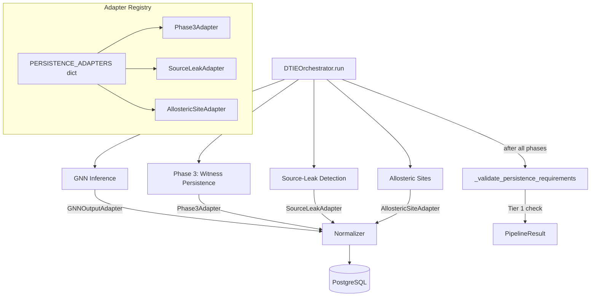

# Design Document: Phase Output Persistence

## Overview

This design addresses the critical gap where DTIE v5 pipeline phase outputs are ephemeral. The solution wires the existing Phase 3 adapter, creates new adapters and fact tables for source-leak detection and allosteric site identification, establishes a consistent adapter protocol/registry, and adds orchestrator guardrails to enforce persistence for Tier 1 phases.

The approach follows Option A from the remediation document: high-fidelity adapters for Tier 1 phases with rich queryable columns, while establishing the pattern for a generic JSONB fallback for Tier 2/3 phases later.

## Architecture



## Components and Interfaces

### Phase Persistence Protocol (`science/dtie/common/phase_persistence.py`)

```python
from dataclasses import dataclass
from typing import Protocol, Any
from science.dtie.common.interfaces import PhaseResult
from science.dtie.common.normalizer_payloads import ProvenanceContext, NormalizerResult


@dataclass
class PhasePersistenceSpec:
    phase_name: str
    tier: int  # 1, 2, or 3
    produces_residue_level_data: bool
    schema_version: str = "1.0"


class PhasePersistenceAdapter(Protocol):
    spec: PhasePersistenceSpec

    async def persist(
        self,
        phase_result: PhaseResult,
        provenance: ProvenanceContext,
        normalizer: Any,
    ) -> NormalizerResult: ...


# Registry: phase_name → adapter instance
PERSISTENCE_ADAPTERS: dict[str, PhasePersistenceAdapter] = {}


def register_adapter(adapter: PhasePersistenceAdapter) -> None:
    PERSISTENCE_ADAPTERS[adapter.spec.phase_name] = adapter
```

### Source-Leak Adapter (`science/dtie/common/adapters/source_leak_adapter.py`)

```python
class SourceLeakAdapter:
    spec = PhasePersistenceSpec(
        phase_name="source_leak_detection",
        tier=1,
        produces_residue_level_data=True,
    )

    async def persist(self, phase_result, provenance, normalizer):
        payload = SourceLeakPayload(
            provenance=provenance,
            leak_residues=[
                SourceLeakResidue(
                    residue_id=rid,
                    epistemic_uncertainty=phase_result.residue_contributions[rid],
                    cone_depth=phase_result.outputs.get("cone_depths", {}).get(rid, 0.0),
                    leak_score=phase_result.outputs.get("leak_scores", {}).get(rid, 0.0),
                )
                for rid in phase_result.residue_contributions or {}
            ],
            total_leaks=phase_result.outputs.get("source_leak_count", 0),
            threshold_used=phase_result.outputs.get("threshold", 0.3),
        )
        return await normalizer.normalize_source_leaks(payload)
```

### Allosteric Site Adapter (`science/dtie/common/adapters/allosteric_site_adapter.py`)

```python
class AllostericSiteAdapter:
    spec = PhasePersistenceSpec(
        phase_name="allosteric_sites",
        tier=1,
        produces_residue_level_data=True,
    )

    async def persist(self, phase_result, provenance, normalizer):
        payload = AllostericSitePayload(
            provenance=provenance,
            sites=[
                AllostericSiteRecord(
                    site_id=site["site_id"],
                    residue_ids=site["residue_ids"],
                    centroid_x=site["centroid"][0],
                    centroid_y=site["centroid"][1],
                    centroid_z=site["centroid"][2],
                    confidence_score=site["confidence"],
                    cluster_method=site.get("method", "dbscan"),
                    n_residues=len(site["residue_ids"]),
                )
                for site in phase_result.outputs.get("sites", [])
            ],
            total_sites=len(phase_result.outputs.get("sites", [])),
        )
        return await normalizer.normalize_allosteric_sites(payload)
```

### Orchestrator Integration

The orchestrator's `run()` method gains a persistence step after each Tier 1 phase:

```python
async def _persist_phase_result(
    self, phase_result: PhaseResult, run_id: str, gnn_run_id: str, config: PipelineConfig
) -> None:
    adapter = PERSISTENCE_ADAPTERS.get(phase_result.phase_name)
    if adapter is None:
        return

    if not phase_result.success:
        return

    provenance = ProvenanceContext(
        run_id=f"{run_id}_{phase_result.phase_name}",
        structure_id=phase_result.structure_id,
        model_version=phase_result.model_version,
        pipeline_name="dtie_v5",
        parent_run_id=gnn_run_id,
        code_version=config.code_version,
    )

    try:
        result = await adapter.persist(phase_result, provenance, self._normalizer)
        phase_result.metadata["persisted"] = True
        phase_result.metadata.update(result.asset_metadata or {})
    except Exception as e:
        phase_result.metadata["persisted"] = False
        phase_result.metadata["persistence_error"] = str(e)
        if config.enforce_governed_outputs and adapter.spec.tier == 1:
            phase_result.success = False
            phase_result.warnings.append(f"Tier 1 persistence failed: {e}")
```

### Validation Step

```python
async def _validate_persistence_requirements(
    self, phase_results: dict[str, PhaseResult], config: PipelineConfig
) -> list[str]:
    warnings = []
    if not config.enforce_governed_outputs:
        return warnings

    for name, result in phase_results.items():
        adapter = PERSISTENCE_ADAPTERS.get(name)
        if adapter and adapter.spec.tier == 1 and result.success:
            if not result.metadata.get("persisted"):
                warnings.append(
                    f"Tier 1 phase '{name}' completed but was not persisted"
                )
    return warnings
```

## Data Models

### New Payload Types (`science/dtie/common/normalizer_payloads.py`)

```python
class SourceLeakResidue(BaseModel):
    residue_id: str
    epistemic_uncertainty: float
    cone_depth: float
    leak_score: float
    is_confirmed: bool = False


class SourceLeakPayload(BaseModel):
    provenance: ProvenanceContext
    leak_residues: list[SourceLeakResidue]
    total_leaks: int
    threshold_used: float
    computed_at: datetime = Field(default_factory=_utcnow)


class AllostericSiteRecord(BaseModel):
    site_id: str
    residue_ids: list[str]
    centroid_x: float
    centroid_y: float
    centroid_z: float
    confidence_score: float
    cluster_method: str = "dbscan"
    n_residues: int


class AllostericSitePayload(BaseModel):
    provenance: ProvenanceContext
    sites: list[AllostericSiteRecord]
    total_sites: int
    computed_at: datetime = Field(default_factory=_utcnow)
```

### Database Migration (`data/aurora/migrations/032_phase_persistence_tier1.sql`)

```sql
-- fact_source_leak: per-residue source-leak candidates
CREATE TABLE IF NOT EXISTS fact_source_leak (
    leak_id             TEXT PRIMARY KEY DEFAULT gen_random_uuid()::text,
    run_id              TEXT NOT NULL REFERENCES provenance_run(run_id),
    structure_id        TEXT NOT NULL REFERENCES dim_structure(structure_id),
    residue_id          TEXT NOT NULL REFERENCES dim_residue(residue_id),
    epistemic_uncertainty DOUBLE PRECISION NOT NULL,
    cone_depth          DOUBLE PRECISION NOT NULL,
    leak_score          DOUBLE PRECISION NOT NULL,
    is_confirmed        BOOLEAN DEFAULT FALSE,
    computed_at         TIMESTAMPTZ DEFAULT NOW()
);

CREATE UNIQUE INDEX uq_source_leak_natural ON fact_source_leak(run_id, residue_id);
CREATE INDEX idx_source_leak_structure ON fact_source_leak(structure_id);
CREATE INDEX idx_source_leak_run ON fact_source_leak(run_id);
CREATE INDEX idx_source_leak_residue ON fact_source_leak(residue_id);

-- fact_allosteric_site: predicted allosteric pockets
CREATE TABLE IF NOT EXISTS fact_allosteric_site (
    site_id             TEXT PRIMARY KEY DEFAULT gen_random_uuid()::text,
    run_id              TEXT NOT NULL REFERENCES provenance_run(run_id),
    structure_id        TEXT NOT NULL REFERENCES dim_structure(structure_id),
    centroid_x          DOUBLE PRECISION,
    centroid_y          DOUBLE PRECISION,
    centroid_z          DOUBLE PRECISION,
    confidence_score    DOUBLE PRECISION,
    cluster_method      TEXT,
    n_residues          INTEGER,
    computed_at         TIMESTAMPTZ DEFAULT NOW()
);

CREATE UNIQUE INDEX uq_allosteric_site_natural ON fact_allosteric_site(run_id, site_id);
CREATE INDEX idx_allosteric_site_structure ON fact_allosteric_site(structure_id);
CREATE INDEX idx_allosteric_site_run ON fact_allosteric_site(run_id);

-- Junction table: site ↔ residue membership
CREATE TABLE IF NOT EXISTS fact_allosteric_site_residue (
    id                  TEXT PRIMARY KEY DEFAULT gen_random_uuid()::text,
    site_id             TEXT NOT NULL REFERENCES fact_allosteric_site(site_id),
    residue_id          TEXT NOT NULL REFERENCES dim_residue(residue_id),
    contribution_score  DOUBLE PRECISION
);

CREATE UNIQUE INDEX uq_site_residue ON fact_allosteric_site_residue(site_id, residue_id);
CREATE INDEX idx_site_residue_site ON fact_allosteric_site_residue(site_id);
CREATE INDEX idx_site_residue_residue ON fact_allosteric_site_residue(residue_id);
```

### PipelineConfig Extension

```python
@dataclass
class PipelineConfig:
    # ... existing fields ...
    enforce_governed_outputs: bool = True  # NEW: Tier 1 phases must persist
```

## Correctness Properties

*A property is a characteristic or behavior that should hold true across all valid executions of a system — essentially, a formal statement about what the system should do. Properties serve as the bridge between human-readable specifications and machine-verifiable correctness guarantees.*

### Property 1: Phase 3 persistence round-trip

*For any* valid Phase3PersistencePayload with random barcodes and residue contributions, writing it through the Normalizer and then querying `fact_phase3_persistence` by run_id should return records containing the same barcodes, max_alpha, and residue contributions.

**Validates: Requirements 1.2**

### Property 2: Source-leak persistence round-trip

*For any* valid SourceLeakPayload with random residue records, writing it through the Normalizer and then querying `fact_source_leak` by run_id should return the same number of records with matching residue_id, epistemic_uncertainty, cone_depth, and leak_score values.

**Validates: Requirements 2.2**

### Property 3: Allosteric site persistence round-trip

*For any* valid AllostericSitePayload with random site records, writing it through the Normalizer and then querying `fact_allosteric_site` and `fact_allosteric_site_residue` by run_id should return matching sites with correct residue membership.

**Validates: Requirements 3.2, 3.3**

### Property 4: Metadata set on successful persistence

*For any* Tier 1 phase with a registered adapter, when the phase completes successfully and persistence succeeds, the PhaseResult's metadata dict should contain `"persisted": True` and the appropriate identifier field.

**Validates: Requirements 1.3, 2.4, 3.4**

### Property 5: Tier 1 failure on persistence error with enforcement

*For any* Tier 1 phase where persistence raises an exception and `enforce_governed_outputs` is True, the PhaseResult should have `success = False` and warnings should contain the error message.

**Validates: Requirements 1.4, 2.5, 3.5**

### Property 6: Idempotent upserts

*For any* valid payload, writing it through the Normalizer N times (N >= 1) should result in exactly one record per natural key in the fact table (no duplicates).

**Validates: Requirements 6.5**

### Property 7: Payload validation rejects invalid residue_ids

*For any* payload containing a residue_id that does not match the canonical format, the Normalizer should reject the payload with a validation error before writing.

**Validates: Requirements 5.3**

### Property 8: Parent run_id provenance linkage

*For any* phase persistence operation, the provenance_run record created should contain a parent_run_id matching the GNN inference run_id, and this should be queryable via a join.

**Validates: Requirements 8.1, 8.2**

### Property 9: Dry-run mode allows completion without persistence

*For any* pipeline run with `enforce_governed_outputs = False`, all phases should complete successfully regardless of whether persistence succeeds or fails.

**Validates: Requirements 7.3**

### Property 10: Orchestrator adapter invocation

*For any* phase that completes successfully and has a registered persistence adapter, the orchestrator should invoke that adapter's persist method.

**Validates: Requirements 4.3**

## Error Handling

- **Persistence failure (Tier 1, enforced):** Phase marked as failed, error captured in `metadata["persistence_error"]`, warning added to PhaseResult. Pipeline continues other phases but overall result is degraded.
- **Persistence failure (Tier 1, not enforced):** Phase remains successful, warning logged, `metadata["persisted"] = False`. Pipeline result is successful.
- **Invalid residue_id in payload:** NormalizerError raised with details. Adapter catches and propagates as persistence failure.
- **Database connection failure:** Normalizer's atomic transaction rolls back. Retry logic in the Normalizer handles transient failures (existing behavior).
- **Missing adapter for a phase:** No persistence attempted, no error. Phase completes normally. Only Tier 1 phases without adapters trigger validation warnings.

## Testing Strategy

**Property-Based Testing Library:** Hypothesis (Python) — already in use in this project.

**Dual approach:**
- Unit tests: Verify specific examples (known payloads, edge cases, error conditions)
- Property tests: Verify universal properties across randomly generated inputs (minimum 100 iterations per property)

**Test tag format:** `Feature: phase-output-persistence, Property {number}: {property_text}`

**Key test areas:**
1. Round-trip persistence tests (write → read → compare) for each fact table
2. Idempotency tests (write same payload twice, verify single record)
3. Orchestrator integration tests (mock normalizer, verify adapter invocation and metadata setting)
4. Validation tests (invalid payloads rejected, valid payloads accepted)
5. Guardrail tests (enforce_governed_outputs behavior)
