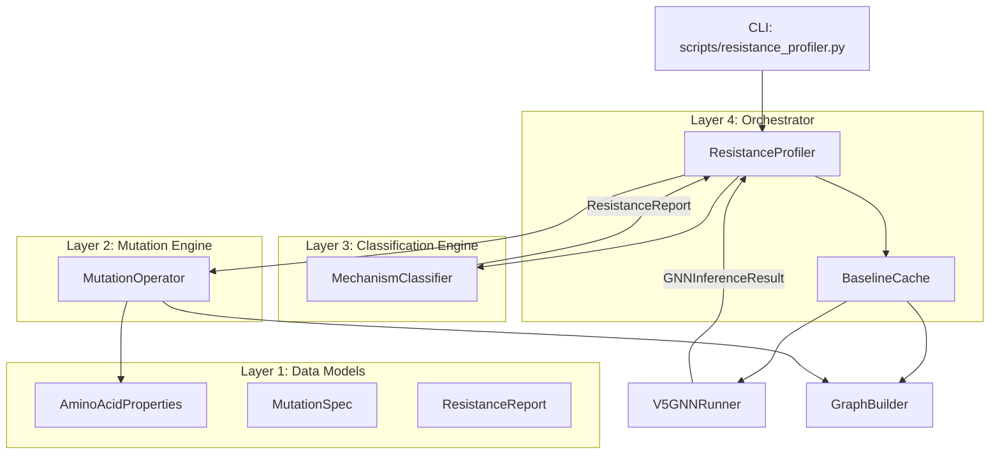

# Design Document: Resistance Profiler

## Overview

The Resistance Profiler (RP) automates drug resistance mechanism classification by performing virtual mutations on protein graphs and analyzing the resulting topological perturbation signatures. It wraps the existing DTIE v5 pipeline, adding a mutation operator, a mechanism classifier, and a batch orchestration layer.

The key insight driving this design: the hyperbolic GNN produces qualitatively different topological signatures for steric (Type I) vs allosteric (Type II) resistance mutations. Type I mutations cause localized uncertainty collapse at the mutation site with no propagation to distal hubs. Type II mutations cause distributed perturbation along the drug's mechanical transmission pathways.

## Architecture



## Components and Interfaces

### Layer 1: Data Models (`science/dtie/v5/resistance/models.py`)

```python
@dataclass
class MutationSpec:
    chain: str
    residue_index: int
    wild_type_aa: str  # Single-letter code
    mutant_aa: str     # Single-letter code

@dataclass
class HubMetrics:
    residue_index: int
    chain: str
    wt_epistemic: float
    mut_epistemic: float
    delta_epistemic: float
    wt_cone_depth: float
    mut_cone_depth: float
    delta_cone_depth: float

@dataclass
class ResistanceReport:
    variant: str  # e.g., "T315I"
    mechanism_class: str  # "Type_I_Steric", "Type_II_Allosteric", "Hybrid"
    confidence_score: float  # 0.0 - 1.0
    metrics: dict  # site_uncertainty_delta, hub_propagation_delta, etc.
    affected_pathways: list[str]
    structural_impact: str
    hub_details: list[HubMetrics]
    error: str | None = None

@dataclass
class BatchReport:
    structure_id: str
    total_variants: int
    type_i_count: int
    type_ii_count: int
    hybrid_count: int
    baseline_metrics: dict  # WT source leaks, spectral gap, top pathways
    reports: list[ResistanceReport]

AMINO_ACID_PROPERTIES: dict[str, dict] = {
    "A": {"volume": 88.6, "hydropathy": 1.8, "charge": 0},
    "R": {"volume": 173.4, "hydropathy": -4.5, "charge": 1},
    "N": {"volume": 114.1, "hydropathy": -3.5, "charge": 0},
    "D": {"volume": 111.1, "hydropathy": -3.5, "charge": -1},
    "C": {"volume": 108.5, "hydropathy": 2.5, "charge": 0},
    "E": {"volume": 138.4, "hydropathy": -3.5, "charge": -1},
    "Q": {"volume": 143.8, "hydropathy": -3.5, "charge": 0},
    "G": {"volume": 60.1, "hydropathy": -0.4, "charge": 0},
    "H": {"volume": 153.2, "hydropathy": -3.2, "charge": 0},
    "I": {"volume": 166.7, "hydropathy": 4.5, "charge": 0},
    "L": {"volume": 166.7, "hydropathy": 3.8, "charge": 0},
    "K": {"volume": 168.6, "hydropathy": -3.9, "charge": 1},
    "M": {"volume": 162.9, "hydropathy": 1.9, "charge": 0},
    "F": {"volume": 189.9, "hydropathy": 2.8, "charge": 0},
    "P": {"volume": 112.7, "hydropathy": -1.6, "charge": 0},
    "S": {"volume": 89.0, "hydropathy": -0.8, "charge": 0},
    "T": {"volume": 116.1, "hydropathy": -0.7, "charge": 0},
    "W": {"volume": 227.8, "hydropathy": -0.9, "charge": 0},
    "Y": {"volume": 193.6, "hydropathy": -1.3, "charge": 0},
    "V": {"volume": 140.0, "hydropathy": 4.2, "charge": 0},
}
```

### Layer 2: Mutation Engine (`science/dtie/v5/resistance/operator.py`)

```python
class MutationOperator:
    """Applies virtual mutations to PyG graph data."""

    def __init__(self, graph_builder: GraphBuilder):
        self._builder = graph_builder

    async def build_mutant_graph(
        self,
        structure_id: str,
        mutation: MutationSpec,
    ) -> tuple[Data, int]:
        """Build a mutated PyG graph.

        Returns:
            Tuple of (mutated PyG Data, graph index of mutated residue)
        """
        ...

    def compute_perturbation_factor(
        self,
        wt_aa: str,
        mut_aa: str,
    ) -> tuple[float, float]:
        """Compute steric and electrostatic perturbation factors.

        Returns:
            (steric_factor, electrostatic_factor)

        Formula:
            steric = V_mut / V_wt  (volume ratio)
            electrostatic = 1.0 + 0.3 * |Q_mut - Q_wt|  (charge penalty)
            combined = steric * electrostatic
        """
        ...

    def apply_perturbation(
        self,
        pyg_data: Data,
        node_idx: int,
        mutation: MutationSpec,
    ) -> Data:
        """Apply feature and edge perturbations to simulate mutation.

        Modifies:
            - Node features at node_idx (rho scaled by volume ratio)
            - Edge attributes for edges incident to node_idx
              (scaled by combined perturbation factor)

        Does NOT modify:
            - Graph connectivity (edge_index unchanged)
            - Other nodes' features
        """
        ...
```

### Layer 3: Classification Engine (`science/dtie/v5/resistance/classifier.py`)

```python
# Classification thresholds (empirically derived from T315I/E255K)
SITE_PERTURBATION_THRESHOLD = -0.05   # Δeps at mutation site
HUB_ALLOSTERIC_THRESHOLD = -0.003     # Δeps at any hub
PROPAGATION_RADIUS_THRESHOLD = 5      # Residues with |Δeps| > 0.003

class MechanismClassifier:
    """Classifies resistance mechanism from WT vs mutant comparison."""

    def classify(
        self,
        wt_nodes: list[GNNNodeOutput],
        mut_nodes: list[GNNNodeOutput],
        mutation: MutationSpec,
        hub_residues: list[tuple[str, int]],  # (chain, residue_index)
    ) -> ResistanceReport:
        """Compare WT and mutant outputs, classify mechanism.

        Decision tree:
        1. Compute site_delta (Δeps at mutation site)
        2. Compute hub_deltas (Δeps at each hub)
        3. Compute propagation_radius (count of residues with |Δeps| > threshold)
        4. Classify:
           - If max(|hub_delta|) < HUB_THRESHOLD and site_delta significant → Type I
           - If max(|hub_delta|) >= HUB_THRESHOLD and radius > 5 → Type II
           - Otherwise → Hybrid
        """
        ...

    def compute_confidence(
        self,
        site_delta: float,
        max_hub_delta: float,
        propagation_radius: int,
    ) -> float:
        """Compute classification confidence based on metric magnitudes."""
        ...
```

### Layer 4: Orchestrator (`science/dtie/v5/resistance/profiler.py`)

```python
class ResistanceProfiler:
    """Main entry point for resistance profiling."""

    def __init__(
        self,
        db: Any,
        checkpoint_path: str = "checkpoints_v5/v5_stage4_11prot.pt",
        device: str = "cpu",
    ):
        self._db = db
        self._runner = V5GNNRunner(checkpoint_path=checkpoint_path, device=device)
        self._builder = GraphBuilder(db=db)
        self._operator = MutationOperator(self._builder)
        self._classifier = MechanismClassifier()
        self._baseline_cache: dict[str, tuple] = {}  # structure_id → (wt_result, hubs)

    async def profile_mutation(
        self,
        structure_id: str,
        mutation: MutationSpec,
        hub_residues: list[tuple[str, int]] | None = None,
    ) -> ResistanceReport:
        """Profile a single mutation against a structure."""
        ...

    async def profile_batch(
        self,
        structure_id: str,
        mutations: list[MutationSpec],
        hub_residues: list[tuple[str, int]] | None = None,
        on_progress: Callable[[int, int], None] | None = None,
    ) -> BatchReport:
        """Profile a batch of mutations against a structure."""
        ...

    async def _ensure_baseline(
        self,
        structure_id: str,
    ) -> tuple[GNNInferenceResult, list[tuple[str, int]]]:
        """Get or compute the WT baseline and auto-detect hubs."""
        ...

    def _auto_detect_hubs(
        self,
        wt_result: GNNInferenceResult,
        structure_id: str,
    ) -> list[tuple[str, int]]:
        """Identify propagation hubs from WT source leaks."""
        ...
```

## Data Models

### Perturbation Factor Computation

The Edge_Perturbation_Factor combines steric and electrostatic components:

```
steric_factor = V_mutant / V_wildtype
electrostatic_factor = 1.0 + 0.3 * |charge_mutant - charge_wildtype|
combined_factor = steric_factor * electrostatic_factor
```

Examples:
- T→I (T315I): steric = 166.7/116.1 = 1.44, electrostatic = 1.0, combined = 1.44
- E→K (E255K): steric = 168.6/138.4 = 1.22, electrostatic = 1.0 + 0.3*2 = 1.6, combined = 1.95

### Hub Auto-Detection

Propagation hubs are auto-detected from the wild-type pipeline run:
1. Run full pipeline on WT structure
2. Extract source leak residues from Phase 1 (source_leak_detection)
3. Extract top coupling pathway targets from Phase 4 (resistance mapping)
4. Union of these sets = hub residues for comparison

### Classification Decision Tree

```
IF site_delta < SITE_THRESHOLD:
    IF max(|hub_delta|) < HUB_THRESHOLD:
        → Type_I_Steric (confidence based on locality ratio)
    ELIF propagation_radius > RADIUS_THRESHOLD:
        → Type_II_Allosteric (confidence based on hub magnitude)
    ELSE:
        → Hybrid (steric_score + allosteric_score)
ELSE:
    → No significant perturbation detected
```


## Correctness Properties

*A property is a characteristic or behavior that should hold true across all valid executions of a system — essentially, a formal statement about what the system should do. Properties serve as the bridge between human-readable specifications and machine-verifiable correctness guarantees.*

### Property 1: Graph connectivity invariant

*For any* protein graph and any valid MutationSpec, applying the virtual mutation SHALL preserve the node count and edge count of the graph (edge_index shape unchanged, x shape unchanged).

**Validates: Requirements 1.4**

### Property 2: Perturbation factor formula correctness

*For any* pair of standard amino acids (wt, mut), the computed Edge_Perturbation_Factor SHALL equal (V_mut / V_wt) * (1.0 + 0.3 * |Q_mut - Q_wt|), and when V_mut/V_wt > 1.2 the factor SHALL be > 1.0, and when |Q_mut - Q_wt| > 0 the electrostatic component SHALL be > 1.0.

**Validates: Requirements 6.2, 6.3, 6.4**

### Property 3: Edge perturbation application

*For any* valid mutation applied to a graph, all edges incident to the mutated node SHALL have their distance attribute scaled by the computed perturbation factor, and all edges NOT incident to the mutated node SHALL remain unchanged.

**Validates: Requirements 1.2**

### Property 4: Classification decision tree correctness

*For any* pair of WT/mutant node lists with known hub residues: if all hub deltas are below the allosteric threshold and the site delta is significant, classification SHALL be Type_I_Steric; if any hub delta exceeds the threshold and propagation radius > 5, classification SHALL be Type_II_Allosteric; otherwise classification SHALL be Hybrid.

**Validates: Requirements 3.2, 3.3, 3.4**

### Property 5: Confidence score bounds

*For any* classification output, the confidence_score SHALL be in the range [0.0, 1.0].

**Validates: Requirements 3.5**

### Property 6: Batch output order preservation

*For any* list of N MutationSpecs processed as a batch, the returned list of ResistanceReports SHALL have length N and the i-th report SHALL correspond to the i-th input mutation.

**Validates: Requirements 4.2**

### Property 7: Report completeness and serializability

*For any* successful ResistanceReport, it SHALL contain all required fields (variant, mechanism_class, confidence_score, metrics, affected_pathways, structural_impact) AND json.dumps(report) SHALL succeed without error.

**Validates: Requirements 5.1, 5.4**

### Property 8: Batch summary count invariant

*For any* BatchReport, the sum of type_i_count + type_ii_count + hybrid_count + error_count SHALL equal total_variants.

**Validates: Requirements 5.2**

### Property 9: Invalid residue error handling

*For any* MutationSpec where residue_index is outside the valid range for the specified chain, the MutationOperator SHALL raise a ValueError.

**Validates: Requirements 1.5**

### Property 10: CLI argument parsing

*For any* valid combination of CLI arguments (--structure, --mutations with valid format, optional --checkpoint and --hub-residues), the parser SHALL produce a config with correct values and defaults.

**Validates: Requirements 7.1**

## Error Handling

| Scenario | Behavior |
|----------|----------|
| Invalid residue index | `ValueError` with residue index and valid range |
| Unknown amino acid code | `ValueError` with the invalid code |
| GNN inference failure | `RuntimeError` propagated with structure context |
| DB connection failure | `ConnectionError` with redacted URL |
| Batch mutation failure | Error recorded in individual report, batch continues |
| Empty mutation list | `ValueError("At least one mutation required")` |
| Structure not in database | `ValueError` with structure_id |

## Testing Strategy

### Property-Based Testing

Library: **Hypothesis** (consistent with project conventions)

Configuration: minimum 100 examples per property test.

Each property test tagged with:
```python
# Feature: resistance-profiler, Property N: <property text>
```

### Unit Tests

- Amino acid property lookup (all 20 AAs present with correct values)
- Perturbation factor for known mutations (T315I → 1.44, E255K → 1.95)
- Classification with synthetic T315I-like inputs → Type I
- Classification with synthetic E255K-like inputs → Type II
- CLI argument parsing edge cases

### Integration Tests

- Full profile_mutation against 1IEP with T315I (validates against known experimental result)
- Batch scan with mixed valid/invalid mutations
- End-to-end CLI invocation

### Test Isolation

Property tests use:
- Synthetic GNNNodeOutput lists (no real inference needed for classifier tests)
- Mock graphs with known structure (for operator tests)
- Real amino acid property table (static data, no mocking needed)

Integration tests use:
- Real PostgreSQL + real checkpoint
- Known structures (1IEP) with validated expected outputs
