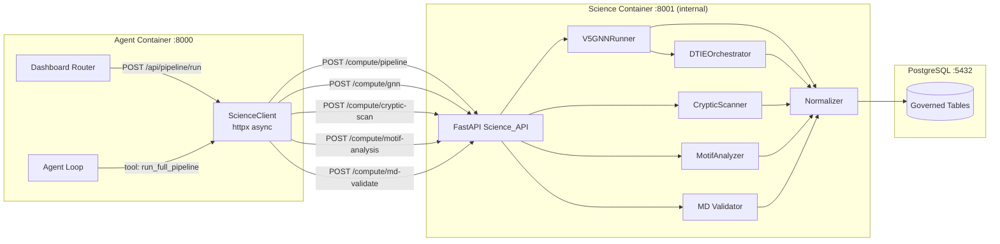

# Design Document: Science Container API

## Overview

Adds a FastAPI HTTP service to the science container (port 8001, internal Docker network only) that replaces the current docker-in-docker shell dispatch pattern. The agent container calls compute endpoints via httpx. Each endpoint runs the corresponding compute pipeline in-process (the science container has torch, PyG, geoopt, biotite, OpenMM) and persists results through the Normalizer to PostgreSQL. The agent-side `science_dispatch.py` is replaced by a typed `ScienceClient` class.

## Architecture



## Components and Interfaces

### 1. Science Container FastAPI App

Location: `science/api/app.py`

```python
from fastapi import FastAPI
from science.api.routers import compute, health

app = FastAPI(title="Tokyo Eye Science API", version="1.0.0")
app.include_router(health.router)
app.include_router(compute.router, prefix="/compute")
```

Startup: The Dockerfile.science CMD changes from a print statement to:
```
uvicorn science.api.app:app --host 0.0.0.0 --port 8001
```

### 2. Compute Router

Location: `science/api/routers/compute.py`

| Endpoint | Method | Handler |
|----------|--------|---------|
| `/compute/gnn` | POST | `run_gnn_inference()` |
| `/compute/pipeline` | POST | `run_full_pipeline()` |
| `/compute/cryptic-scan` | POST | `run_cryptic_scan()` |
| `/compute/motif-analysis` | POST | `run_motif_analysis()` |
| `/compute/md-validate` | POST | `run_md_validate()` |

Each endpoint:
1. Validates input with Pydantic models
2. Acquires a DB connection
3. Runs the compute in-process (same async event loop)
4. Persists through the Normalizer
5. Returns structured result with run_id and provenance
6. Emits pipeline runtime audit events via `shared/audit/` (geometric validation, curvature, preconditions) — queryable on the coordinator, not returned inline on every response. See `docs/audit/PIPELINE_AUDIT.md`.

`POST /compute/jobs/{job_id}` accepts optional `pipeline_job_id` for correlation with dashboard `pipeline_job` rows.

### 3. Request/Response Models

```python
# --- GNN ---
class GNNRequest(BaseModel):
    structure_id: str
    model_version: str = "v5"
    device: str = "cpu"
    checkpoint_path: str = "checkpoints_v5/v5_stage4_11prot.pt"

class GNNResponse(BaseModel):
    run_id: str
    structure_id: str
    node_count: int
    checkpoint_version_hash: str
    duration_ms: float

# --- Pipeline ---
class PipelineRequest(BaseModel):
    structure_id: str
    source_leak_only: bool = False
    device: str = "cpu"
    checkpoint_path: str = "checkpoints_v5/v5_stage4_11prot.pt"

class PipelineResponse(BaseModel):
    run_id: str
    structure_id: str
    phases_run: list[str]
    assets_created: int
    duration_ms: float
    warnings: list[str] = []

# --- Cryptic Scan ---
class CrypticScanRequest(BaseModel):
    structure_id: str
    candidate_percentile: float = 75.0
    cluster_distance_angstrom: float = 8.0
    min_cluster_size: int = 3
    max_pockets: int = 10

class CrypticScanResponse(BaseModel):
    run_id: str
    structure_id: str
    sites_found: int
    sites: list[dict]  # CrypticSiteResult objects
    duration_ms: float

# --- Motif Analysis ---
class MotifAnalysisRequest(BaseModel):
    structure_id: str
    min_cluster_size: int = 5
    min_samples: int = 3

class MotifAnalysisResponse(BaseModel):
    run_id: str
    structure_id: str
    motif_count: int
    motifs: list[dict]  # MotifResult objects
    duration_ms: float

# --- MD Validation ---
class MDValidateRequest(BaseModel):
    structure_id: str
    site_id: str
    duration_ns: float = 10.0
    temperature_k: float = 310.0
    force_field: str = "amber14-all"
    dry_run: bool = False

class MDValidateResponse(BaseModel):
    run_id: str
    structure_id: str
    site_id: str
    pocket_open_fraction: float | None
    confidence_delta: float | None
    duration_ms: float
    dry_run: bool
```

### 4. Agent-Side ScienceClient

Location: `agent/tools/science_client.py`

Replaces the shell-based `science_dispatch.py` with a typed async HTTP client.

```python
import httpx
from typing import Any

SCIENCE_BASE_URL = "http://science:8001"

class ScienceTimeoutError(Exception):
    def __init__(self, endpoint: str, timeout: float):
        self.endpoint = endpoint
        self.timeout = timeout
        super().__init__(f"Science API timeout: {endpoint} after {timeout}s")

class ScienceComputeError(Exception):
    def __init__(self, endpoint: str, status: int, detail: str):
        self.endpoint = endpoint
        self.status = status
        self.detail = detail
        super().__init__(f"Science API error: {endpoint} → {status}: {detail}")

class ScienceClient:
    def __init__(self, base_url: str = SCIENCE_BASE_URL):
        self._base_url = base_url
        self._default_timeout = 600.0
        self._health_timeout = 30.0

    async def health(self) -> dict[str, Any]:
        async with httpx.AsyncClient(timeout=self._health_timeout) as client:
            resp = await client.get(f"{self._base_url}/health")
            resp.raise_for_status()
            return resp.json()

    async def run_gnn(self, structure_id: str, **kwargs) -> dict[str, Any]:
        return await self._post("/compute/gnn", {"structure_id": structure_id, **kwargs})

    async def run_pipeline(self, structure_id: str, **kwargs) -> dict[str, Any]:
        return await self._post("/compute/pipeline", {"structure_id": structure_id, **kwargs})

    async def run_cryptic_scan(self, structure_id: str, **kwargs) -> dict[str, Any]:
        return await self._post("/compute/cryptic-scan", {"structure_id": structure_id, **kwargs})

    async def run_motif_analysis(self, structure_id: str, **kwargs) -> dict[str, Any]:
        return await self._post("/compute/motif-analysis", {"structure_id": structure_id, **kwargs})

    async def run_md_validate(self, structure_id: str, site_id: str, **kwargs) -> dict[str, Any]:
        return await self._post("/compute/md-validate", {"structure_id": structure_id, "site_id": site_id, **kwargs})

    async def _post(self, path: str, payload: dict) -> dict[str, Any]:
        try:
            async with httpx.AsyncClient(timeout=self._default_timeout) as client:
                resp = await client.post(f"{self._base_url}{path}", json=payload)
            if resp.status_code >= 400:
                detail = resp.json().get("detail", resp.text)
                raise ScienceComputeError(path, resp.status_code, detail)
            return resp.json()
        except httpx.TimeoutException:
            raise ScienceTimeoutError(path, self._default_timeout)
```

### 5. Docker Compose Changes

The science container changes from a "print and exit" entrypoint to a running FastAPI service:

```yaml
science:
  ...
  entrypoint: []
  command: ["uvicorn", "science.api.app:app", "--host", "0.0.0.0", "--port", "8001"]
  healthcheck:
    test: ["CMD", "curl", "-f", "http://localhost:8001/health"]
    interval: 10s
    timeout: 5s
    retries: 3
    start_period: 30s
```

No port mapping to host (internal network only).

### 6. Migration: fact_hyperbolic_motif

```sql
-- Migration 045: Hyperbolic motif persistence
CREATE TABLE IF NOT EXISTS fact_hyperbolic_motif (
    motif_id            TEXT PRIMARY KEY DEFAULT gen_random_uuid()::text,
    structure_id        TEXT NOT NULL REFERENCES dim_structure(structure_id),
    run_id              TEXT NOT NULL REFERENCES provenance_run(run_id),
    cluster_id          INTEGER NOT NULL,
    residue_ids         TEXT[] NOT NULL,
    medoid_residue_id   TEXT NOT NULL,
    centroid_angle_deg  DOUBLE PRECISION NOT NULL,
    centroid_radius     DOUBLE PRECISION NOT NULL,
    motif_size          INTEGER NOT NULL,
    angular_sector      TEXT NOT NULL,
    classification      TEXT,
    created_at          TIMESTAMPTZ DEFAULT NOW(),
    UNIQUE (run_id, cluster_id)
);

CREATE INDEX idx_fact_hyperbolic_motif_structure ON fact_hyperbolic_motif(structure_id);
CREATE INDEX idx_fact_hyperbolic_motif_run ON fact_hyperbolic_motif(run_id);
```

## Data Models

### Compute Job Lifecycle (Agent Side)

The agent's `POST /api/pipeline/run` endpoint now:
1. Creates a `pipeline_job` record (status=queued)
2. In background task: calls `ScienceClient.run_pipeline(structure_id)`
3. Updates job progress based on Science_API response
4. On success: marks job complete, hydration data is available
5. On failure: marks job failed with error from Science_API

### Normalizer Integration (Science Side)

Each compute endpoint follows the same pattern:
```python
async with get_connection() as conn:
    db = DBAdapter(conn)
    # Create provenance_run
    # Execute compute
    # Persist results via Normalizer
    # Return structured response
```

## Correctness Properties

*A property is a characteristic or behavior that should hold true across all valid executions of a system.*

### Property 1: Health endpoint availability

*For any* running science container, the `GET /health` endpoint SHALL respond within 5 seconds with a valid JSON payload containing `status`, `gpu_available`, and `checkpoints` fields.

**Validates: Requirements 1.2**

### Property 2: GNN persistence completeness

*For any* valid structure_id with residues in dim_residue, calling `POST /compute/gnn` SHALL result in fact_gnn_node_embedding rows equal to the structure's residue count, each with non-null hyp_projection_2d and cone_depth.

**Validates: Requirements 2.2, 2.3**

### Property 3: Pipeline phase coverage

*For any* successful pipeline run, the returned phases_run list SHALL contain all enabled phase names, and assets_created SHALL be greater than zero.

**Validates: Requirements 3.2, 3.3**

### Property 4: Cryptic scan precondition enforcement

*For any* structure_id without GNN embeddings in the database, calling `POST /compute/cryptic-scan` SHALL return HTTP 422 with a message referencing the pipeline prerequisite.

**Validates: Requirements 4.5**

### Property 5: Motif persistence round-trip

*For any* successful motif analysis, querying `fact_hyperbolic_motif` for the returned run_id SHALL yield exactly motif_count rows, each with valid residue_ids, medoid_residue_id, and angular_sector.

**Validates: Requirements 5.3, 5.4, 8.1, 8.3**

### Property 6: ScienceClient error typing

*For any* Science_API timeout, the ScienceClient SHALL raise `ScienceTimeoutError`. For any 4xx/5xx response, it SHALL raise `ScienceComputeError` with the correct status code and detail message.

**Validates: Requirements 7.3, 7.4**

### Property 7: Checkpoint hash determinism

*For any* GNN or pipeline call using the same checkpoint file, the returned checkpoint_version_hash SHALL be identical across calls.

**Validates: Requirements 2.4**

### Property 8: Idempotent pipeline re-run

*For any* structure that has already been computed, re-running the pipeline with the same checkpoint SHALL succeed (upsert semantics) and produce the same asset count.

**Validates: Requirements 3.5**

## Error Handling

| Scenario | Science API Response | Agent Behavior |
|----------|---------------------|----------------|
| Structure not in DB | 404 + detail | ScienceComputeError, job marked failed |
| No embeddings (cryptic/motif prereq) | 422 + detail | ScienceComputeError, suggest pipeline first |
| Checkpoint file missing | 500 + FileNotFoundError | ScienceComputeError, log + fail job |
| GPU OOM | 500 + RuntimeError | ScienceComputeError, suggest CPU fallback |
| DB connection failure | 503 + ConnectionError | ScienceComputeError, retry once |
| OpenMM not installed | 501 + detail | ScienceComputeError, skip MD validation |
| Timeout (>600s) | No response | ScienceTimeoutError, job marked timed_out |

## Testing Strategy

### Property-Based Testing

Library: **Hypothesis** (Python)

Configuration: minimum 100 examples per property test.

Tag format: `# Feature: science-container-api, Property N: <title>`

### Unit Tests

- ScienceClient: mock httpx responses, verify error typing
- Compute router: mock InferenceEngine/Normalizer, verify response schemas
- Health endpoint: verify structure under various conditions (GPU/no-GPU, checkpoints present/missing)

### Integration Tests

- Full GNN → DB round-trip with real PostgreSQL
- Pipeline → hydration endpoint returns populated data
- Cryptic scan prereq enforcement (422 when no embeddings)
- Motif analysis → fact_hyperbolic_motif populated

### Test Organization

```
tests/
├── test_science_client.py              # Agent-side client unit tests
├── test_science_api_unit.py            # Science router with mocked compute
├── test_science_api_integration.py     # Full round-trip with DB
```
