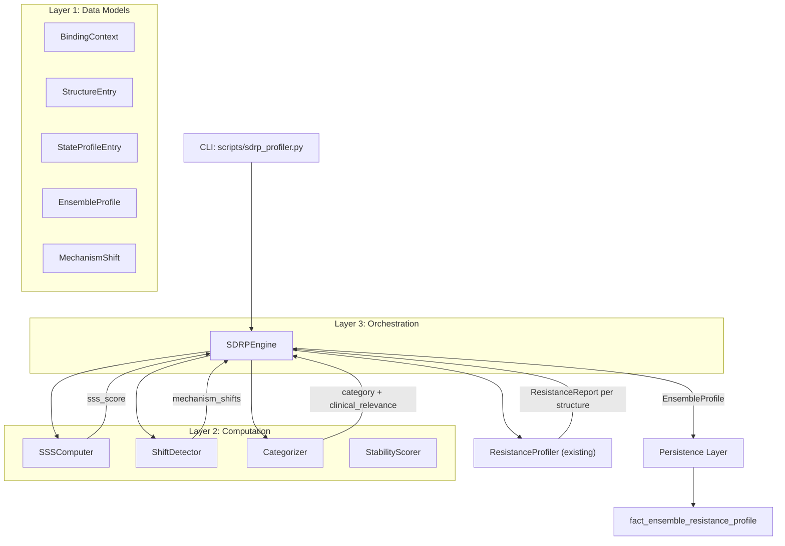

# Design Document: State-Dependent Resistance Profile (SDRP)

## Overview

The SDRP module replaces the single-consensus resistance classification paradigm with a multi-dimensional conformational profile. It wraps the existing `ResistanceProfiler`, running it independently against multiple PDB structures (each representing a different drug-binding state), then computes a State-Sensitivity Score (SSS) via Jensen-Shannon Divergence to quantify how much a mutation's resistance mechanism varies across conformational states.

The key design principle: **divergence is data, not error.** A mutation that classifies differently across PDBs is a "Conformational Switch" — a biologically meaningful signal indicating state-dependent resistance that requires different drug design strategies per binding context.

The module produces an `EnsembleProfile` containing:
- Per-state classifications with stability scores (not a single consensus)
- SSS quantifying conformational plasticity
- Mechanism shift annotations between states
- Clinical relevance categorization (Conformational Switch vs Static Disruptor)

## Architecture



## Components and Interfaces

### Layer 1: Data Models (`science/dtie/v5/resistance/sdrp_models.py`)

```python
@dataclass
class BindingContext:
    """Metadata describing the conformational state of a PDB structure."""
    label: str           # Human-readable label, e.g. "imatinib_bound"
    drug: str | None     # Drug name if ligand-bound, None for apo
    binding_mode: str    # "type_i", "type_ii", "allosteric", "apo"
    pdb_id: str          # Source PDB identifier

@dataclass
class StructureEntry:
    """A structure to profile against, with its binding context."""
    structure_id: str
    binding_context: BindingContext

@dataclass
class KinaseStateSet:
    """Canonical conformational states for a kinase family.
    
    Optional constraint that defines the expected states for structured
    downstream ML. Sparse states (not provided) get None entries in the
    profile, enabling consistent feature vectors across variants.
    """
    kinase_family: str           # e.g., "ABL1"
    canonical_states: list[str]  # e.g., ["apo", "imatinib_bound", "dasatinib_bound", "ponatinib_bound"]

@dataclass
class StateProfileEntry:
    """Per-state classification result within an SDRP.
    
    Preserves raw metrics for post-hoc debugging alongside the classification.
    """
    mechanism_class: str       # "Type_I_Steric", "Type_II_Allosteric", "Hybrid", "Neutral"
    stability_score: float     # 0.0–1.0, margin to nearest decision boundary
    confidence_score: float    # Original classifier confidence
    site_uncertainty_delta: float  # Raw Δε_site
    max_hub_delta: float          # Raw max |Δε_hub|
    propagation_radius: int       # Count of perturbed residues

@dataclass
class MechanismShift:
    """Records a mechanism change between two conformational states.
    
    This is an observational record — it captures WHAT changed, not WHY.
    The optional structural_basis field is an extension point for future
    causal analysis (backbone RMSD, DFG state, contact network changes).
    """
    source_state: str          # BindingContext label
    target_state: str          # BindingContext label
    source_class: str
    target_class: str
    delta_site_uncertainty: float   # target.site_delta - source.site_delta
    delta_max_hub: float            # target.max_hub - source.max_hub
    structural_basis: dict | None = None  # Future: RMSD, DFG state, contact Jaccard

@dataclass
class EnsembleProfile:
    """Complete SDRP output for a single variant."""
    variant: str
    state_profile: dict[str, StateProfileEntry]  # binding_context.label → entry
    conformational_sensitivity: float  # Alias for sss_score (0.0–1.0)
    sss_score: float                   # Jensen-Shannon Divergence / log₂(4)
    category: str                      # "Conformational_Switch", "Static_Disruptor", "Intermediate"
    clinical_relevance: str            # Summary string
    mechanism_shifts: list[MechanismShift]
    structure_entries: list[StructureEntry]  # Input structures for provenance
    per_structure_run_ids: list[str]         # Provenance linkage
    error_structures: dict[str, str]         # structure_id → error message
```

### Layer 2: Computation

#### SSS Computer (`science/dtie/v5/resistance/sdrp_sss.py`)

```python
CLASS_SPACE = ["Type_I_Steric", "Type_II_Allosteric", "Hybrid", "Neutral"]

# Fixed normalization denominator: log₂(|CLASS_SPACE|) = log₂(4) = 2.0
# This ensures SSS is commensurable across batches of any size.
# Raw JSD ∈ [0, log₂(4)] = [0, 2], so SSS = JSD / 2.0 ∈ [0, 1].
SSS_NORMALIZATION_FACTOR = np.log2(len(CLASS_SPACE))  # 2.0

def mechanism_to_probability_vector(
    mechanism_class: str,
    confidence_score: float,
) -> np.ndarray:
    """Convert a classification to a probability vector over CLASS_SPACE.
    
    The classified category gets weight = confidence_score.
    Remaining (1 - confidence) is distributed uniformly across other classes.
    
    Returns:
        np.ndarray of shape (4,) summing to 1.0.
    """
    ...

def compute_sss(
    state_entries: list[StateProfileEntry],
) -> float:
    """Compute State-Sensitivity Score via Jensen-Shannon Divergence.
    
    JSD is computed over the probability vectors of all state entries.
    Normalized by dividing by log₂(|CLASS_SPACE|) = 2.0 to produce
    a fixed [0.0, 1.0] range independent of batch size.
    
    This fixed denominator ensures SSS scores are commensurable across
    different ensemble sizes and cross-study comparisons.
    
    None entries (from sparse KinaseStateSet) are SKIPPED — SSS is
    computed only over populated states. This prevents artificial
    inflation when comparing ensembles of different cardinality.
    
    Returns:
        SSS in [0.0, 1.0]. 0 = all states agree, 1 = maximum divergence.
    """
    ...
```

#### Stability Scorer (`science/dtie/v5/resistance/sdrp_stability.py`)

```python
def compute_stability_score(
    site_delta: float,
    max_hub_delta: float,
    propagation_radius: int,
    mechanism_class: str,
    config: ClassifierConfig,
) -> float:
    """Compute margin to nearest decision boundary that would flip the call.
    
    For each classification threshold that is relevant to the current
    mechanism_class, compute the distance from the observed metric to
    that threshold. The minimum distance (weakest link) determines stability.
    
    This directly measures how much noise you can add before flipping
    the classification — analogous to |log_odds(predicted) - log_odds(runner_up)|.
    
    Formula:
        For Type_I_Steric:
            margin = min(
                |site_delta| - site_threshold,  # must stay above
                hub_threshold - max_hub_delta,   # must stay below
            )
        For Type_II_Allosteric:
            margin = min(
                max_hub_delta - hub_threshold,   # must stay above
                radius - radius_threshold,       # must stay above
            )
        For Hybrid/Neutral: margin based on distance to nearest clear class
        
        stability = clamp(margin / normalization_scale, 0.0, 1.0)
    
    The normalization_scale is set to 2× the threshold value so that
    stability = 0.5 means "exactly at 1× threshold distance."
    """
    ...
```

#### Shift Detector (`science/dtie/v5/resistance/sdrp_shifts.py`)

```python
def detect_mechanism_shifts(
    state_profile: dict[str, StateProfileEntry],
) -> list[MechanismShift]:
    """Detect all pairwise mechanism shifts between states.
    
    A shift is recorded when two states have different mechanism_class values.
    Only unique pairs are recorded (A→B, not also B→A).
    """
    ...
```

#### Categorizer (`science/dtie/v5/resistance/sdrp_categorizer.py`)

```python
SSS_SWITCH_THRESHOLD = 0.5
SSS_STATIC_THRESHOLD = 0.3

def categorize(sss_score: float) -> str:
    """Categorize based on SSS thresholds."""
    ...

def generate_clinical_relevance(
    category: str,
    variant: str,
    state_profile: dict[str, StateProfileEntry],
    mechanism_shifts: list[MechanismShift],
) -> str:
    """Generate a clinical relevance summary string."""
    ...
```

### Layer 3: Orchestration (`science/dtie/v5/resistance/sdrp_engine.py`)

```python
class SDRPEngine:
    """Orchestrates multi-structure ensemble profiling.
    
    Accepts variable-cardinality structure sets. If a KinaseStateSet is
    provided, the output state_profile will include None entries for
    canonical states not represented in the input structures, enabling
    consistent feature vectors for downstream ML.
    """
    
    def __init__(
        self,
        db: Any,
        checkpoint_path: str = DEFAULT_CHECKPOINT,
        device: str = "cpu",
        classifier_config: ClassifierConfig | None = None,
        kinase_state_set: KinaseStateSet | None = None,
    ):
        self._profiler = ResistanceProfiler(
            db=db,
            checkpoint_path=checkpoint_path,
            device=device,
            classifier_config=classifier_config,
        )
        self._db = db
        self._kinase_state_set = kinase_state_set
    
    async def profile_variant(
        self,
        variant: MutationSpec,
        structures: list[StructureEntry],
        hub_residues: list[tuple[str, int]] | None = None,
    ) -> EnsembleProfile:
        """Profile a single variant across multiple structures.
        
        Each structure is profiled independently using the existing
        ResistanceProfiler. Per-structure baselines are cached and
        reused across variants in batch mode.
        """
        ...
    
    async def profile_batch(
        self,
        variants: list[MutationSpec],
        structures: list[StructureEntry],
        hub_residues: list[tuple[str, int]] | None = None,
        on_progress: Callable[[int, int], None] | None = None,
    ) -> list[EnsembleProfile]:
        """Profile multiple variants across the same structure ensemble.
        
        Baselines are computed once per structure and shared across all
        variants. Progress callback receives (variants_completed, total).
        """
        ...
```

## Data Models

### Probability Vector Construction

For a classification with `mechanism_class = "Type_I_Steric"` and `confidence_score = 0.85`:

```
CLASS_SPACE = ["Type_I_Steric", "Type_II_Allosteric", "Hybrid", "Neutral"]

probability_vector = [0.85, 0.05, 0.05, 0.05]
                      ^^^^  ^^^^^^^^^^^^^^^^^^^^
                      conf  (1-conf)/3 each
```

### Jensen-Shannon Divergence

Given N state probability vectors P₁, P₂, ..., Pₙ:

```
M = (P₁ + P₂ + ... + Pₙ) / N          # Mixture distribution
JSD = H(M) - (H(P₁) + H(P₂) + ... + H(Pₙ)) / N
```

Where H is Shannon entropy with log base 2.

Raw JSD ∈ [0, log₂(|CLASS_SPACE|)] = [0, log₂(4)] = [0, 2.0].

**Normalization**: SSS = JSD / log₂(|CLASS_SPACE|) = JSD / 2.0

This fixed denominator (2.0) ensures SSS ∈ [0, 1] regardless of ensemble size, making scores commensurable across different batch sizes and cross-study comparisons. The denominator is a property of the class space cardinality, not the data.

### Stability Score

The stability score measures the minimum margin to the nearest decision boundary that would flip the classification. This is analogous to `|log_odds(predicted) - log_odds(runner_up)|` — it directly measures how much noise you can add before the call changes.

For **Type_I_Steric** (must have: site significant, hub NOT significant):
```
margin = min(
    (|site_delta| - site_threshold) / site_threshold,   # site must stay above threshold
    (hub_threshold - max_hub_delta) / hub_threshold,    # hub must stay below threshold
)
```

For **Type_II_Allosteric** (must have: hub significant, radius significant):
```
margin = min(
    (max_hub_delta - hub_threshold) / hub_threshold,    # hub must stay above threshold
    (radius - radius_threshold) / radius_threshold,     # radius must stay above threshold
)
```

For **Hybrid/Neutral**: margin is the distance to the nearest clear-class boundary.

```
stability = clamp(margin, 0.0, 1.0)
```

A stability of 0.5 means the metrics are exactly 1× threshold-distance away from flipping. A stability of 1.0 means ≥1× threshold-distance (saturated).

### Baseline Sharing (Batch Context)

Each PDB structure has its own independent WT baseline. When profiling T315I across 3 PDBs (1IEP, 2HYY, 3CS9):

- 1IEP gets its own WT baseline (WT inference on 1IEP graph)
- 2HYY gets its own WT baseline (WT inference on 2HYY graph)
- 3CS9 gets its own WT baseline (WT inference on 3CS9 graph)

The existing `ResistanceProfiler._ensure_baseline(structure_id)` handles this caching. In batch mode, when profiling multiple variants against the same ensemble, each structure's baseline is computed once and reused across all variants — but never shared between different PDB structures.

This ensures the null reference is always the same protein in the same conformational state, just without the mutation applied.

### Database Schema

```sql
-- Migration 037: Ensemble Resistance Profile
CREATE TABLE IF NOT EXISTS fact_ensemble_resistance_profile (
    ensemble_id     TEXT PRIMARY KEY,
    variant         TEXT NOT NULL,
    sss_score       DOUBLE PRECISION NOT NULL,
    category        TEXT NOT NULL,  -- "Conformational_Switch", "Static_Disruptor", "Intermediate"
    state_profile   JSONB NOT NULL, -- Full state_profile mapping
    mechanism_shifts JSONB,         -- List of MechanismShift entries
    clinical_relevance TEXT,
    structure_ids   TEXT[] NOT NULL, -- Array of structure_ids in the ensemble
    run_ids         TEXT[] NOT NULL, -- Array of per-structure run_ids for provenance
    computed_at     TIMESTAMPTZ NOT NULL DEFAULT NOW(),
    
    UNIQUE(variant, structure_ids)   -- Upsert key
);

CREATE INDEX IF NOT EXISTS idx_ensemble_profile_variant
    ON fact_ensemble_resistance_profile(variant);

CREATE INDEX IF NOT EXISTS idx_ensemble_profile_category
    ON fact_ensemble_resistance_profile(category);

CREATE INDEX IF NOT EXISTS idx_ensemble_profile_sss
    ON fact_ensemble_resistance_profile(sss_score);
```

## Correctness Properties

*A property is a characteristic or behavior that should hold true across all valid executions of a system — essentially, a formal statement about what the system should do. Properties serve as the bridge between human-readable specifications and machine-verifiable correctness guarantees.*

### Property 1: Ensemble output count matches input structures

*For any* variant and list of N structure entries where K structures succeed and (N-K) fail, the resulting EnsembleProfile SHALL contain exactly K entries in state_profile and (N-K) entries in error_structures.

**Validates: Requirements 1.1, 1.3, 1.4**

### Property 2: Ensemble_Profile completeness

*For any* valid EnsembleProfile, it SHALL contain all required top-level fields (variant, state_profile, conformational_sensitivity, sss_score, category, clinical_relevance, mechanism_shifts) AND each state_profile entry SHALL contain mechanism_class, stability_score, site_uncertainty_delta, and max_hub_delta. The output SHALL NOT contain a field named "consensus_class".

**Validates: Requirements 2.1, 2.2, 2.3**

### Property 3: JSON serializability round-trip

*For any* valid EnsembleProfile, serializing to JSON via json.dumps SHALL succeed without error, and the resulting JSON SHALL be parseable back to a dict containing all required fields.

**Validates: Requirements 2.4**

### Property 4: SSS equals JSD of probability vectors

*For any* list of StateProfileEntries with known mechanism_classes and confidence_scores, the computed SSS SHALL equal the Jensen-Shannon Divergence of the corresponding probability vectors (within floating-point tolerance of 1e-10).

**Validates: Requirements 3.1, 3.2**

### Property 5: SSS bounds

*For any* list of two or more StateProfileEntries (with any combination of mechanism_classes and confidence_scores), the computed SSS SHALL be in the range [0.0, 1.0].

**Validates: Requirements 3.5**

### Property 6: SSS monotonicity with divergence

*For any* set of StateProfileEntries where all entries have the same mechanism_class, the SSS SHALL be less than or equal to the SSS of a modified set where one entry's mechanism_class is changed to a different class (holding confidence constant).

**Validates: Requirements 3.3, 3.4**

### Property 7: Stability score bounds and monotonicity

*For any* set of classification metrics (site_delta, max_hub_delta, propagation_radius), the stability_score SHALL be in [0.0, 1.0]. Furthermore, for any two sets of metrics where one is strictly farther from all decision boundaries than the other, the farther set SHALL have a higher or equal stability_score.

**Validates: Requirements 4.1, 4.2, 4.3**

### Property 8: Categorization threshold correctness

*For any* SSS value in [0.0, 1.0]: if SSS > 0.5 the category SHALL be "Conformational_Switch"; if SSS < 0.3 the category SHALL be "Static_Disruptor"; if 0.3 ≤ SSS ≤ 0.5 the category SHALL be "Intermediate". Additionally, the clinical_relevance string SHALL be non-empty.

**Validates: Requirements 5.1, 5.2, 5.3, 5.4**

### Property 9: Mechanism shift detection completeness

*For any* state_profile with K distinct mechanism_classes across N states, the number of detected MechanismShifts SHALL equal the number of unique pairs (i, j) where state_profile[i].mechanism_class ≠ state_profile[j].mechanism_class. Each shift SHALL include delta_site_uncertainty and delta_max_hub annotations.

**Validates: Requirements 6.1, 6.2, 6.3**

### Property 10: Batch output order preservation

*For any* list of N variants processed as a batch, the returned list of EnsembleProfiles SHALL have length N and the i-th profile SHALL correspond to the i-th input variant.

**Validates: Requirements 7.1, 7.4**

### Property 11: Persistence upsert idempotence

*For any* EnsembleProfile, persisting it twice with the same variant and structure ensemble SHALL result in exactly one row in the database (upsert behavior, not duplicate).

**Validates: Requirements 8.3**

## Error Handling

| Scenario | Behavior |
|----------|----------|
| Single structure fails in ensemble | Error recorded in `error_structures`, remaining structures continue |
| All structures fail | EnsembleProfile with empty state_profile, SSS = 0.0, category = "Error" |
| Fewer than 2 successful structures | SSS = 0.0, category based on single result's confidence |
| Empty structure list | `ValueError("At least two structures required for ensemble profiling")` |
| Empty variant list (batch) | `ValueError("At least one variant required")` |
| Invalid MutationSpec | Propagated from underlying ResistanceProfiler |
| DB persistence failure | Warning logged, profile still returned to caller |

## Testing Strategy

### Property-Based Testing

Library: **Hypothesis** (consistent with project conventions)

Configuration: minimum 100 examples per property test.

Each property test tagged with:
```python
# Feature: state-dependent-resistance-profile, Property N: <property text>
```

### Unit Tests

- Probability vector construction for each mechanism_class
- JSD computation against known analytical values (e.g., two identical distributions → 0, two maximally different → 1)
- Stability score for known T315I-like metrics (far from boundaries → high stability)
- Categorization at exact threshold boundaries (0.3, 0.5)
- Mechanism shift detection with 2, 3, 4 states
- Clinical relevance string generation for each category

### Integration Tests

- Full `profile_variant` against 1IEP + 2HYY with T315I (expect Static_Disruptor, low SSS)
- Full `profile_variant` against 1IEP + 2HYY + 3CS9 with H396R (expect Conformational_Switch, high SSS)
- Batch profiling with mixed valid/invalid variants
- Database persistence round-trip

### Test Isolation

Property tests use:
- Synthetic StateProfileEntry lists (no real inference needed for SSS/stability/categorization tests)
- Mock ResistanceProfiler responses for engine-level tests
- Real ClassifierConfig thresholds (static data)

Integration tests use:
- Real PostgreSQL + real checkpoint
- Known structures (1IEP, 2HYY, 3CS9) with validated expected outputs

