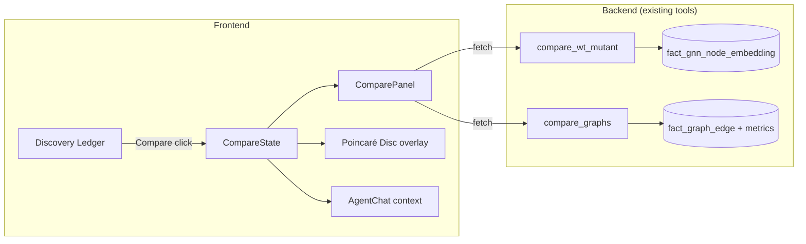

# Design Document: Structure Compare

## Overview

Adds a compare mode to the dashboard where two ingested structures can be analyzed side-by-side. The user activates comparison from the Discovery Ledger, and a dedicated Compare Panel (in the tool sidebar) displays embedding displacements, graph topology diffs, and metric deltas. The Poincaré disc supports an overlay mode showing both structures simultaneously. All comparison data feeds into the agent context so the LLM can reason about differences.

## Architecture



## Components and Interfaces

### CompareState (App-level state)

```typescript
interface CompareState {
  active: boolean;
  primaryStructure: Structure;    // same as activeStructure
  secondaryStructure: Structure | null;
  displacements: DisplacementResult | null;
  graphDiff: GraphCompareResult | null;
  loading: boolean;
  error: string | null;
}
```

Managed in `App.tsx` alongside `activeStructure`. When `secondaryStructure` is set, compare mode is active. Clearing it exits compare mode.

### Compare Activation Flow

1. User clicks "Compare" button on a row in `ResultsTable`
2. `ResultsTable` calls `enterCompareMode(structure)` from context
3. `App.tsx` sets `compareState.secondaryStructure = structure`
4. `App.tsx` triggers parallel fetches: `api.compareWtMutant(primary, secondary)` + `api.compareGraphs(primary, secondary)`
5. Results stored in `compareState.displacements` and `compareState.graphDiff`

### API Endpoints (existing, no changes needed)

- `POST /api/agent/chat` with tool call `compare_wt_mutant(wt_structure_id, mutant_structure_id)`
- `POST /api/agent/chat` with tool call `compare_graphs(structure_id_a, structure_id_b)`

For direct frontend use without the agent, we'll add thin REST wrappers:

```python
# New endpoints
@router.get("/api/compare/embeddings/{id_a}/{id_b}")
async def compare_embeddings(id_a: str, id_b: str):
    """Direct endpoint wrapping compare_wt_mutant for frontend use."""
    
@router.get("/api/compare/graphs/{id_a}/{id_b}")
async def compare_graphs_endpoint(id_a: str, id_b: str):
    """Direct endpoint wrapping compare_graphs for frontend use."""
```

### ComparePanel Component

A new tool panel with three tabs:

```typescript
// Tab 1: Embeddings
interface DisplacementRow {
  residue_id: string;
  chain: string;
  index: number;
  primary_depth: number;
  secondary_depth: number;
  depth_delta: number;
  displacement: number;  // hyperbolic distance
}

// Tab 2: Graph
interface GraphDiffSummary {
  gained_count: number;
  lost_count: number;
  changed_count: number;
  hbond_gained: number;
  hbond_lost: number;
  metric_deltas: MetricDeltaRow[];
}

interface MetricDeltaRow {
  residue_id: string;
  chain: string;
  betweenness_delta: number;
  degree_delta: number;
  clustering_delta: number;
}

// Tab 3: Summary
interface CompareSummary {
  mean_displacement: number;
  max_displacement: number;
  movers_above_threshold: number;
  threshold: number;
  top_movers: DisplacementRow[];  // top 10
}
```

### Poincaré Disc Overlay

When compare mode is active and overlay is toggled on:
- Fetch secondary structure embeddings via `api.getEmbeddings(secondaryStructure.structure_id)`
- Render secondary points as hollow circles (stroke-only) with 60% opacity
- On residue selection, draw a line from primary position → secondary position
- Point color uses the same metric normalization (shared min/max across both structures)

### Discovery Ledger Compare Button

Each row in `ResultsTable` gets a "⇔" (compare) icon button that:
- Is disabled when the row IS the active structure
- Is disabled when the structure has no embeddings
- On click: calls `enterCompareMode(structure)`

### Agent Context Integration

When compare mode is active, `buildContext()` adds:

```typescript
compare: {
  secondary_structure_id: string;
  top_movers: Array<{ residue_id: string; displacement: number }>;
  edge_diff: { gained: number; lost: number; changed: number };
}
```

## Data Models

No new database tables. All comparison data is computed on-the-fly from existing fact tables:
- `fact_gnn_node_embedding` — for displacement calculation
- `fact_graph_edge` — for edge diff
- `fact_graph_node_metrics` — for metric deltas

Alignment uses canonical position `(chain_label, residue_index)` as implemented in existing `compare_wt_mutant` and `compare_graphs` tools.

## Correctness Properties

*A property is a characteristic or behavior that should hold true across all valid executions of a system — essentially, a formal statement about what the system should do.*

### Property 1: Displacement table sorted by magnitude

*For any* set of per-residue displacements returned by the comparison, the displacement table rows shall be sorted in descending order by displacement magnitude and each row shall contain non-null values for residue_id, chain, index, primary_depth, secondary_depth, depth_delta, and displacement.

**Validates: Requirements 2.1, 2.2**

### Property 2: Summary statistics accuracy

*For any* set of displacement values and a given threshold, the summary's mean_displacement shall equal the arithmetic mean of all displacement values, max_displacement shall equal the maximum value, and movers_above_threshold shall equal the count of displacements exceeding the threshold.

**Validates: Requirements 2.4, 5.3**

### Property 3: Edge diff counts consistency

*For any* two sets of graph edges keyed by canonical position, the gained count shall equal the number of edges present in structure B but absent in structure A, the lost count shall equal edges in A absent from B, and changed count shall equal edges present in both but with different weights.

**Validates: Requirements 3.1**

### Property 4: H-bond subset accuracy

*For any* edge diff result, the hbond_gained count shall equal the number of entries in the gained edges list where edge_type is 'hbond', and hbond_lost shall equal the same filter on lost edges.

**Validates: Requirements 3.4**

### Property 5: Metric delta arithmetic

*For any* two sets of per-residue graph metrics aligned by canonical position, the delta for each metric (betweenness, degree, clustering_coefficient) shall equal the value in structure B minus the value in structure A.

**Validates: Requirements 3.3**

### Property 6: Compare context payload completeness

*For any* active compare mode state with both structures having embeddings, the agent context payload shall include non-null values for compare.secondary_structure_id, compare.top_movers (non-empty array), and compare.edge_diff with numeric gained/lost/changed values.

**Validates: Requirements 6.2**

### Property 7: CSV export completeness

*For any* displacement result with N rows, the CSV export string shall contain exactly N+1 lines (header + data), and the header shall include all required column names.

**Validates: Requirements 5.4**

## Error Handling

- Secondary structure has no embeddings: show error in Compare Panel, don't enter compare mode
- Structures have no overlapping residues (different proteins): display "0 aligned residues" with explanation
- API timeout on large comparisons: show loading state, allow cancellation
- One structure deleted while in compare mode: exit compare mode, notify user

## Testing Strategy

**Property-Based Testing Library:** Hypothesis (Python) for backend comparison logic.

**Approach:**
- Property tests: Backend displacement sorting, summary stats, edge diff consistency (Properties 1-5)
- Unit tests: Frontend CompareState transitions, context payload construction
- Integration tests: Full compare flow from API to rendered panel

**Tag format:** `Feature: structure-compare, Property {number}: {property_text}`

Each property test runs minimum 100 iterations with Hypothesis-generated data.
