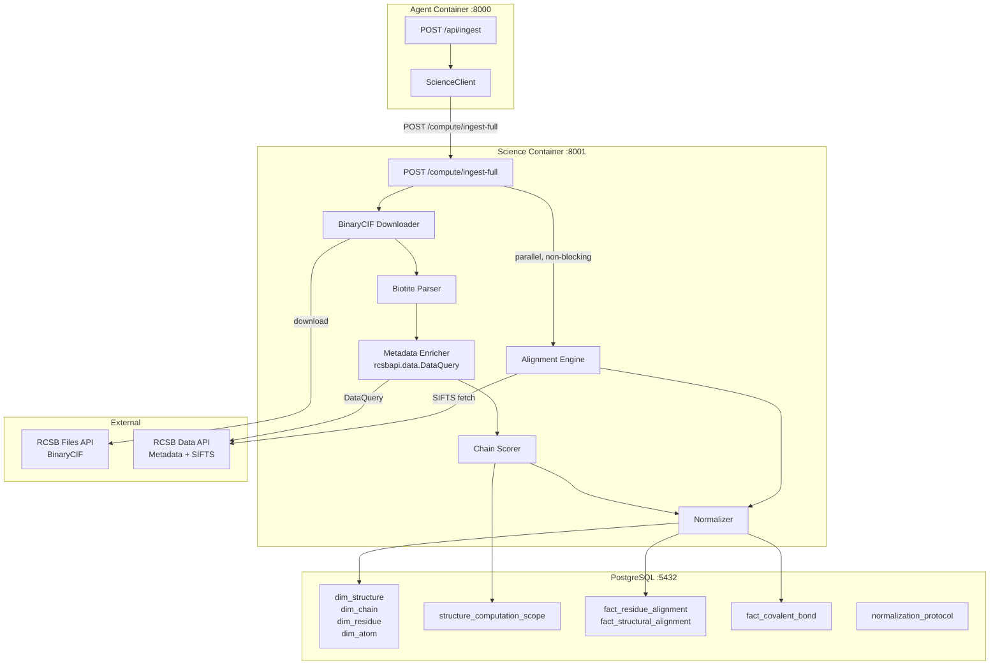
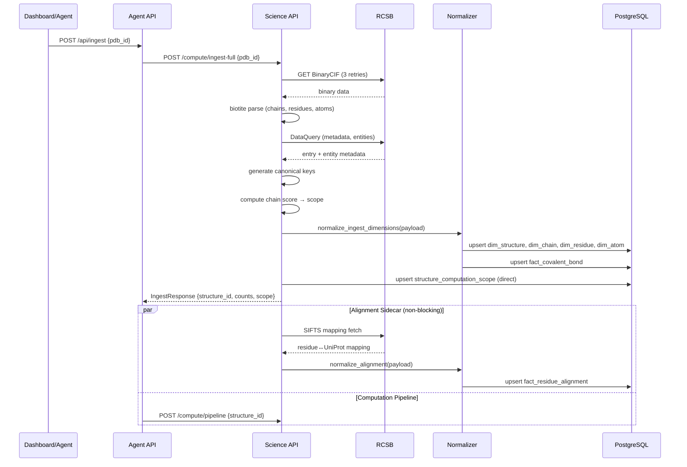

# Design Document: Structure Ingestion & Normalization

## Overview

This design covers the full lifecycle of PDB structure ingestion in Tokyo Eye: BinaryCIF download → atom-level parsing → metadata enrichment → canonical key assignment → computation scope selection → persistent storage via Normalizer → post-ingest alignment sidecar. The core principle is that raw ingest is opinion-free (all data preserved as deposited), and normalization is applied JIT via named versioned protocols tailored to specific computation tasks.

The implementation lives primarily in the science container (which has biotite, numpy, scipy) with a thin agent-side endpoint that delegates to the science API. All writes go through the Normalizer single write path except computation_scope (which is configuration, direct upsert).

## Architecture



### Ingestion Sequence



## Components and Interfaces

### 1. BinaryCIF Downloader

Location: `science/dtie/ingest/downloader.py`

```python
from dataclasses import dataclass
from pathlib import Path

@dataclass
class DownloadResult:
    pdb_id: str
    file_path: Path
    file_hash: str  # SHA-256 of downloaded content
    size_bytes: int

async def download_bcif(
    pdb_id: str,
    output_dir: Path = Path("/tmp/bcif"),
    max_retries: int = 3,
    backoff_base: float = 2.0,
) -> DownloadResult:
    """Download BinaryCIF from RCSB with retry + exponential backoff.
    
    URL pattern: https://files.rcsb.org/download/{pdb_id}.bcif.gz
    """
    ...
```

### 2. Structure Parser

Location: `science/dtie/ingest/parser.py`

```python
from dataclasses import dataclass, field

@dataclass
class ParsedAtom:
    atom_name: str
    element: str
    x: float
    y: float
    z: float
    occupancy: float
    b_factor: float
    altloc: str | None
    is_hetero: bool
    model_id: int

@dataclass
class ParsedResidue:
    auth_seq_id: int
    label_seq_id: int | None
    insertion_code: str | None
    residue_name: str      # 1-letter
    residue_name_3: str    # 3-letter
    comp_id: str           # mmCIF comp_id
    parent_comp_id: str | None  # for modified residues
    sse_code: str | None
    is_resolved: bool
    is_modified: bool
    atoms: list[ParsedAtom] = field(default_factory=list)

@dataclass
class ParsedChain:
    auth_asym_id: str
    label_asym_id: str
    entity_id: str
    entity_type: str  # protein, nucleic_acid, etc.
    residues: list[ParsedResidue] = field(default_factory=list)

@dataclass
class ParsedStructure:
    pdb_id: str
    method: str
    resolution: float | None
    r_factor: float | None
    r_free: float | None
    title: str
    organism: str | None
    release_date: str | None
    polymer_composition: str  # e.g., "protein", "protein/na"
    model_count: int
    assembly_id: str | None
    chains: list[ParsedChain] = field(default_factory=list)
    covalent_bonds: list[CovalentBond] = field(default_factory=list)
    modified_residues: dict[str, str] = field(default_factory=dict)  # comp_id → parent_comp_id

@dataclass
class CovalentBond:
    chain_1: str
    res_seq_1: int
    ins_code_1: str | None
    atom_1: str
    chain_2: str
    res_seq_2: int
    ins_code_2: str | None
    atom_2: str
    bond_type: str  # disulf, covale, etc.

def parse_bcif(file_path: Path) -> ParsedStructure:
    """Parse BinaryCIF using biotite into structured dataclasses.
    
    Extracts:
    - All chains (from _atom_site + _pdbx_poly_seq_scheme)
    - All residues including unresolved (is_resolved=False from seq scheme)
    - All atoms with altlocs preserved
    - SSE from _struct_conf
    - Modified residues from _pdbx_struct_mod_residue
    - Covalent bonds from _struct_conn
    """
    ...
```

### 3. Metadata Enricher

Location: `science/dtie/ingest/metadata.py`

```python
from dataclasses import dataclass

@dataclass
class EntityMetadata:
    entity_id: str
    organism: str | None
    uniprot_accessions: list[str]
    entity_type: str
    ref_seq_ids: list[str]

@dataclass
class StructureMetadata:
    title: str
    resolution: float | None
    organism: str | None
    release_date: str | None
    entities: list[EntityMetadata]
    auth_to_label_mapping: dict[str, str]  # auth_asym_id → label_asym_id

async def enrich_metadata(pdb_id: str) -> StructureMetadata | None:
    """Query RCSB Data API via rcsbapi for entry + entity metadata.
    
    Returns None if API unreachable (graceful degradation).
    Uses rcsbapi's built-in batching and rate limiting.
    """
    ...
```

### 4. Chain Scorer

Location: `science/dtie/ingest/chain_scorer.py`

```python
from dataclasses import dataclass

@dataclass
class ChainScore:
    chain_id: str
    auth_asym_id: str
    score: float
    factors: dict[str, float]
    is_representative: bool

@dataclass
class ComputationScope:
    primary_chain_ids: list[str]
    reference_chain: str
    exclude_chain_ids: list[str]
    scope_source: str  # 'auto' or 'user'
    selection_reason: str
    normalization_protocol: str  # default: 'graph_default'
    quality_filters: QualityFilters | None = None

@dataclass
class QualityFilters:
    max_b_factor_threshold: float = 100.0
    min_resolution: float | None = None

SCORING_WEIGHTS = {
    "is_protein": 10.0,         # polymer type = protein
    "uniprot_coverage": 3.0,    # fraction of residues with UniProt mapping
    "resolved_fraction": 2.0,   # fraction of resolved residues
    "b_factor_quality": 1.5,    # inverse of mean B-factor (normalized)
    "not_duplicate": 2.0,       # is NOT a duplicate entity instance
    "low_mutation_burden": 1.0, # fewer engineered mutations
    "sequence_length": 0.5,     # longer = slightly preferred (tiebreaker)
}

def score_chains(
    parsed: ParsedStructure,
    metadata: StructureMetadata | None,
) -> ComputationScope:
    """Score all chains and select primary + reference.
    
    Algorithm:
    1. Collapse duplicate entity instances (same entity_id) → pick highest scorer
    2. Score each unique entity representative
    3. Primary = highest scoring protein chain
    4. Exclude = non-protein + duplicate instances
    """
    ...
```

### 5. Normalization Protocols

Location: `science/dtie/normalize/protocols/`

```python
from dataclasses import dataclass
from enum import Enum

class ProtocolName(str, Enum):
    GRAPH_DEFAULT = "graph_default"
    FAMILY_COMPARE = "family_compare"
    BINDING_SITE = "binding_site"
    INTERFACE = "interface"

@dataclass
class NormalizationProtocol:
    name: ProtocolName
    version: int
    parameters: dict  # protocol-specific config

    def apply(self, parsed: ParsedStructure, scope: ComputationScope) -> NormalizedView:
        """Apply this protocol to produce a task-specific view."""
        ...

PROTOCOL_REGISTRY: dict[ProtocolName, NormalizationProtocol] = {
    ProtocolName.GRAPH_DEFAULT: NormalizationProtocol(
        name=ProtocolName.GRAPH_DEFAULT,
        version=1,
        parameters={
            "atoms": "protein_only",
            "altloc": "highest_occupancy",
            "modified_residues": "harmonize_to_parent",
            "unresolved": "exclude",
            "projection": "ca_only",
            "partial_backbone": "exclude",
        },
    ),
    ProtocolName.FAMILY_COMPARE: NormalizationProtocol(
        name=ProtocolName.FAMILY_COMPARE,
        version=1,
        parameters={
            "residues": "sifts_mapped_only",
            "intersection": "uniprot_positions",
            "superposition": "apply_reference",
            "tags_tails": "exclude",
            "mutations": "retain",
        },
    ),
    ProtocolName.BINDING_SITE: NormalizationProtocol(
        name=ProtocolName.BINDING_SITE,
        version=1,
        parameters={
            "ligands": "within_cutoff",
            "cutoff_angstrom": 5.0,
            "waters": "exclude_unless_bridging",
            "frame": "local_pocket",
            "protonation": "untouched",
        },
    ),
    ProtocolName.INTERFACE: NormalizationProtocol(
        name=ProtocolName.INTERFACE,
        version=1,
        parameters={
            "chains": "multi_chain",
            "assembly": "biological",
            "entity_collapse": False,
        },
    ),
}
```

### 6. Alignment Engine

Location: `science/dtie/alignment/`

```python
from dataclasses import dataclass
import numpy as np

@dataclass
class ResidueAlignment:
    residue_id: str
    uniprot_accession: str
    uniprot_position: int | None
    isoform_id: str | None
    mapping_source: str  # "sifts"
    mapping_confidence: float
    reason_code: str | None  # null=mapped, "tag", "engineered", "unmapped"

@dataclass
class ComparableCore:
    """The subset of residues used for superposition."""
    residue_pairs: list[tuple[str, str]]  # (residue_id_query, residue_id_ref)
    uniprot_positions: list[int]
    criteria: dict  # JSON-serializable definition for reproducibility

@dataclass
class SuperpositionResult:
    rotation_matrix: np.ndarray  # 3x3
    translation: np.ndarray      # 3
    rmsd: float
    aligned_residue_count: int
    comparable_core: ComparableCore

async def fetch_sifts_mapping(
    pdb_id: str,
    chain_label: str,
    uniprot_accession: str,
) -> list[ResidueAlignment]:
    """Fetch SIFTS PDB↔UniProt residue mapping from RCSB.
    
    Uses rcsbapi's alignment endpoint or PDBe SIFTS API.
    Returns empty list (with warning log) if unavailable.
    """
    ...

def compute_kabsch_superposition(
    query_coords: np.ndarray,   # Nx3 Cα coordinates
    ref_coords: np.ndarray,     # Nx3 Cα coordinates (same N)
    comparable_core: ComparableCore,
) -> SuperpositionResult:
    """Compute optimal rotation + translation minimizing RMSD.
    
    Uses SVD-based Kabsch algorithm (scipy.spatial.transform).
    Handles reflection case (det(R) = -1).
    """
    ...
```

### 7. Ingest Endpoint (Science Container)

Location: `science/api/routers/ingest.py`

```python
from pydantic import BaseModel

class IngestRequest(BaseModel):
    pdb_id: str
    force_reingest: bool = False

class IngestResponse(BaseModel):
    structure_id: str
    chain_count: int
    residue_count: int
    atom_count: int
    computation_scope: dict
    alignment_status: str  # "completed", "pending", "skipped"
    already_existed: bool

@router.post("/compute/ingest-full")
async def ingest_full(request: IngestRequest) -> IngestResponse:
    """Full structure ingestion pipeline.
    
    Steps:
    1. Check idempotency (skip if exists and not force)
    2. Download BinaryCIF
    3. Parse with biotite
    4. Enrich metadata from RCSB Data API
    5. Generate canonical keys
    6. Compute chain scores → scope
    7. Derive quality flags (partial_backbone, low_confidence_coords, max_b_factor)
    8. Persist via Normalizer (dimensions + covalent bonds)
    9. Store computation scope (direct upsert)
    10. Fire alignment sidecar (background, non-blocking)
    11. Return summary
    """
    ...
```

### 8. Normalizer Ingestion Path

Location: extends `data/normalizer/core.py`

```python
# New method on Normalizer class

async def normalize_ingest_dimensions(
    self, payload: IngestDimensionPayload
) -> NormalizerResult:
    """Persist structure dimensions from ingestion.
    
    Writes: dim_structure, dim_chain, dim_residue, dim_atom, fact_covalent_bond.
    Source_type: 'empirical' for dimensions, 'empirical' for covalent bonds.
    
    Partial failure semantics: each table is its own sub-transaction.
    If dim_atom fails, dim_structure/chain/residue are still committed.
    """
    ...
```

### 9. Normalizer Alignment Path

```python
async def normalize_alignment(
    self, payload: AlignmentPayload
) -> NormalizerResult:
    """Persist UniProt alignment + structural superposition.
    
    Writes: fact_residue_alignment, fact_structural_alignment.
    Source_type: 'deterministic'.
    """
    ...
```

## Data Models

### IngestDimensionPayload (Pydantic)

```python
class IngestDimensionPayload(BaseModel):
    provenance: ProvenanceContext
    structure: StructureDimension
    chains: list[ChainDimension]
    residues: list[ResidueDimension]
    atoms: list[AtomDimension]
    covalent_bonds: list[CovalentBondFact]
    file_hash: str
    biotite_version: str
    rcsbapi_version: str

class StructureDimension(BaseModel):
    structure_id: str
    pdb_id: str
    source: str = "rcsb"
    method: str
    resolution: float | None
    r_factor: float | None
    r_free: float | None
    title: str
    organism: str | None
    release_date: str | None
    polymer_composition: str
    model_count: int
    assembly_id: str | None

class ChainDimension(BaseModel):
    chain_id: str  # canonical: structure_id:auth_asym_id
    structure_id: str
    auth_asym_id: str
    label_asym_id: str
    entity_id: str
    entity_type: str
    sequence_length: int
    uniprot_accession: str | None
    uniprot_start: int | None
    uniprot_end: int | None
    is_entity_duplicate: bool
    is_representative: bool

class ResidueDimension(BaseModel):
    residue_id: str  # canonical key
    chain_id: str
    residue_index: int  # auth_seq_id
    label_seq_id: int | None
    insertion_code: str | None
    residue_name: str
    residue_name_3: str
    comp_id: str
    parent_comp_id: str | None
    sse_code: str | None
    is_resolved: bool
    is_modified: bool
    max_b_factor: float | None
    low_confidence_coords: bool
    partial_backbone: bool

class AtomDimension(BaseModel):
    atom_id: str  # canonical: residue_id:atom_name[:altloc]
    residue_id: str
    atom_name: str
    element: str
    x: float
    y: float
    z: float
    occupancy: float
    b_factor: float
    altloc: str | None
    is_hetero: bool
    model_id: int

class CovalentBondFact(BaseModel):
    residue_id_1: str
    residue_id_2: str
    atom_name_1: str
    atom_name_2: str
    bond_type: str
```

### AlignmentPayload (Pydantic)

```python
class AlignmentPayload(BaseModel):
    provenance: ProvenanceContext
    structure_id: str
    residue_alignments: list[ResidueAlignmentRecord]
    structural_alignments: list[StructuralAlignmentRecord] | None = None

class ResidueAlignmentRecord(BaseModel):
    residue_id: str
    uniprot_accession: str
    uniprot_position: int | None
    isoform_id: str | None
    mapping_source: str = "sifts"
    mapping_confidence: float
    reason_code: str | None  # null = successfully mapped

class StructuralAlignmentRecord(BaseModel):
    query_structure_id: str
    reference_structure_id: str
    uniprot_accession: str
    rotation_matrix: list[list[float]]  # 3x3 flattened
    translation: list[float]            # 3
    rmsd: float
    aligned_residue_count: int
    comparable_core: dict               # JSON: criteria + positions
    protocol_version: str
```

### Schema Extensions (Migration 047)

```sql
-- Migration 047: Structure Ingestion Schema Extensions
-- Extends core dimensions for full BinaryCIF ingest support

-- dim_structure extensions
ALTER TABLE dim_structure ADD COLUMN IF NOT EXISTS title TEXT;
ALTER TABLE dim_structure ADD COLUMN IF NOT EXISTS organism TEXT;
ALTER TABLE dim_structure ADD COLUMN IF NOT EXISTS release_date DATE;
ALTER TABLE dim_structure ADD COLUMN IF NOT EXISTS polymer_composition TEXT;
ALTER TABLE dim_structure ADD COLUMN IF NOT EXISTS r_factor DOUBLE PRECISION;
ALTER TABLE dim_structure ADD COLUMN IF NOT EXISTS r_free DOUBLE PRECISION;
ALTER TABLE dim_structure ADD COLUMN IF NOT EXISTS model_count INTEGER DEFAULT 1;
ALTER TABLE dim_structure ADD COLUMN IF NOT EXISTS assembly_id TEXT;

-- dim_chain extensions
ALTER TABLE dim_chain ADD COLUMN IF NOT EXISTS label_asym_id TEXT;
ALTER TABLE dim_chain ADD COLUMN IF NOT EXISTS entity_id TEXT;
ALTER TABLE dim_chain ADD COLUMN IF NOT EXISTS sequence_length INTEGER;
ALTER TABLE dim_chain ADD COLUMN IF NOT EXISTS uniprot_accession TEXT;
ALTER TABLE dim_chain ADD COLUMN IF NOT EXISTS uniprot_start INTEGER;
ALTER TABLE dim_chain ADD COLUMN IF NOT EXISTS uniprot_end INTEGER;
ALTER TABLE dim_chain ADD COLUMN IF NOT EXISTS is_entity_duplicate BOOLEAN DEFAULT FALSE;
ALTER TABLE dim_chain ADD COLUMN IF NOT EXISTS is_representative BOOLEAN DEFAULT TRUE;

-- dim_residue extensions
ALTER TABLE dim_residue ADD COLUMN IF NOT EXISTS label_seq_id INTEGER;
ALTER TABLE dim_residue ADD COLUMN IF NOT EXISTS insertion_code TEXT;
ALTER TABLE dim_residue ADD COLUMN IF NOT EXISTS comp_id TEXT;
ALTER TABLE dim_residue ADD COLUMN IF NOT EXISTS parent_comp_id TEXT;
ALTER TABLE dim_residue ADD COLUMN IF NOT EXISTS is_resolved BOOLEAN DEFAULT TRUE;
ALTER TABLE dim_residue ADD COLUMN IF NOT EXISTS is_modified BOOLEAN DEFAULT FALSE;
ALTER TABLE dim_residue ADD COLUMN IF NOT EXISTS max_b_factor DOUBLE PRECISION;
ALTER TABLE dim_residue ADD COLUMN IF NOT EXISTS low_confidence_coords BOOLEAN DEFAULT FALSE;
ALTER TABLE dim_residue ADD COLUMN IF NOT EXISTS partial_backbone BOOLEAN DEFAULT FALSE;

-- dim_atom extensions
ALTER TABLE dim_atom ADD COLUMN IF NOT EXISTS altloc TEXT;
ALTER TABLE dim_atom ADD COLUMN IF NOT EXISTS is_hetero BOOLEAN DEFAULT FALSE;
ALTER TABLE dim_atom ADD COLUMN IF NOT EXISTS model_id INTEGER DEFAULT 1;

-- Computation scope table (new)
CREATE TABLE IF NOT EXISTS structure_computation_scope (
    structure_id        TEXT PRIMARY KEY REFERENCES dim_structure(structure_id),
    primary_chain_ids   TEXT[] NOT NULL,
    reference_chain     TEXT NOT NULL,
    exclude_chain_ids   TEXT[] DEFAULT '{}',
    scope_source        TEXT NOT NULL DEFAULT 'auto',  -- 'auto' or 'user'
    selection_reason    TEXT,
    normalization_protocol TEXT NOT NULL DEFAULT 'graph_default',
    quality_filters     JSONB,
    model_index         INTEGER DEFAULT 1,
    created_at          TIMESTAMPTZ DEFAULT NOW(),
    updated_at          TIMESTAMPTZ DEFAULT NOW()
);

-- Residue alignment table (new)
CREATE TABLE IF NOT EXISTS fact_residue_alignment (
    id                  BIGSERIAL PRIMARY KEY,
    residue_id          TEXT NOT NULL REFERENCES dim_residue(residue_id),
    uniprot_accession   TEXT NOT NULL,
    uniprot_position    INTEGER,  -- NULL = unmapped
    isoform_id          TEXT,
    mapping_source      TEXT NOT NULL DEFAULT 'sifts',
    mapping_confidence  DOUBLE PRECISION NOT NULL,
    reason_code         TEXT,  -- NULL = success, else: tag, engineered, unmapped
    run_id              TEXT NOT NULL REFERENCES provenance_run(run_id),
    created_at          TIMESTAMPTZ DEFAULT NOW(),
    UNIQUE (residue_id, uniprot_accession, run_id)
);

CREATE INDEX idx_fact_residue_alignment_uniprot ON fact_residue_alignment(uniprot_accession, uniprot_position);
CREATE INDEX idx_fact_residue_alignment_residue ON fact_residue_alignment(residue_id);

-- Structural alignment table (new)
CREATE TABLE IF NOT EXISTS fact_structural_alignment (
    id                      BIGSERIAL PRIMARY KEY,
    query_structure_id      TEXT NOT NULL REFERENCES dim_structure(structure_id),
    reference_structure_id  TEXT NOT NULL REFERENCES dim_structure(structure_id),
    uniprot_accession       TEXT NOT NULL,
    rotation_matrix         DOUBLE PRECISION[9] NOT NULL,
    translation             DOUBLE PRECISION[3] NOT NULL,
    rmsd                    DOUBLE PRECISION NOT NULL,
    aligned_residue_count   INTEGER NOT NULL,
    comparable_core         JSONB NOT NULL,
    protocol_version        TEXT NOT NULL,
    run_id                  TEXT NOT NULL REFERENCES provenance_run(run_id),
    created_at              TIMESTAMPTZ DEFAULT NOW(),
    UNIQUE (query_structure_id, reference_structure_id, uniprot_accession, run_id)
);

CREATE INDEX idx_fact_structural_alignment_query ON fact_structural_alignment(query_structure_id);
CREATE INDEX idx_fact_structural_alignment_ref ON fact_structural_alignment(reference_structure_id);

-- Covalent bond table (new)
CREATE TABLE IF NOT EXISTS fact_covalent_bond (
    id              BIGSERIAL PRIMARY KEY,
    structure_id    TEXT NOT NULL REFERENCES dim_structure(structure_id),
    residue_id_1    TEXT NOT NULL REFERENCES dim_residue(residue_id),
    residue_id_2    TEXT NOT NULL REFERENCES dim_residue(residue_id),
    atom_name_1     TEXT NOT NULL,
    atom_name_2     TEXT NOT NULL,
    bond_type       TEXT NOT NULL,
    run_id          TEXT NOT NULL REFERENCES provenance_run(run_id),
    created_at      TIMESTAMPTZ DEFAULT NOW(),
    UNIQUE (structure_id, residue_id_1, residue_id_2, bond_type)
);

-- Normalization protocol registry (new)
CREATE TABLE IF NOT EXISTS normalization_protocol (
    protocol_name   TEXT PRIMARY KEY,
    version         INTEGER NOT NULL DEFAULT 1,
    parameters      JSONB NOT NULL,
    description     TEXT,
    created_at      TIMESTAMPTZ DEFAULT NOW(),
    updated_at      TIMESTAMPTZ DEFAULT NOW()
);

-- Seed default protocols
INSERT INTO normalization_protocol (protocol_name, version, parameters, description)
VALUES
    ('graph_default', 1, '{"atoms":"protein_only","altloc":"highest_occupancy","modified_residues":"harmonize_to_parent","unresolved":"exclude","projection":"ca_only","partial_backbone":"exclude"}', 'Default for GNN graph building'),
    ('family_compare', 1, '{"residues":"sifts_mapped_only","intersection":"uniprot_positions","superposition":"apply_reference","tags_tails":"exclude","mutations":"retain"}', 'For cross-structure family comparison'),
    ('binding_site', 1, '{"ligands":"within_cutoff","cutoff_angstrom":5.0,"waters":"exclude_unless_bridging","frame":"local_pocket","protonation":"untouched"}', 'For binding site analysis'),
    ('interface', 1, '{"chains":"multi_chain","assembly":"biological","entity_collapse":false}', 'For protein-protein interface analysis')
ON CONFLICT (protocol_name) DO NOTHING;
```

## Correctness Properties

*A property is a characteristic or behavior that should hold true across all valid executions of a system — essentially, a formal statement about what the system should do. Properties serve as the bridge between human-readable specifications and machine-verifiable correctness guarantees.*

### Property 1: Ingestion completeness

*For any* valid PDB structure, after successful ingestion the number of dim_chain rows SHALL equal the number of polymer chains in the BinaryCIF, the number of dim_residue rows SHALL equal the total residue count (resolved + unresolved from pdbx_poly_seq_scheme), and each chain row SHALL contain both auth_asym_id and label_asym_id non-null.

**Validates: Requirements 1.4, 1.5, 2.3**

### Property 2: Idempotent re-ingest

*For any* structure_id, calling ingest-full twice with the same pdb_id SHALL produce identical dimension row counts and identical canonical keys. The second call SHALL NOT create duplicate rows.

**Validates: Requirements 1.8, 9.4**

### Property 3: Canonical key determinism

*For any* valid (pdb_id, auth_asym_id, auth_seq_id, insertion_code) tuple, the generated residue_id SHALL be deterministic (same inputs → same output), SHALL match the regex `^[a-zA-Z0-9_]+:[A-Za-z0-9]+:\d+(:[A-Za-z])?$`, and two residues with the same auth_seq_id but different insertion codes SHALL produce distinct residue_ids.

**Validates: Requirements 3.1, 3.2, 3.3, 3.6**

### Property 4: Key format rejection

*For any* residue_id that does not match the canonical format regex, the Normalizer SHALL reject the payload and raise NormalizerError.

**Validates: Requirements 3.5, 11.6**

### Property 5: Modified residue parent mapping

*For any* structure containing modified residues (MSE, SEP, etc.), each modified residue in dim_residue SHALL have is_modified=true and parent_comp_id set to the standard parent amino acid.

**Validates: Requirements 1.9**

### Property 6: Partial backbone detection

*For any* residue where one or more of {N, CA, C} backbone atoms are missing from the atom list, dim_residue.partial_backbone SHALL be true.

**Validates: Requirements 1.11**

### Property 7: Duplicate entity detection

*For any* structure with multiple chains sharing the same entity_id, all chains except the representative SHALL have is_entity_duplicate=true, and exactly one chain per entity_id SHALL have is_representative=true.

**Validates: Requirements 2.4, 4.6**

### Property 8: Chain scorer selects highest quality

*For any* structure with multiple protein chains, the chain scorer SHALL assign the highest score to the chain with the best combination of quality signals, and the selected primary_chain SHALL always be a protein chain (never nucleic acid or ligand).

**Validates: Requirements 4.1**

### Property 9: graph_default protocol filtering

*For any* structure processed with the graph_default normalization protocol, the resulting view SHALL contain only protein atoms, SHALL select highest-occupancy altloc where alternates exist, SHALL exclude unresolved residues, and SHALL exclude residues with partial_backbone=true.

**Validates: Requirements 5.2**

### Property 10: Provenance records protocol and versions

*For any* ingestion run, the provenance_run record SHALL contain the normalization_protocol name, protocol version, BinaryCIF file_hash, rcsbapi version string, and biotite version string in its parameters field.

**Validates: Requirements 5.6, 11.7**

### Property 11: Alignment completeness with reason codes

*For any* chain with a UniProt accession and available SIFTS data, every residue in that chain SHALL have a fact_residue_alignment record. Mapped residues SHALL have non-null uniprot_position. Unmapped residues (tags, engineered) SHALL have uniprot_position=NULL with a non-null reason_code.

**Validates: Requirements 6.2, 6.3**

### Property 12: Kabsch superposition validity

*For any* structural superposition between two structures sharing a UniProt accession, the rotation_matrix SHALL be orthogonal (R^T·R ≈ I within tolerance 1e-6), det(R) SHALL be +1 (no reflection), RMSD SHALL be non-negative, and aligned_residue_count SHALL equal the number of positions in the comparable_core.

**Validates: Requirements 7.1, 7.2, 7.3**

### Property 13: Covalent bond extraction

*For any* structure with disulfide bonds in _struct_conn, the corresponding fact_covalent_bond rows SHALL exist with correct residue_id pairs and bond_type='disulf'.

**Validates: Requirements 8.1**

### Property 14: B-factor derived quality flags

*For any* residue, dim_residue.max_b_factor SHALL equal the maximum b_factor value across all its atoms. *For any* residue where max_b_factor > 100, low_confidence_coords SHALL be true.

**Validates: Requirements 8.3, 8.5**

### Property 15: Source type classification

*For any* dimension write (dim_structure, dim_chain, dim_residue, dim_atom), provenance source_type SHALL be 'empirical'. *For any* alignment write (fact_residue_alignment, fact_structural_alignment), provenance source_type SHALL be 'deterministic'.

**Validates: Requirements 11.1, 11.2, 11.3**

### Property 16: Partial failure persistence

*For any* ingestion where a later stage (e.g., alignment) fails, all data from earlier successful stages (dimensions, covalent bonds) SHALL remain persisted in the database.

**Validates: Requirements 11.5**

## Error Handling

| Scenario | Behavior | Recovery |
|----------|----------|----------|
| BinaryCIF download fails (network) | Retry 3× with exponential backoff (2s, 4s, 8s) | Return error after exhausting retries |
| BinaryCIF download 404 (invalid PDB ID) | Immediate error, no retry | Return 404 to caller |
| Biotite parse failure (corrupt file) | Log error with file_hash, raise | Return 500 with parse error detail |
| RCSB Data API unreachable | Proceed with BinaryCIF-only metadata | Log warning, metadata fields may be null |
| SIFTS mapping unavailable | Skip alignment sidecar | Log warning, structure usable without alignment |
| Normalizer key validation failure | Reject entire dimension payload | Return 422 with invalid key detail |
| Partial atom data (missing coords) | Skip atom, log warning | Continue with available atoms |
| Duplicate structure (already exists) | Return existing metadata (idempotent) | No error |
| DB connection failure during write | Rollback transaction, retry once | Return 503 if retry fails |
| Kabsch fails (< 3 common residues) | Skip superposition for this pair | Log, alignment records still stored |

## Testing Strategy

### Property-Based Testing

Library: **Hypothesis** (Python)

Configuration: minimum 100 examples per property test, `@settings(max_examples=200)` for complex properties.

Tag format: `# Feature: structure-ingestion-normalization, Property N: <title>`

Strategy generators needed:
- `st_pdb_id()` — 4-character alphanumeric
- `st_parsed_structure()` — generates ParsedStructure with realistic chain/residue/atom distributions
- `st_chain_set()` — generates sets of chains with entity duplicates
- `st_residue_with_atoms()` — generates residues with varying backbone completeness
- `st_modified_residue()` — generates modified residues with parent mapping
- `st_alignment_pair()` — generates two structures sharing a UniProt accession

### Unit Tests

- Canonical key generation edge cases (negative residue_index, insertion codes)
- Chain scorer: verify scoring formula with known inputs
- Protocol filtering: verify each protocol's exclusion rules
- B-factor computation: verify max across atoms
- Partial backbone detection: verify N/CA/C presence check

### Integration Tests

- Full ingest round-trip: submit PDB ID → verify all tables populated
- Idempotency: ingest same structure twice → verify no duplicates
- Alignment sidecar: verify fact_residue_alignment populated post-ingest
- Metadata graceful degradation: mock RCSB API down → verify ingest succeeds

### Test Organization

```
tests/
├── test_ingest_properties.py           # Property-based tests (Properties 1-16)
├── test_ingest_parser.py               # Biotite parser unit tests
├── test_chain_scorer.py                # Chain scoring unit tests
├── test_normalization_protocols.py     # Protocol filtering tests
├── test_alignment_engine.py            # Kabsch + SIFTS unit tests
├── test_ingest_integration.py          # Full round-trip integration tests
```

### Module Layout

```
science/dtie/
├── ingest/                    # Raw ingestion (no opinions)
│   ├── __init__.py
│   ├── downloader.py          # BinaryCIF download + retry
│   ├── parser.py              # biotite BinaryCIF → ParsedStructure
│   ├── metadata.py            # RCSB Data API enrichment
│   └── chain_scorer.py        # Multi-factor chain selection → scope
│
├── normalize/                 # JIT normalization (task-specific views)
│   ├── __init__.py
│   ├── scope_selector.py      # Reads scope, applies protocol
│   └── protocols/
│       ├── base.py
│       ├── graph_default.py
│       ├── family_compare.py
│       ├── binding_site.py
│       └── interface.py
│
├── alignment/                 # Post-ingest sidecar
│   ├── __init__.py
│   ├── sifts_mapper.py        # SIFTS PDB↔UniProt fetch
│   ├── kabsch_aligner.py      # SVD-based superposition
│   └── alignment_engine.py    # Orchestrates align + persist
│
└── common/
    ├── keys.py                # Canonical key generation (existing)
    └── ingest_payloads.py     # Pydantic models for ingest + alignment
```
