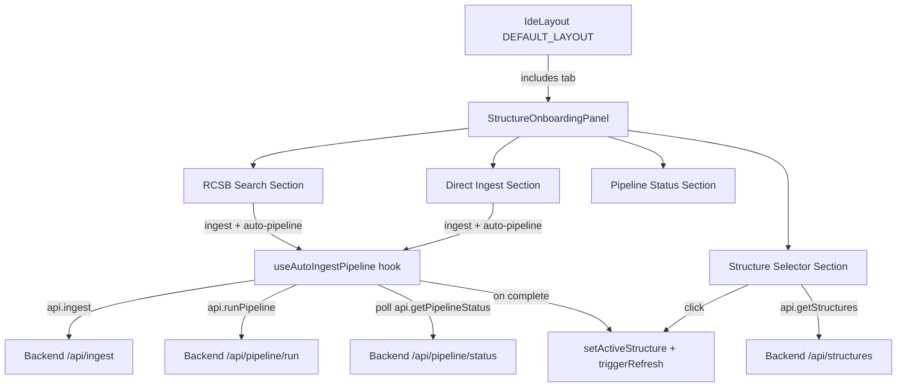

# Design Document: Structure Onboarding Panel

## Overview

This feature adds a "Structures" tab to the default IdeLayout that combines RCSB search, direct PDB ingest, structure selection, and pipeline status into a single unified panel. The key behavioral change is that ingesting a structure (from search or direct ID) automatically triggers the full normalize→inference→pipeline flow.

The implementation reuses existing API client methods (`api.ingest`, `api.runPipeline`, `api.getPipelineStatus`, `api.rcsbSearch`, `api.getStructures`) and adapts logic from the existing `RCSBSearchPanel` and `PipelineControls` components into a new composite component.

## Architecture



## Components and Interfaces

### New Component: `StructureOnboardingPanel`

Location: `visualizer/frontend/src/components/StructureOnboardingPanel.tsx`

A tabbed panel with four sections. Each section is rendered inline (no sub-routes), and state is maintained via local `useState` so switching sections preserves inputs/results.

### New Hook: `useAutoIngestPipeline`

Location: `visualizer/frontend/src/lib/useAutoIngestPipeline.ts`

Encapsulates the ingest→pipeline→poll→complete flow:

```typescript
interface UseAutoIngestPipelineOptions {
  onComplete: (structure: Structure) => void;
  onError: (error: string) => void;
}

interface UseAutoIngestPipelineReturn {
  ingestAndRun: (pdbId: string) => Promise<void>;
  isIngesting: boolean;
  isRunningPipeline: boolean;
  pipelineJob: PipelineJob | null;
  error: string | null;
  reset: () => void;
}
```

Flow:
1. Call `api.ingest(pdbId)` 
2. On success, call `api.runPipeline({ structure_id, modules: all })` 
3. Poll `api.getPipelineStatus(jobId)` every 2s
4. On complete: call `onComplete(structure)` which sets active + refreshes
5. On failure: call `onError(msg)`

### Modified: `IdeLayout` DEFAULT_LAYOUT

Add a "Structures" tab to the right-side tabset:

```json
{
  "type": "tab",
  "name": "Structures",
  "component": "structure_onboarding"
}
```

### Modified: `IdeLayout` factory

Add case for `"structure_onboarding"` → `<StructureOnboardingPanel />`.

## Data Models

No new data models. Reuses existing types from `lib/types.ts`:
- `Structure` — from `api.getStructures()` and constructed from `IngestResponse`
- `PipelineJob` — from `api.runPipeline()` and `api.getPipelineStatus()`
- `RCSBSearchResult` — from `api.rcsbSearch()`
- `IngestResponse` — from `api.ingest()`

## Correctness Properties

*A property is a characteristic or behavior that should hold true across all valid executions of a system — essentially, a formal statement about what the system should do. Properties serve as the bridge between human-readable specifications and machine-verifiable correctness guarantees.*

### Property 1: Search results contain required information and action

*For any* RCSB search result returned by the API, the rendered result card SHALL contain the PDB ID, title, resolution (if available), method (if available), and an actionable "Ingest & Run" control.

**Validates: Requirements 2.1, 2.2**

### Property 2: Auto-pipeline triggers after successful ingest

*For any* successful ingest response (containing a valid `structure_id`), the `useAutoIngestPipeline` hook SHALL call `api.runPipeline` with that `structure_id` and all default modules enabled, without additional user interaction.

**Validates: Requirements 3.1, 4.1**

### Property 3: Pipeline completion activates structure and refreshes dashboard

*For any* pipeline job that reaches `status === "complete"`, the hook SHALL call `setActiveStructure` with the ingested structure AND call `triggerRefresh` to update all panels.

**Validates: Requirements 4.3, 5.4**

### Property 4: Structure list displays required fields

*For any* structure returned by `api.getStructures()`, the rendered list item SHALL contain the structure's PDB ID, title (or structure_id fallback), and a processing status indicator (Complete/Processing/Ingested).

**Validates: Requirements 5.1**

### Property 5: Structure selection sets active structure

*For any* structure in the selector list, clicking it SHALL result in `setActiveStructure` being called with that structure object.

**Validates: Requirements 5.2**

## Error Handling

| Scenario | Behavior |
|----------|----------|
| RCSB search fails | Display error message, allow retry. Search results cleared. |
| Ingest fails (404/502/500) | Display error, re-enable input. No pipeline triggered. |
| Pipeline fails | Display error with step info, provide "Retry Pipeline" button. Structure remains ingested but not active. |
| Pipeline poll network error | Continue polling (resilient). Only stop on explicit fail/complete. |
| Structure list fetch fails | Show empty list with "retry" option. Non-blocking. |

## Testing Strategy

**Unit Tests:**
- `useAutoIngestPipeline` hook: test that ingest success triggers pipeline call
- `useAutoIngestPipeline` hook: test that pipeline completion calls onComplete
- `useAutoIngestPipeline` hook: test that ingest failure does not trigger pipeline
- `StructureOnboardingPanel`: test that default layout includes the structures tab

**Property-Based Tests:**
- Library: [fast-check](https://github.com/dubzzz/fast-check) (standard PBT for TypeScript)
- Minimum 100 iterations per property
- Tag format: **Feature: structure-onboarding-panel, Property {N}: {title}**

Properties 2 and 3 are the most valuable to test with PBT since they encode the core behavioral contract of the auto-pipeline flow. Properties 1, 4, 5 are rendering properties better suited to example-based unit tests since they involve DOM assertions.
