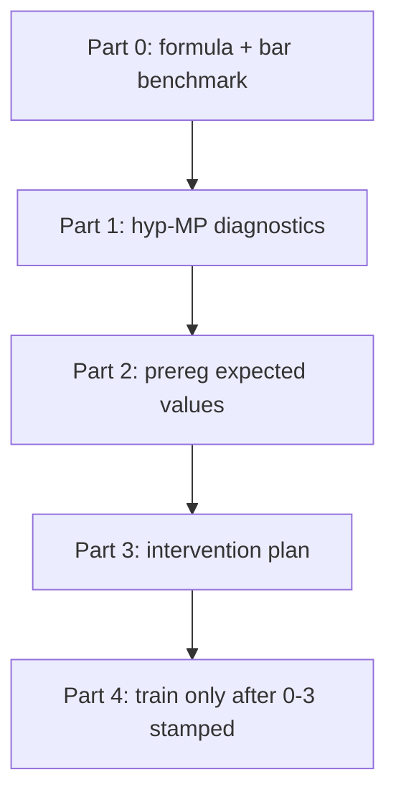

# Tokyo Eye v7 B′ — uncertainty unpark brief

**Status:** PARKED (2026-07-21)  
**Health SSOT (unchanged):** `checkpoints/v7/runs/tokyo_eye_v7_bprime_core_floor_continue_v1/v7_healthy_sealed.pt`  
**Failed recovery closeout:** [`data/gates/tokyo_eye_v7_bprime_uncertainty_heads_closeout.json`](../../../data/gates/tokyo_eye_v7_bprime_uncertainty_heads_closeout.json)  
**Prereg that authorized rematch-0/1:** [`bprime-uncertainty-heads-prereg.md`](bprime-uncertainty-heads-prereg.md)

This note is the **unpark SSOT** for **evidential (NIG) head** recovery. Do not reopen with another blind coeff bump on the rematch stack.

**Companion (investigation metrics, not NIG):** Starting definitions for **allele sensitivity** and **epistatic coupling** on frozen \(x_{\mathrm{hyp}}\) — [`investigation-allele-epistasis-metrics.md`](investigation-allele-epistasis-metrics.md). Those are accepted as park-time starting points; they must **not** reuse the abbreviations `ale`/`epi` (collision with aleatoric/epistemic).

---

## Why park / what went wrong methodologically

Hyp MP is **new** communication geometry. The first recovery run nonetheless started from **pre-existing Euclidean/P4 feeler mitigations** (`epistemic_decoupling`, `epi_ale_decorrelation`, `epistemic_anticollapse` knobs ported from `p4_uncertainty_calibration`) without:

1. Measuring where TokyoEye+hyp-MP sits against **known uncertainty formulas / bars**
2. Separating **epi** (“haven’t seen this”) from **ale** (noise / τ-boundary) failure modes
3. Diagnosing *what blocks* epi under frozen trunk + NIG heads

That was the wrong order. Rematch-0/1 proved the **freeze+disc-hold path works** and that **scales can move**, but they do **not** prove the inherited recipe is the right one for v7.

**“Budget exhausted”** only means: the rematch-0 prereg authorized **one** coeff rematch. It is not a claim that uncertainty is impossible under hyp-MP.

---

## What we actually know (evidence, not folklore)

### Baseline (sealed health, pre-recovery)

| Signal | ~Value | Read |
|--------|--------|------|
| `disc_r_mean` | ≥0.25 (Pass) | Health OK |
| `aleatoric_std_mean` | ~0.0036 | Collapsed |
| `epistemic_std_mean` | ~0.0031 | Collapsed |
| `probe_r_epi_ale` | ~−0.77 | Locked anti-correlation |
| Uncertainty coeffs in health stack | **0** | Never trained |

### Rematch-0 (mild inherited coeffs, heads-only)

| | Start → End (24 ep) |
|--|---------------------|
| ale std | 0.0032 → 0.0045 (flat) |
| epi std | 0.0026 → 0.0040 (flat) |
| `|r(epi,ale)|` | 0.29 → ~0 (**unlocked**) |
| disc | flat ~0.269 |

### Rematch-1 (↑ decoupling/decorr/anticollapse only; still no v3 ale hinge)

| | Start → End | Bar |
|--|-------------|-----|
| ale std | 0.0046 → **0.013** | need ≥0.02 — miss |
| epi std | 0.0042 → **0.013** | ≥0.01 — **Pass** |
| `evidence_nu_cv` | 0.0025 → **0.007** | need ≥0.02 — miss |
| `|r|` | ~0.02 | ≤0.70 — Pass |
| τ relative lift | → 0.173 | need ≥0.20 — miss (fell as ale std rose) |
| disc | flat ~0.269 | Pass |

**Working pieces:** heads-only freeze protects disc; anti-correlation can unlock; rematch-1 **does** move epi/ale scale (~3×); epi std can clear a pragmatic floor.

**Not working / unknown:** whether inherited P4 terms are the right levers under hyp-MP; ν diversity (structure of evidence) vs mere std inflate; ale informative floor (0.05 historical) still far; no formula-level audit done.

Runs (compare-only archaeology):  
`tokyo_eye_v7_bprime_uncertainty_heads_v1`, `…_rematch_v1`. Prefer sealed health for any biology path.

---

## Unpark order of operations (mandatory)

When reopening, do **not** jump to training. Execute in this order:

### Part 0 — Benchmark against known formulas

**Goal:** Put TokyoEye+hyp-MP (sealed + optional rematch tip) on the **same scorecard** as historical evidential gates, without assuming P4 coeffs transfer.

Reference SSOT: [`docs/audit/EVIDENTIAL_UNCERTAINTY.md`](../../audit/EVIDENTIAL_UNCERTAINTY.md), `science/training/evidential_validation.py`, `science/training/nig_identifiability.py`.

| Formula / gate | What it asks | Historical bar (do not silently soften) |
|----------------|--------------|----------------------------------------|
| Informative ale | `std(ale)` large enough to interpret | `NODE_ALE_INFORMATIVE_FLOOR = 0.05` |
| Epi non-degenerate | corpus epi std | `EPISTEMIC_CORPUS_STD_FLOOR` (tiny) + richer ν CV |
| P8 / G4a | τ-boundary ale elevation | relative lift ≥ **0.20** *and* informative ale |
| S6 joint | epi⊥ale + P8 + informative ale | `|r|≤0.70` ∧ P8 ∧ ale≥0.05 |
| NIG identifiability | ν / αβ not collapsed | see `nig_identifiability` probes |
| Temp-scaling cheat | epi inflate without ν | **Forbidden** (`epistemic_temp_scaling`) |

**Deliverable:** a gate JSON (e.g. `data/gates/tokyo_eye_v7_uncertainty_formula_benchmark.json`) with:

- Sealed health scores on every row above
- Rematch-1 tip scores (compare-only)
- Optional: one **known-good** historical ckpt (Fix-1 / rs2 P4 lineage if available) scored with the **same** probe code on the **same** Stage-A corpus
- Explicit delta table: hyp-MP trunk vs Euc-era champion on epi/ale/ν/P8 — *this* answers “did hyp-MP change the problem?”

No training in Part 0.

### Part 1 — Diagnostics (what stands in the way)

Run / write probes that answer concrete blockers. Prefer read-only forwards on sealed (+ rematch tip).

| Question | Why it matters | Suggested probe |
|----------|----------------|-----------------|
| Is epi head getting gradient under freeze? | “Should at least say OOD” fails if grads are ~0 or drowned by NIG | Per-param ‖g‖ on `uncertainty_head` vs evidential residual |
| Does NIG NLL **fight** variance expansion? | Rematch saw `evidential≈8.7` vs `anticollapse≈0.09` | Loss term magnitudes + sign of ∂L/∂log σ |
| Is ν collapsed (fake epi)? | std can rise without informative evidence | `evidence_nu_*`, CV, entropy of ν |
| Are epi/ale trunks entangled? | Locked `|r|` at sealed; unlock may be shallow | Split-trunk vs shared; Jacobian or freeze-one-branch ablations |
| Does hyp-MP feature distribution starve the head? | New geometry → different tangent / routed features into the head | Compare head **inputs** (not just disc) sealed vs Fix-1 |
| Can epi respond to a synthetic OOD mask? | Minimal “haven’t seen this” test | Hold out structures / corrupt ρ·τ / shuffle edges; require epi↑ on OOD, hold on ID |

**Deliverable:** short diagnostic memo + JSON under `checkpoints/v7/diagnostics/uncertainty_*`.

### Part 2 — Pre-register expected values

Only after Part 0–1. Draft a **new** prereg (do not extend rematch-0).

Suggested structure (fill numbers from Part 0 deltas):

| Claim | Expected (example placeholders — replace from benchmark) | Fail if |
|-------|----------------------------------------------------------|---------|
| Epi OOD lift | Δ epi(OOD−ID) ≥ **T_epi** on held-out set | No lift or ID epi also blows up |
| Epi informative | `epistemic_std` ≥ **T** and `evidence_nu_cv` ≥ **T_ν** | std-only / temp fake |
| Ale (if in scope) | ≥0.02 pragmatic **or** full 0.05 informative — pick one and lock | Silent soften |
| Disc hold | `disc_r_mean` ≥ 0.25 if heads-only | Trunk chase |
| Non-claims | No biology / promote | — |

**Epi-first option (recommended):** Part 2a prereg **only** epistemic OOD + ν structure; ale/P8 deferred to Part 2b. Matches the intuition that “haven’t seen this” should be achievable without solving full S6.

### Part 3 — Formulate the intervention plan

Choose **one** primary intervention from diagnostics (not a kitchen sink):

| If Part 1 shows… | Prefer… | Avoid… |
|------------------|---------|--------|
| Gradients drowned by NIG | Reweight / stage: anticollapse or epi-only objective before full NLL | Blind ×3 all P4 coeffs |
| ν collapsed | Explicit ν diversity / evidence prior | Temp scaling |
| Head inputs starved under hyp-MP | Unfreeze thin adapter into head **or** feature-norm for head only | Full trunk unfreeze |
| Ale needs τ shaping | Then (and only then) v3 hinge / G4a recipe | Leading with v3 before epi OOD works |
| Split trunks help | `p4_head_decouple`-class architecture rematch | Decorrelation coeff alone |

Stamp plan + make target **before** train. Rematch policy: ≤1 coeff/arch rematch; disc break → restore sealed.

### Part 4 — Train

Resume **only** `v7_healthy_sealed.pt` unless Part 3 explicitly authorizes rematch tip warmstart. Grade into a **new** closeout gate. Biology remains gated on Pass **or** explicit waiver.

---

## Parked artifacts (do not promote)

| Artifact | Role |
|----------|------|
| `v7_healthy_sealed.pt` | Restore / biology baseline |
| `tokyo_eye_v7_bprime_uncertainty_heads_*` runs | Compare-only |
| Rematch-0/1 closeouts | Archaeology of wrong-order attempt |
| This brief | Unpark checklist |

---

## Explicit non-goals while parked

- Formal biology / hub migration / promote on rematch weights  
- Softening informative-ale 0.05 or S6 without a new prereg  
- Another rematch-2 under the old heads prereg  

---

## When you unpark — checklist

- [ ] Part 0 formula benchmark JSON stamped  
- [ ] Part 1 diagnostics memo (blocker named)  
- [ ] Part 2 new prereg with locked expected values (epi-first OK)  
- [ ] Part 3 single-intervention plan + make target  
- [ ] Train + closeout; disc hold policy retained if heads-only  

## Parked alongside (investigation defs)

Accepted starting metrics on invariant \(\Theta\): [`investigation-allele-epistasis-metrics.md`](investigation-allele-epistasis-metrics.md) (`AlleleSens`, `Epistasis`). Implement under new probe preregs; do not confuse with NIG channels.
