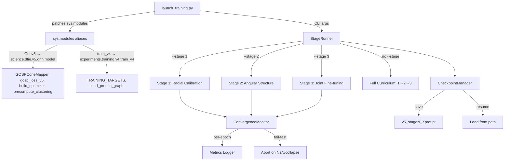

# Design Document: V5 Training Launcher

## Overview

The V5 Training Launcher is a thin adapter script that bridges the legacy training infrastructure (`experiments/training/v5/train_v5.py`) to the consolidated monorepo module layout. It patches `sys.modules` to redirect legacy imports (`Gnnv5`, `train_v4`) to their canonical locations (`science.dtie.v5.gnn.model`, `experiments.training.v4.train_v4`), then invokes the training loop with stage-selective execution, convergence monitoring, and checkpoint management.

The launcher does NOT rewrite the training script. It intercepts Python's import machinery at runtime, making the existing `train_v5.py` work unmodified from the monorepo root.

## Architecture



## Components and Interfaces

### 1. ImportPatcher

Responsible for aliasing legacy module names to consolidated paths before the training script is imported.

```python
def patch_legacy_imports() -> None:
    """Patch sys.modules so train_v5.py imports resolve correctly."""
    import sys
    from science.dtie.v5.gnn import model as gnn_model
    from experiments.training.v4 import train_v4 as v4_module

    # Alias the legacy namespace
    sys.modules['Gnnv5'] = gnn_model
    sys.modules['train_v4'] = v4_module

    # Verify required symbols exist
    required_gnn = ['GOSPConeMapper', 'gosp_loss_v5', 'build_optimizer', 'precompute_clustering']
    for sym in required_gnn:
        if not hasattr(gnn_model, sym):
            raise ImportError(
                f"Missing symbol '{sym}' in science.dtie.v5.gnn.model. "
                f"Expected by legacy train_v5.py."
            )

    required_v4 = ['TRAINING_TARGETS', 'load_protein_graph']
    for sym in required_v4:
        if not hasattr(v4_module, sym):
            raise ImportError(
                f"Missing symbol '{sym}' in experiments.training.v4.train_v4. "
                f"Expected by legacy train_v5.py."
            )
```

### 2. StageRunner

Orchestrates stage-selective execution of the 3-stage curriculum.

```python
class StageRunner:
    """Executes training stages with configurable selection."""

    STAGES = {
        1: {
            "name": "Stage 1: Radial calibration",
            "epochs": 20,
            "freeze_radial": False,
            "freeze_angular": True,
            "coeffs": {
                "cone_coeff": 0.30,
                "neighborhood_coeff": 0.10,
                "angular_coeff": 0.0,
                "domain_sep_2d_coeff": 0.0,
                "domain_sep_3d_coeff": 0.0,
            },
        },
        2: { ... },  # Angular structure
        3: { ... },  # Joint fine-tuning
    }

    def run(self, stage: int | None, model, proteins, config) -> dict:
        """Run selected stage(s). Returns final metrics."""
        ...
```

### 3. ConvergenceMonitor

Tracks per-epoch metrics and implements fail-fast abort conditions.

```python
class ConvergenceMonitor:
    """Monitors training convergence and implements fail-fast conditions."""

    def __init__(self, collapse_window: int = 3):
        self.history: list[dict] = []
        self.collapse_window = collapse_window

    def record_epoch(self, metrics: dict) -> None:
        """Record epoch metrics and check abort conditions."""
        ...

    def should_abort(self) -> tuple[bool, str]:
        """Check if training should abort due to NaN or collapse."""
        ...

    def stage_summary(self) -> dict:
        """Return convergence summary for the completed stage."""
        ...
```

### 4. CheckpointManager

Handles saving and loading checkpoints with full metadata.

```python
class CheckpointManager:
    """Manages training checkpoints with metadata."""

    def save(self, model, optimizer, epoch, stage, metrics, config, output_dir) -> Path:
        """Save checkpoint with full metadata."""
        ...

    def load(self, path: Path) -> dict:
        """Load checkpoint for resume."""
        ...
```

### 5. RCSBDownloader

Wraps the existing `_download_pdb` with rate limiting and exponential backoff.

```python
class RCSBDownloader:
    """Rate-limited PDB downloader with exponential backoff."""

    def __init__(self, pdb_dir: Path, delay: float = 1.0, max_retries: int = 3):
        self.pdb_dir = pdb_dir
        self.delay = delay
        self.max_retries = max_retries

    def download(self, pdb_id: str) -> Path | None:
        """Download with rate limiting. Returns path or None on failure."""
        ...
```

## Data Models

### TrainingConfig

```python
@dataclass
class TrainingConfig:
    device: str = "cpu"
    lr: float = 5e-4
    hidden: int = 128
    num_layers: int = 6
    num_experts: int = 4
    output_dir: Path = Path("./checkpoints_v5")
    pdb_dir: Path = Path("/tmp/dtie_pdb_cache")
    stage: int | None = None  # None = full curriculum
    resume: Path | None = None
```

### CheckpointData

```python
@dataclass
class CheckpointData:
    model_state_dict: dict
    optimizer_state_dict: dict
    epoch: int
    stage: int
    metrics: dict
    training_config: dict  # Serialized TrainingConfig + stage coefficients
```

### EpochMetrics

```python
@dataclass
class EpochMetrics:
    epoch: int
    stage: int
    total_loss: float
    cone_loss: float
    depth_std: float
    neighborhood_loss: float
    angular_loss: float
    domain_sep_2d_loss: float
    domain_sep_3d_loss: float
    grad_norm_radial: float
    grad_norm_angular: float
    grad_norm_backbone: float
```


## Correctness Properties

*A property is a characteristic or behavior that should hold true across all valid executions of a system — essentially, a formal statement about what the system should do. Properties serve as the bridge between human-readable specifications and machine-verifiable correctness guarantees.*

### Property 1: Import alias resolution

*For any* public symbol defined in `science.dtie.v5.gnn.model`, after `patch_legacy_imports()` is called, importing that symbol via `sys.modules['Gnnv5']` SHALL return the identical object (same `id()`) as importing it directly from the canonical module.

**Validates: Requirements 1.1, 1.3**

### Property 2: Checkpoint naming convention

*For any* stage number in {1, 2, 3} and any protein count > 0, when a stage completes, the saved checkpoint filename SHALL match the pattern `v5_stage{N}_{count}prot.pt`.

**Validates: Requirements 2.5**

### Property 3: Epoch metrics completeness

*For any* epoch result returned by `train_epoch`, the metrics dictionary SHALL contain all required keys: `total`, `cone_consistency`, `neighborhood_consistency`, `angular_diversity`, `domain_separation_2d`, `domain_separation_3d`, `grad_radial`, `grad_angular`, `grad_backbone`.

**Validates: Requirements 3.1, 3.2**

### Property 4: Fail-fast on convergence collapse

*For any* sequence of epoch metrics where `cone_loss` is NaN OR `depth_std` equals 0.0 for 3 consecutive epochs, the `ConvergenceMonitor.should_abort()` method SHALL return `(True, <reason>)`.

**Validates: Requirements 3.5**

### Property 5: Checkpoint structure completeness

*For any* valid model state, optimizer state, epoch, stage, and metrics, a saved checkpoint SHALL contain all required fields: `model_state_dict`, `optimizer_state_dict`, `epoch`, `stage`, `metrics`, and `training_config`.

**Validates: Requirements 4.1, 4.2**

### Property 6: Checkpoint save/resume round-trip

*For any* valid training state (model weights, optimizer state, epoch, stage), saving a checkpoint and then loading it SHALL produce an equivalent state — model parameters are identical (within floating-point tolerance), epoch and stage match exactly.

**Validates: Requirements 4.3**

### Property 7: Protein count consistency

*For any* subset of TRAINING_TARGETS where N structures load successfully and M fail, the launcher SHALL report exactly N loaded proteins and log exactly M warnings.

**Validates: Requirements 5.4**

## Error Handling

| Condition | Behavior |
|-----------|----------|
| Missing symbol in consolidated module | `ImportError` with symbol name and expected location |
| Invalid `--stage` value | Exit with error listing valid values (1, 2, 3) |
| Checkpoint not found for `--resume` | `FileNotFoundError` with attempted path |
| NaN cone_loss for 3 consecutive epochs | Abort training, log fatal convergence error |
| depth_std = 0.0 for 3 consecutive epochs | Abort training, log fatal convergence error |
| RCSB download failure | Log warning, skip structure, continue with remaining |
| RCSB rate limit (HTTP 429) | Exponential backoff (1s, 2s, 4s), max 3 retries |
| All proteins fail to load | Exit with error "No proteins loaded" |
| CUDA OOM during training | Clear cache, log error, suggest CPU fallback |

## Testing Strategy

### Property-Based Testing

Library: **Hypothesis** (already in use across the project — see `.hypothesis/` directory)

Configuration: minimum 100 iterations per property test.

Each property test will be tagged with:
```
# Feature: v5-training-launcher, Property N: <property_text>
```

Properties 1–7 will be implemented as Hypothesis property tests that generate random valid inputs and verify the invariants hold universally.

### Unit Tests

Unit tests will cover:
- CLI argument parsing with valid/invalid inputs
- Stage selection logic (specific stage vs full curriculum)
- Convergence monitor edge cases (exactly 3 epochs, boundary conditions)
- Checkpoint file I/O with mock filesystem
- Rate limiter timing behavior

### Integration Tests

- End-to-end: patch imports → load 1 protein → run 1 epoch of Stage 1 → verify checkpoint saved
- Resume: save checkpoint → load → verify model weights match

### Test File Location

`tokyo-eye-agenticpoincare/tests/test_training_launcher_properties.py`
