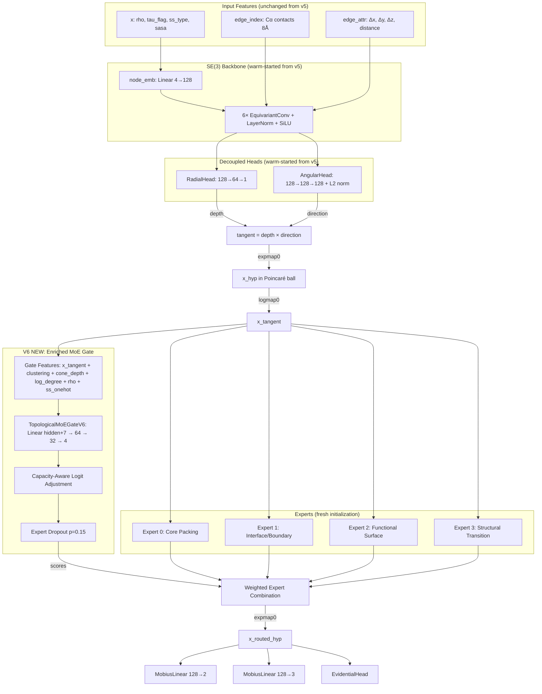

# Design Document: V6 MoE Specialization

## Overview

V6 evolves the GOSPConeMapper architecture to achieve true expert specialization in the Mixture-of-Experts routing layer. The core insight: experts should specialize by topological role (core packing, interface, functional surface, structural transition) rather than secondary structure type. This requires three coordinated changes: (1) enriching the gate's input with high-variance topological features, (2) replacing the symmetric balance loss with asymmetric capacity regularization, and (3) training on a structurally diverse corpus of ~120 proteins.

The v6 model lives in `science/dtie/v6/` as a clean implementation. It preserves the v5 decoupled RadialHead/AngularHead architecture and SE(3)-equivariant backbone, modifying only the MoE gate, loss functions, and training schedule. V5 backbone weights can be loaded for warm-start training.

## Architecture



## Components and Interfaces

### TopologicalMoEGateV6

```python
class TopologicalMoEGateV6(nn.Module):
    """V6 MoE gate with enriched topological features and capacity-aware routing."""

    def __init__(self, hidden_dim: int, num_experts: int = 4, capacity_threshold: float = 0.4):
        super().__init__()
        # Gate input: hidden + 7 (clustering, cone_depth, log_degree, rho, ss_H, ss_E, ss_C)
        gate_input_dim = hidden_dim + 7
        self.gate_net = nn.Sequential(
            nn.Linear(gate_input_dim, 64),
            nn.SiLU(),
            nn.Linear(64, 32),
            nn.SiLU(),
            nn.Linear(32, num_experts),
        )
        self.num_experts = num_experts
        self.capacity_threshold = capacity_threshold
        self.expert_dropout_p = 0.15

        # Running statistics for degree/rho normalization
        self.register_buffer('degree_mean', torch.tensor(0.0))
        self.register_buffer('degree_var', torch.tensor(1.0))
        self.register_buffer('rho_mean', torch.tensor(0.0))
        self.register_buffer('rho_var', torch.tensor(1.0))
        self.register_buffer('num_updates', torch.tensor(0))

    def forward(
        self,
        x_tangent: torch.Tensor,      # [N, hidden]
        clustering: torch.Tensor,      # [N]
        cone_depth: torch.Tensor,      # [N, 1]
        degree: torch.Tensor,          # [N] integer node degree
        rho: torch.Tensor,             # [N] dehydron density
        ss_onehot: torch.Tensor,       # [N, 3] one-hot secondary structure
    ) -> Tuple[torch.Tensor, torch.Tensor]:
        # Log-transform and normalize degree
        log_degree = torch.log1p(degree.float())
        if self.training:
            self._update_running_stats(log_degree, rho)
        norm_degree = (log_degree - self.degree_mean) / (self.degree_var.sqrt() + 1e-8)
        norm_rho = (rho - self.rho_mean) / (self.rho_var.sqrt() + 1e-8)

        # Assemble gate input
        gate_input = torch.cat([
            x_tangent,
            clustering.unsqueeze(-1),
            cone_depth.detach(),
            norm_degree.unsqueeze(-1),
            norm_rho.unsqueeze(-1),
            ss_onehot,
        ], dim=-1)

        # Compute raw logits
        raw_logits = self.gate_net(gate_input)

        # Capacity-aware adjustment (two-pass)
        scores_initial = F.softmax(raw_logits, dim=-1)
        expected_load = scores_initial.mean(dim=0)  # [num_experts]
        overload_penalty = torch.relu(expected_load - self.capacity_threshold) ** 2
        adjusted_logits = raw_logits - 2.0 * overload_penalty.unsqueeze(0)

        # Expert dropout (training only)
        if self.training and torch.rand(1).item() < self.expert_dropout_p:
            drop_idx = torch.randint(0, self.num_experts, (1,)).item()
            adjusted_logits[:, drop_idx] = -1e9

        scores = F.softmax(adjusted_logits, dim=-1)

        # Asymmetric capacity loss
        f = scores.mean(dim=0)
        min_usage = 0.05
        capacity_loss = torch.relu(min_usage - f).pow(2).sum()

        return scores, capacity_loss
```

### GraphBuilder Extensions

The `GraphBuilder` gains two new computed features attached to the PyG Data object:

```python
# In GraphBuilder.to_pyg():
data.degree = torch.tensor(edge_index_counts_per_node, dtype=torch.long)  # [N]
data.ss_onehot = torch.tensor(ss_one_hot_matrix, dtype=torch.float32)     # [N, 3]
data.rho = torch.tensor(rho_values, dtype=torch.float32)                  # [N]
```

Node degree is computed directly from `edge_index` (count of edges per node). SS one-hot is derived from the existing `ss_type` scalar encoding.

### Training Schedule Implementation

```python
@dataclass
class V6TrainingConfig:
    # Phase boundaries
    phase1_end: int = 50
    phase2_end: int = 200

    # Phase 1: Stabilize representations
    phase1_balance_coeff: float = 0.1
    phase1_expert_dropout: float = 0.0

    # Phase 2: Break symmetry
    phase2_balance_coeff: float = 0.001
    phase2_expert_dropout: float = 0.15
    phase2_capacity_threshold: float = 0.4

    # Phase 3: Freeze gate, fine-tune experts
    phase3_gate_frozen: bool = True
    phase3_expert_lr_multiplier: float = 0.5
```

### Training Corpus Manifest

The training corpus is defined as a JSON manifest at `data/training/v6_corpus.json`:

```json
{
  "version": "v6",
  "selection_criteria": {
    "max_resolution_angstrom": 2.5,
    "max_sequence_identity": 0.30,
    "min_residues": 20,
    "max_residues": 2000
  },
  "fold_class_targets": {
    "all_alpha": {"target": 20, "description": "Globins, 4-helix bundles, coiled-coils"},
    "all_beta": {"target": 20, "description": "Immunoglobulins, beta-barrels, beta-propellers"},
    "alpha_beta": {"target": 20, "description": "TIM barrels, Rossmann folds, flavodoxins"},
    "alpha_plus_beta": {"target": 15, "description": "Ferredoxins, SH3 domains, ubiquitin-like"},
    "multi_domain_hinge": {"target": 15, "description": "Kinases, adenylate kinase, calmodulin"},
    "membrane": {"target": 10, "description": "GPCRs, ion channels, transporters"},
    "idp_flexible": {"target": 10, "description": "p53 TAD, α-synuclein, HMGA"},
    "small_peptide": {"target": 10, "description": "Trp-cage, villin headpiece, WW domains"}
  },
  "proteins": []
}
```

The `proteins` array is populated during the dataset curation task with entries like:
```json
{"pdb_id": "4AKE", "chain": "A", "fold_class": "multi_domain_hinge", "residues": 214, "resolution": 2.0}
```

## Data Models

### Extended PyG Data Object

```python
# Fields added to torch_geometric.data.Data for v6:
data.degree: Tensor[N]        # Node degree from contact graph
data.ss_onehot: Tensor[N, 3]  # One-hot [helix, sheet, coil]
data.rho: Tensor[N]           # Raw dehydron density (for gate shortcut)
data.seq_separation: Tensor[N] # Mean sequence distance to spatial neighbors (optional, Phase 2+)
```

### V6 Model Output (superset of v5)

```python
{
    # All v5 outputs preserved
    "projections": Tensor[N, 64],
    "hyp_projections_2d": Tensor[N, 2],
    "hyp_projections_3d": Tensor[N, 3],
    "x_hyp": Tensor[N, 128],
    "x_routed_hyp": Tensor[N, 128],
    "uncertainty": {"epistemic": ..., "aleatoric": ..., "total": ...},
    "cone_depth": Tensor[N, 1],
    "cone_width": Tensor[N, 1],
    "expert_weights": Tensor[N, 4],
    "balance_loss": scalar,
    "evidence": {"mu": ..., "nu": ..., "alpha": ..., "beta": ...},
    "radial_features": Tensor[N, 1],
    "angular_features": Tensor[N, 128],
    "audit_trail": dict,

    # V6 NEW
    "capacity_loss": scalar,           # Asymmetric capacity penalty
    "expert_load": Tensor[4],          # Per-expert mean routing probability
    "routing_entropy": scalar,         # H(expert_weights) for monitoring
    "gate_features_used": list[str],   # Audit: which features fed the gate
}
```


## Correctness Properties

*A property is a characteristic or behavior that should hold true across all valid executions of a system — essentially, a formal statement about what the system should do. Properties serve as the bridge between human-readable specifications and machine-verifiable correctness guarantees.*

### Property 1: Gate input dimension correctness

*For any* protein graph with N residues, the gate input tensor should have shape [N, hidden+7] where the 7 extra dimensions are [clustering, cone_depth, log_degree_normalized, rho_normalized, ss_H, ss_E, ss_C].

**Validates: Requirements 1.1, 1.2, 1.3**

### Property 2: Asymmetric capacity loss is zero when all experts above minimum

*For any* routing distribution where every expert receives ≥ 5% of tokens, the asymmetric capacity loss should be exactly zero.

**Validates: Requirements 2.1, 2.2**

### Property 3: Expert dropout preserves probability mass

*For any* set of routing logits with one expert masked, the resulting softmax probabilities should sum to 1.0 across the remaining experts.

**Validates: Requirements 3.1, 3.2**

### Property 4: Capacity penalty monotonically increases with overload

*For any* two load fractions ρ_a > ρ_b > capacity_threshold, the logit penalty for ρ_a should be strictly greater than for ρ_b.

**Validates: Requirements 4.1, 4.2**

### Property 5: V6 output compatibility with GNNInferenceResult

*For any* valid protein graph, the v6 model output should contain all fields required by the GNNInferenceResult interface (residue_id, embedding, cone_depth, epistemic_uncertainty, expert_weights, hyp_projections).

**Validates: Requirements 7.4**

### Property 6: Routing entropy decreases across training phases

*For any* training run that completes all three phases, the mean routing entropy at the end of Phase 2 should be strictly less than at the end of Phase 1.

**Validates: Requirements 5.1, 5.2, 8.2**

### Property 7: Training corpus fold-class coverage

*For any* valid v6 corpus manifest, each fold class should have at least 80% of its target count populated, and no two proteins should share > 30% sequence identity.

**Validates: Requirements 6.1, 6.2, 6.3**

### Property 8: Log-degree transform preserves ordering

*For any* two nodes with degree_a > degree_b, log(1 + degree_a) > log(1 + degree_b) (monotonicity preserved).

**Validates: Requirements 1.4**

## Error Handling

- **Missing SS annotation**: Default to coil [0, 0, 1] when secondary structure is unavailable
- **Zero-degree node**: log(1 + 0) = 0, normalized to negative z-score. Gate handles gracefully.
- **All experts masked**: Expert dropout only masks one expert; 3 always remain active.
- **NaN in gate features**: Clamp all gate inputs to [-10, 10] before the gate network.
- **V5 checkpoint loading**: Missing keys (gate, capacity) are randomly initialized; extra keys are ignored with a warning.
- **Corpus protein fails ingestion**: Skip and log warning. Require minimum 100 proteins to proceed with training.

## Testing Strategy

**Property-Based Testing Library:** Hypothesis (Python)

**Dual approach:**
- Unit tests: Specific examples for gate dimension, loss computation, dropout behavior
- Property tests: Universal properties across randomly generated routing distributions and graph topologies

**Test tag format:** `Feature: v6-moe-specialization, Property {number}: {property_text}`

**Key test areas:**
1. Gate input assembly (correct dimensions, correct feature ordering)
2. Asymmetric capacity loss (zero when balanced, positive when starved)
3. Expert dropout (probability mass conservation, inference bypass)
4. Capacity-aware routing (monotonic penalty, logit adjustment)
5. Output interface compatibility (all required fields present)
6. Training schedule transitions (coefficient changes at phase boundaries)
7. Corpus manifest validation (fold-class coverage, identity threshold)
